# 🌿 TripNest - Hệ Sinh Thái Nền Tảng Đặt Phòng Du Lịch & Nghỉ Dưỡng Trực Tuyến

<div align="center">


[](https://react.dev/)
[](https://vitejs.dev/)
[](https://redux-toolkit.js.org/)
[](https://laravel.com/)
[](https://www.php.net/)
[](https://www.mysql.com/)
[](https://ai.google.dev/)
[](https://cloudinary.com/)

**BÁO CÁO KỸ THUẬT VÀ ĐẶC TẢ HỆ THỐNG TOÀN DIỆN (100% CODEBASE & DATABASE ALIGNED)**  
*Đề tài Nghiên cứu, Thiết kế và Xây dựng Nền tảng Đặt phòng Du lịch Cao cấp TripNest*

</div>

---

### 📋 Thông Tin Đề Tài & Nhóm Nghiên Cứu
- **Tên đề tài:** Thiết kế và xây dựng Hệ thống Quản lý & Đặt phòng Du lịch Trực tuyến TripNest (TripNest Hospitality & Booking Platform)
- **Đơn vị đào tạo:** Khoa Công nghệ Thông tin
- **Chuyên ngành:** Kỹ thuật Phần mềm / Công nghệ Web Nâng cao
- **Cán bộ / Giảng viên hướng dẫn:** Ban Giảng viên Chuyên ngành Kỹ thuật Phần mềm
- **Nhóm sinh viên thực hiện (4 thành viên):**
  1. **Vũ Xuân Bách** - Phụ trách Phân hệ Khách hàng, Trải nghiệm Giao diện Người dùng (Frontend SPA, UI/UX Design & Client Module).
  2. **Trần Trung Kiên** - Phụ trách Phân hệ Chủ nhà, Dịch vụ Máy chủ & Quản trị Lưu trữ (Backend API, Host Portal & Media CDN).
  3. **Vũ Văn Minh (Trưởng nhóm)** - Phụ trách Kiến trúc CSDL 31 bảng chuẩn hóa DBML, Phân hệ Quản trị & Điều phối Kỹ thuật (Full-stack, Database Architecture & Admin Operations).
  4. **Lê Gia Bảo** - Phụ trách Đảm bảo Chất lượng, Hạ tầng Hệ thống, Nghiệp vụ Tài chính Escrow & Kiểm thử Hiệu năng JMeter (System Architecture, Financial Engine, QA & Load Testing).

---

## 📑 Mục Lục Báo Cáo Chuyên Sâu

- [Chương 1: Tổng Quan và Xác Định Bài Toán](#chương-1-tổng-quan-và-xác-định-bài-toán)
  - [1.1. Bối cảnh thị trường & Xu hướng Staycation 2026](#11-bối-cảnh-thị-trường--xu-hướng-staycation-2026)
  - [1.2. Mục tiêu nghiên cứu và phát triển nền tảng TripNest](#12-mục-tiêu-nghiên-cứu-và-phát-triển-nền-tảng-tripnest)
  - [1.3. Khảo sát thực trạng quy trình thủ công vs Nền tảng số hóa TripNest](#13-khảo-sát-thực-trạng-quy-trình-thủ-công-vs-nền-tảng-số-hóa-tripnest)
  - [1.4. Đề xuất giải pháp kiến trúc tổng thể TripNest](#14-đề-xuất-giải-pháp-kiến-trúc-tổng-thể-tripnest)
  - [1.5. Phạm vi nghiên cứu và giới hạn chức năng](#15-phạm-vi-nghiên-cứu-và-giới-hạn-chức-năng)
  - [1.6. Yêu cầu môi trường phần cứng, phần mềm và máy chủ](#16-yêu-cầu-môi-trường-phần-cứng-phần-mềm-và-máy-chủ)
- [Chương 2: Phân Tích Yêu Cầu Nghiệp Vụ Hệ Thống (Input - Process - Output)](#chương-2-phân-tích-yêu-cầu-nghiệp-vụ-hệ-thống)
  - [2.1. Xác định tác nhân hệ thống](#21-xác-định-tác-nhân-hệ-thống)
  - [2.2. Bảng ma trận tổng hợp tính năng toàn sàn (Feature Matrix)](#22-bảng-ma-trận-tổng-hợp-tính-năng-toàn-sàn-feature-matrix)
  - [2.3. Đặc tả chi tiết phân hệ Khách hàng (15 chức năng)](#23-đặc-tả-chi-tiết-phân-hệ-khách-hàng-15-chức-năng)
  - [2.4. Đặc tả chi tiết phân hệ Đối tác Chủ nhà Host (9 chức năng)](#24-đặc-tả-chi-tiết-phân-hệ-đối-tác-chủ-nhà-host-9-chức-năng)
  - [2.5. Đặc tả chi tiết phân hệ Quản trị viên Admin (10 chức năng)](#25-đặc-tả-chi-tiết-phân-hệ-quản-trị-viên-admin-10-chức-năng)
  - [2.6. Đặc tả chi tiết phân hệ Trợ lý ảo AI Du lịch](#26-đặc-tả-chi-tiết-phân-hệ-trợ-lý-ảo-ai-du-lịch)
  - [2.7. Đặc tả yêu cầu phi chức năng](#27-đặc-tả-yêu-cầu-phi-chức-năng)
- [Chương 3: Phân Tích và Thiết Kế Hệ Thống](#chương-3-phân-tích-và-thiết-kế-hệ-thống)
  - [3.1. Sơ đồ phân rã chức năng (BFD)](#31-sơ-đồ-phân-rã-chức-năng-bfd)
  - [3.2. Mô hình hóa Use Case Diagrams](#32-mô-hình-hóa-use-case-diagrams)
  - [3.3. Bảng đặc tả Use Case chi tiết (Use Case Specifications)](#33-bảng-đặc-tả-use-case-chi-tiết-use-case-specifications)
  - [3.4. Biểu đồ Hoạt động (Activity Diagrams) 8 luồng cốt lõi](#34-biểu-đồ-hoạt-động-activity-diagrams-8-luồng-cốt-lõi)
  - [3.5. Biểu đồ Tuần tự (Sequence Diagrams) 5 luồng xương sống](#35-biểu-đồ-tuần-tự-sequence-diagrams-5-luồng-xương-sống)
  - [3.6. Thiết kế Cơ sở Dữ liệu (Chuẩn hóa 100% DBML & MySQL Live)](#36-thiết-kế-cơ-sở-dữ-liệu-chuẩn-hóa-100-dbml--mysql-live)
  - [3.7. Từ điển dữ liệu chi tiết toàn bộ 31 bảng CSDL](#37-từ-điển-dữ-liệu-chi-tiết-toàn-bộ-31-bảng-csdl)
  - [3.8. Sơ đồ Thực thể Quan hệ (ERD Diagram)](#38-sơ-đồ-thực-thể-quan-hệ-erd-diagram)
  - [3.9. Biểu đồ Lớp (Class Diagram) kiến trúc Backend](#39-biểu-đồ-lớp-class-diagram-kiến-trúc-backend)
- [Chương 4: Công Nghệ và Quy Trình Phát Triển](#chương-4-công-nghệ-và-quy-trình-phát-triển)
  - [4.1. Cấu trúc thư mục toàn dự án (Directory Tree)](#41-cấu-trúc-thư-mục-toàn-dự-án-directory-tree)
  - [4.2. Kiến trúc phân tầng Frontend (React 19 + Redux Toolkit + Vite)](#42-kiến-trúc-phân-tầng-frontend-react-19--redux-toolkit--vite)
  - [4.3. Kiến trúc phân tầng Backend (Laravel 11 RESTful API)](#43-kiến-trúc-phân-tầng-backend-laravel-11-restful-api)
  - [4.4. Bảng ánh xạ toàn bộ 18 Controllers & Các API Endpoints cốt lõi](#44-bảng-ánh-xạ-toàn-bộ-18-controllers--các-api-endpoints-cốt-lõi)
  - [4.5. Cơ chế Bảo mật và Xác thực đa lớp](#45-cơ-chế-bảo-mật-và-xác-thực-đa-lớp)
  - [4.6. Cơ chế Khóa phòng phân tán chống Overbooking](#46-cơ-chế-khóa-phòng-phân-tán-chống-overbooking)
  - [4.7. Mô hình Dòng tiền Ký quỹ Trung gian (Escrow Pool)](#47-mô-hình-dòng-tiền-ký-quỹ-trung-gian-escrow-pool)
  - [4.8. Tích hợp Dịch vụ Đám mây & Trí tuệ Nhân tạo Gemini Flash](#48-tích-hợp-dịch-vụ-đám-mây--trí-tuệ-nhân-tạo-gemini-flash)
  - [4.9. Quy trình phát triển Git Flow & Quy chuẩn phối hợp nhóm](#49-quy-trình-phát-triển-git-flow--quy-chuẩn-phối-hợp-nhóm)
- [Chương 5: Hiện Thực Hóa và Kết Quả Đạt Được](#chương-5-hiện-thực-hóa-và-kết-quả-đạt-được)
  - [5.1. Danh mục các màn hình giao diện chính & Component](#51-danh-mục-các-màn-hình-giao-diện-chính--component)
  - [5.2. Hiện thực hóa Phân hệ Khách hàng (Guest Experience)](#52-hiện-thực-hóa-phân-hệ-khách-hàng-guest-experience)
  - [5.3. Hiện thực hóa Cổng thông tin Đối tác Chủ nhà (Host Portal)](#53-hiện-thực-hóa-cổng-thông-tin-đối-tác-chủ-nhà-host-portal)
  - [5.4. Hiện thực hóa Trung tâm Điều hành Quản trị (Admin Portal)](#54-hiện-thực-hóa-trung-tâm-điều-hành-quản-trị-admin-portal)
  - [5.5. Hiện thực hóa Trợ lý Ảo AI Du lịch TripNest](#55-hiện-thực-hóa-trợ-lý-ảo-ai-du-lịch-tripnest)
  - [5.6. Đánh giá kết quả đạt được đối chiếu mục tiêu ban đầu](#56-đánh-giá-kết-quả-đạt-được-đối-chiếu-mục-tiêu-ban-đầu)
- [Chương 6: Kiểm Thử và Đảm Bảo Chất Lượng (QA)](#chương-6-kiểm-thử-và-đảm-bảo-chất-lượng-qa)
  - [6.1. Kiểm tra điều kiện hoạt động của hệ thống (Checklist tiền đề)](#61-kiểm-tra-điều-kiện-hoạt-động-của-hệ-thống-checklist-tiền-đề)
  - [6.2. Ma trận 25 Ca kiểm thử chức năng (Functional Test Cases)](#62-ma-trận-25-ca-kiểm-thử-chức-năng-functional-test-cases)
  - [6.3. Kiểm thử Hiệu năng và Chịu tải với Apache JMeter](#63-kiểm-thử-hiệu-năng-và-chịu-tải-với-apache-jmeter)
  - [6.4. Đánh giá độ ổn định và tỷ lệ lỗi](#64-đánh-giá-độ-ổn-định-và-tỷ-lệ-lỗi)
- [Chương 7: Kết Luận và Hướng Phát Triển](#chương-7-kết-luận-và-hướng-phát-triển)
  - [7.1. Đánh giá ưu điểm nổi bật của hệ thống](#71-đánh-giá-ưu-điểm-nổi-bật-của-hệ-thống)
  - [7.2. Các hạn chế tồn đọng](#72-các-hạn-chế-tồn-đọng)
  - [7.3. Định hướng phát triển tương lai](#73-định-hướng-phát-triển-tương-lai)
- [Phụ Lục 1: Ma Trận Phân Công Công Việc 4 Thành Viên](#phụ-lục-1-ma-trận-phân-công-công-việc-4-thành-viên)
- [Phụ Lục 2: Hướng Dẫn Cài Đặt, Cấu Hình .ENV & Khởi Chạy Dự Án](#phụ-lục-2-hướng-dẫn-cài-đặt-cấu-hình-env--khởi-chạy-dự-án)
- [Tài Liệu Tham Khảo & Lời Cảm Ơn](#tài-liệu-tham-khảo--lời-cảm-ơn)

---

## CHƯƠNG 1: TỔNG QUAN VÀ XÁC ĐỊNH BÀI TOÁN

### 1.1. Bối cảnh thị trường & Xu hướng Staycation 2026
Trong kỷ nguyên hậu chuyển đổi số, ngành du lịch và lưu trú chứng kiến sự dịch chuyển mang tính bước ngoặt từ du lịch truyền thống sang mô hình **Du lịch Trải nghiệm Cá nhân hóa (Personalized & Experiential Tourism)**, **Staycation (Nghỉ dưỡng bản địa ngắn ngày)**, và **Workation (Kết hợp làm việc từ xa và nghỉ dưỡng)**. 
Du khách ngày nay đòi hỏi tiêu chuẩn khắt khe về tính minh bạch thông tin, tốc độ phản hồi tức thời, quy trình thanh toán an toàn không chạm và trải nghiệm giao diện người dùng (UI/UX) đạt đẳng cấp thẩm mỹ cao.

Tuy nhiên, thị trường cho thuê lưu trú tại Việt Nam (đặc biệt là phân khúc homestay, biệt thự nghỉ dưỡng, căn hộ dịch vụ cao cấp) vẫn còn phân mảnh lớn:
- Chủ nhà phụ thuộc vào các kênh thủ công (Zalo, Messenger, hội nhóm Facebook) dẫn đến tình trạng quá tải tin nhắn, sót đơn, và đặc biệt là **Overbooking** (trùng lịch phòng).
- Khách hàng thiếu công cụ tìm kiếm chuẩn xác theo tiện ích và phong cách sống, lo ngại rủi ro lừa đảo cọc, hoặc vướng phải các quy định hủy phòng mập mờ, thiếu sự bảo lãnh từ bên thứ ba.
- Các sàn OTA quốc tế hiện tại thu phí hoa hồng quá cao (từ 18% - 25%), thủ tục giải ngân chậm chạp, và giao diện phức tạp, chưa tối ưu hóa sâu sắc cho hành vi tiêu dùng của du khách Việt Nam.

### 1.2. Mục tiêu nghiên cứu và phát triển nền tảng TripNest
- **Về mặt nghiệp vụ đối với khách hàng**: Xây dựng trải nghiệm tìm kiếm thông minh, lọc phòng theo phong cách sống (Lifestyle curation), hỗ trợ đặt phòng với quy trình Checkout 3 bước mượt mà, áp dụng voucher tự động, hủy phòng minh bạch và tư vấn hành trình tự động với Trợ lý AI.
- **Về mặt nghiệp vụ đối với chủ nhà (Host)**: Cung cấp Cổng thông tin Host Portal chuyên nghiệp với công cụ tạo chỗ nghỉ trực quan 6 bước (Listing Wizard), quản lý lịch đặt phòng, bảng điều khiển KPI doanh thu và cơ chế rút tiền ký quỹ (Payout) an toàn.
- **Về mặt nghiệp vụ đối với quản trị sàn (Admin)**: Thiết lập trung tâm điều hành toàn diện: thẩm định danh tính đối tác e-KYC (CCCD 2 mặt + Giấy phép kinh doanh), kiểm duyệt cơ sở lưu trú, quản lý dòng tiền trung gian (Escrow Cashflow Model), kiểm soát đánh giá chất lượng (Radar Review Moderation) và thống kê tăng trưởng.
- **Về mặt kỹ thuật**: Xây dựng kiến trúc tách biệt hoàn toàn Frontend SPA (Single Page Application) và Backend RESTful API, đạt chuẩn bảo mật JWT, mã hóa Bcrypt, tối ưu hóa CSDL quan hệ 31 bảng đạt dạng chuẩn 3 (3NF), thời gian phản hồi API trung bình dưới 1.5 giây và triệt tiêu hoàn toàn rủi ro Overbooking thông qua cơ chế khóa phòng phân tán (`room_locks`).

### 1.3. Khảo sát thực trạng quy trình thủ công vs Nền tảng số hóa TripNest

| Tiêu chí đối soát | Quy trình truyền thống qua Mạng xã hội / Zalo / Excel | Nền tảng số hóa cao cấp TripNest |
| :--- | :--- | :--- |
| **Tìm kiếm & Bộ lọc** | Khách hỏi thủ công từng fanpage, chờ tư vấn lâu, thông tin phân mảnh. | Bộ lọc đa chiều: Địa điểm (63 tỉnh thành), Khoảng ngày, Số khách, Mức giá, Danh mục trải nghiệm, Tiện nghi nổi bật. |
| **Kiểm tra tình trạng phòng** | Tra sổ tay hoặc file Excel nội bộ; dễ xảy ra xung đột khi nhiều khách cùng hỏi. | Kiểm tra thời gian thực (Real-time Availability) kết hợp thuật toán giao thoa ngày và khóa giữ chỗ tạm thời (`room_locks`). |
| **Trùng lịch (Overbooking)** | Thường xuyên xảy ra khi chủ nhà nhận cọc từ nhiều kênh (Facebook, Hotline, OTA khác). | **Triệt tiêu 100% rủi ro Overbooking** nhờ cơ chế khóa chỗ tạm thời 10-15 phút tại bước Checkout. |
| **Thanh toán & Đặt cọc** | Chuyển khoản cá nhân không có bên thứ ba bảo lãnh, rủi ro lừa đảo cao. | Tích hợp cổng thanh toán trực tuyến bảo mật, lưu vết Webhook IPN, áp dụng mô hình ký quỹ trung gian (Escrow). |
| **Chính sách hủy phòng** | Tranh chấp kéo dài, Host tự đặt quy định cảm tính, khách chịu thiệt thòi. | Tính toán hoàn tiền 3 bậc tự động (`CancellationPolicyService`): ≥ 48h hoàn 100%, < 48h hoàn 50%, sau check-in hoàn 0%. |
| **Định danh chủ nhà** | Không xác thực danh tính chủ nhà, tiềm ẩn rủi ro phòng ảo, cơ sở lưu trú kém an toàn. | Quy trình e-KYC bắt buộc: Tải ảnh CCCD 2 mặt, chân dung, mã số thuế, giấy phép kinh doanh được Admin duyệt. |
| **Đánh giá dịch vụ** | Dễ bị spam đánh giá giả mạo, mua bán review hoặc xóa bình luận tiêu cực. | Biểu đồ Radar 6 tiêu chí quốc tế; **CHỈ khách đã hoàn thành kỳ nghỉ thực tế mới được viết duy nhất 1 review**. |

### 1.4. Đề xuất giải pháp kiến trúc tổng thể TripNest
TripNest áp dụng kiến trúc **Client-Server hướng dịch vụ (Decoupled SPA Architecture)**:
- **Tầng Trình diễn (Presentation Layer)**: Xây dựng bằng **React 19** kết hợp trình đóng gói siêu tốc **Vite 8.2**. Quản lý trạng thái toàn cục bằng **Redux Toolkit**, tối ưu CSS Modules scoped riêng biệt, hệ thống thông báo Toast phi chặn, và Skeleton Loaders cho toàn bộ màn hình.
- **Tầng Ứng dụng & Nghiệp vụ (Application & Domain Services Layer)**: Xây dựng bằng **Laravel 11 RESTful API**. Định tuyến qua `routes/api.php`, phân quyền bằng Middleware (`auth:api`, `host.auth`, `admin`), chia tách nghiệp vụ vào các Domain Services chuyên biệt (`RoomAvailabilityService`, `CancellationPolicyService`, `AiTravelAssistantService`).
- **Tầng Trí tuệ Nhân tạo (AI Service Layer)**: Tích hợp mô hình ngôn ngữ lớn **Google Gemini 3.6 Flash** qua API, thiết lập hệ thống ranh giới bảo mật (Guardrail Security Check), kết hợp truy xuất dữ liệu có cấu trúc từ CSDL để tư vấn phòng và điểm đến du lịch theo ngữ cảnh tự nhiên.
- **Tầng Dữ liệu & Lưu trữ (Persistence & Storage Layer)**: Cơ sở dữ liệu quan hệ **MySQL 9.x**, bảng mã `utf8mb4`, engine InnoDB với hỗ trợ giao dịch ACID. Toàn bộ hình ảnh truyền thông đa phương tiện được tối ưu và phân phối qua mạng lưới CDN đám mây **Cloudinary**.

### 1.5. Phạm vi nghiên cứu và giới hạn chức năng
- **Phạm vi đối tượng lưu trú**: Tập trung vào phân khúc căn hộ du lịch, biệt thự nghỉ dưỡng (villas), resort ven biển, homestay cao cấp và trải nghiệm văn hóa bản địa trên lãnh thổ Việt Nam.
- **Phạm vi tiền tệ**: Tiền tệ thanh toán gốc neo cố định theo Đồng Việt Nam (VND), hỗ trợ hiển thị quy đổi đa ngoại tệ (USD, EUR, JPY, GBP, AUD) thông qua bảng `exchange_rates`.
- **Giới hạn đề tài**: Hệ thống chưa phát hành phiên bản Mobile App Native riêng (hiện tại hỗ trợ Mobile Web Responsive toàn diện) và chưa liên kết trực tiếp API đồng bộ buồng phòng 2 chiều với các sàn OTA quốc tế thứ ba (Channel Manager iCal).

### 1.6. Yêu cầu môi trường phần cứng, phần mềm và máy chủ

```text
Yêu cầu môi trường vận hành TripNest:
├── Môi trường Khách hàng (Client Device):
│   ├── Trình duyệt: Chrome 100+, Safari 15+, Firefox 90+, Edge Chromium.
│   └── Thiết bị: PC/Laptop (1366x768 trở lên), Máy tính bảng, Điện thoại thông minh (Viewport responsive >= 360px).
├── Môi trường Phát triển (Development Environment):
│   ├── Node.js: >= 20.x LTS & npm >= 10.x
│   ├── PHP Runtime: >= 8.3.x với các extension: pdo_mysql, mbstring, openssl, tokenizer, xml, curl, fileinfo
│   ├── Composer: >= 2.7.x
│   └── Database Server: MySQL Server 9.x / 8.4 LTS
└── Môi trường Triển khai Máy chủ (Production Server):
    ├── Web Server: Nginx 1.24+ / Apache 2.4+ (Reverse Proxy & HTTP/2)
    ├── RAM: Tối thiểu 2GB (Khuyến nghị 4GB trở lên)
    ├── CPU: 2 vCPU trở lên
    └── Dịch vụ đám mây: Cloudinary Media Storage, Google AI Studio Gemini API
```


---

## CHƯƠNG 2: PHÂN TÍCH YÊU CẦU NGHIỆP VỤ HỆ THỐNG

### 2.1. Xác định tác nhân hệ thống
Hệ thống TripNest được xây dựng trên mô hình phân quyền đa tác nhân chặt chẽ:
1. **Khách du lịch (Guest / Customer)**: Người dùng tìm kiếm chỗ nghỉ, xem thông tin phòng, kiểm tra phòng trống, áp dụng mã ưu đãi, thực hiện thanh toán giữ phòng, yêu cầu hủy đơn nhận hoàn tiền, đánh giá trải nghiệm dịch vụ theo biểu đồ Radar, trò chuyện với Trợ lý AI và quản lý danh sách yêu thích.
2. **Đối tác Chủ nhà (Host / Property Owner)**: Người cho thuê cơ sở lưu trú, hoàn tất hồ sơ định danh e-KYC (CCCD 2 mặt + Giấy phép kinh doanh), khởi tạo khuôn viên lưu trú và các hạng phòng ngủ con, quản lý tình trạng đóng/mở phòng, tiếp nhận đơn đặt, quản trị tài khoản thụ hưởng ngân hàng, giám sát biểu đồ dòng tiền và gửi yêu cầu rút tiền giải ngân (Payout).
3. **Quản trị viên sàn (Administrator)**: Kiểm soát toàn bộ hệ sinh thái sàn: duyệt hồ sơ nâng quyền Host & cấp huy hiệu Superhost, kiểm duyệt cơ sở lưu trú và gắn nhãn Nổi bật (Featured), giám sát dòng tiền ký quỹ Escrow, phê duyệt lệnh chuyển tiền Payout, quản trị chiến dịch Voucher, danh mục và tour trải nghiệm.
4. **Bộ lập lịch hệ thống (System Scheduler / Queue Worker)**: Tác vụ chạy ngầm định kỳ quét và giải phóng các khóa giữ chỗ phòng hết hạn (`CleanExpiredRoomLocks`), xử lý hàng đợi gửi email xác thực OTP và thông báo đặt phòng.
5. **Trợ lý ảo AI Du lịch (TripNest AI Assistant)**: Tác nhân thông minh tiếp nhận thắc mắc của du khách bằng ngôn ngữ tự nhiên, giải đáp gợi ý địa điểm, tư vấn chọn phòng phù hợp với ngân sách và sở thích.

---

### 2.2. Bảng ma trận tổng hợp tính năng toàn sàn (Feature Matrix)

| STT | Phân hệ | Mã chức năng | Tên chức năng nghiệp vụ | Tác nhân chính | Mức độ ưu tiên |
| :---: | :--- | :---: | :--- | :---: | :---: |
| 1 | Khách hàng | **F-GST-01** | Đăng ký tài khoản & Xác thực OTP Email | Khách du lịch | Bắt buộc (Must) |
| 2 | Khách hàng | **F-GST-02** | Đăng nhập Mật khẩu & Google OAuth2 SSO | Khách du lịch | Bắt buộc (Must) |
| 3 | Khách hàng | **F-GST-03** | Quên mật khẩu & Đặt lại mật khẩu OTP | Khách du lịch | Bắt buộc (Must) |
| 4 | Khách hàng | **F-GST-04** | Quản lý Hồ sơ cá nhân & Đổi mật khẩu | Khách du lịch | Bắt buộc (Must) |
| 5 | Khách hàng | **F-GST-05** | Khám phá theo Danh mục phong cách sống | Khách du lịch | Nên có (Should) |
| 6 | Khách hàng | **F-GST-06** | Tìm kiếm chỗ nghỉ đa tiêu chí (Hero Bar) | Khách du lịch | Bắt buộc (Must) |
| 7 | Khách hàng | **F-GST-07** | Bộ lọc nâng cao đa chiều (Filter Modal) | Khách du lịch | Bắt buộc (Must) |
| 8 | Khách hàng | **F-GST-08** | Xem chi tiết phòng & Radar Đánh giá 6 tiêu chí | Khách du lịch | Bắt buộc (Must) |
| 9 | Khách hàng | **F-GST-09** | Bản đồ tương tác & Chỉ đường GPS | Khách du lịch | Nên có (Should) |
| 10 | Khách hàng | **F-GST-10** | Checkout 3 bước & Khóa phòng tạm thời | Khách du lịch | Bắt buộc (Must) |
| 11 | Khách hàng | **F-GST-11** | Áp dụng mã ưu đãi khuyến mãi (Voucher) | Khách du lịch | Bắt buộc (Must) |
| 12 | Khách hàng | **F-GST-12** | Quản lý Chuyến đi & Xem chi tiết đơn | Khách du lịch | Bắt buộc (Must) |
| 13 | Khách hàng | **F-GST-13** | Hủy phòng & Tính toán hoàn tiền 3 bậc | Khách du lịch | Bắt buộc (Must) |
| 14 | Khách hàng | **F-GST-14** | Đánh giá Radar 6 tiêu chí quốc tế | Khách du lịch | Bắt buộc (Must) |
| 15 | Khách hàng | **F-GST-15** | Quản lý danh sách phòng yêu thích (Wishlist) | Khách du lịch | Nên có (Should) |
| 16 | Chủ nhà | **F-HST-01** | Đăng ký làm Host & Nộp hồ sơ e-KYC | Chủ nhà Host | Bắt buộc (Must) |
| 17 | Chủ nhà | **F-HST-02** | Khởi tạo Chỗ nghỉ qua Wizard 6 bước | Chủ nhà Host | Bắt buộc (Must) |
| 18 | Chủ nhà | **F-HST-03** | Chỉnh sửa & Cập nhật thông tin Chỗ nghỉ | Chủ nhà Host | Bắt buộc (Must) |
| 19 | Chủ nhà | **F-HST-04** | Quản lý buồng phòng, tình trạng đóng/mở & giá | Chủ nhà Host | Bắt buộc (Must) |
| 20 | Chủ nhà | **F-HST-05** | Tiếp nhận & Quản lý đơn đặt phòng | Chủ nhà Host | Bắt buộc (Must) |
| 21 | Chủ nhà | **F-HST-06** | Xác nhận tiếp đón Check-in / Check-out | Chủ nhà Host | Bắt buộc (Must) |
| 22 | Chủ nhà | **F-HST-07** | Cấu hình TK thụ hưởng & Yêu cầu Payout | Chủ nhà Host | Bắt buộc (Must) |
| 23 | Chủ nhà | **F-HST-08** | Bảng điều khiển KPI & Biểu đồ dòng tiền | Chủ nhà Host | Bắt buộc (Must) |
| 24 | Chủ nhà | **F-HST-09** | Xem & Phản hồi công khai đánh giá | Chủ nhà Host | Nên có (Should) |
| 25 | Quản trị | **F-ADM-01** | Bảng điều khiển KPI toàn sàn Overview | Quản trị Admin | Bắt buộc (Must) |
| 26 | Quản trị | **F-ADM-02** | Quản lý Người dùng & Khóa tài khoản vi phạm | Quản trị Admin | Bắt buộc (Must) |
| 27 | Quản trị | **F-ADM-03** | Thẩm định e-KYC Host & Cấp Superhost | Quản trị Admin | Bắt buộc (Must) |
| 28 | Quản trị | **F-ADM-04** | Kiểm duyệt Chỗ nghỉ & Gắn nhãn Nổi bật | Quản trị Admin | Bắt buộc (Must) |
| 29 | Quản trị | **F-ADM-05** | Quản lý Đơn đặt phòng toàn hệ thống | Quản trị Admin | Bắt buộc (Must) |
| 30 | Quản trị | **F-ADM-06** | Giám sát Quỹ Ký quỹ Escrow & Duyệt Payout | Quản trị Admin | Bắt buộc (Must) |
| 31 | Quản trị | **F-ADM-07** | Quản trị Danh mục (`categories`) & Tiện nghi | Quản trị Admin | Bắt buộc (Must) |
| 32 | Quản trị | **F-ADM-08** | Quản trị Chiến dịch Voucher & Khuyến mãi | Quản trị Admin | Bắt buộc (Must) |
| 33 | Quản trị | **F-ADM-09** | Kiểm duyệt Đánh giá Radar & Khiếu nại | Quản trị Admin | Nên có (Should) |
| 34 | Quản trị | **F-ADM-10** | Quản lý Tour & Trải nghiệm bản địa | Quản trị Admin | Nâng cao (Nice) |
| 35 | AI Assistant| **F-AI-01** | Trợ lý ảo AI tư vấn lộ trình & gợi ý phòng | Du khách / AI | Nâng cao (Nice) |
| 36 | Scheduler | **F-SCH-01** | Tự động quét giải phóng phòng khóa hết hạn | Scheduler | Bắt buộc (Must) |

---

### 2.3. Đặc tả chi tiết phân hệ Khách hàng (15 chức năng)
Mỗi chức năng nghiệp vụ được đặc tả theo cấu trúc tiêu chuẩn **Đầu vào (Input) - Xử lý (Process) - Đầu ra (Output)**:

#### 2.3.1. Đăng ký tài khoản & Xác thực OTP qua Email (`F-GST-01`)
- **Đầu vào**: Họ tên đầy đủ, địa chỉ email, mật khẩu (tối thiểu 8 ký tự), xác nhận mật khẩu.
- **Xử lý**:
  1. Hệ thống validate định dạng email, kiểm tra xem email đã tồn tại trong bảng `accounts` hay chưa.
  2. Nếu hợp lệ, hệ thống băm mật khẩu bằng thuật toán Bcrypt (cost factor = 12).
  3. Tạo mã OTP ngẫu nhiên 6 chữ số lưu vào bảng `password_otps` với thời hạn hết hạn 15 phút.
  4. Đẩy tác vụ gửi email chứa mã OTP vào hàng đợi (`SendOtpMail`).
  5. Khi người dùng nhập đúng 6 số OTP, cập nhật `email_verified_at = NOW()` và trạng thái `status = 'active'`.
- **Đầu ra**: Tài khoản được kích hoạt thành công, cấp Bearer JWT Token để tự động đăng nhập.

#### 2.3.2. Đăng nhập hệ thống (Mật khẩu & Google OAuth2 SSO) (`F-GST-02`)
- **Đầu vào**: Email và Mật khẩu (hoặc nhấp chọn nút "Đăng nhập với Google").
- **Xử lý**:
  - *Đối với Mật khẩu*: So khớp email và verify mật khẩu băm Bcrypt. Kiểm tra trạng thái tài khoản; nếu `banned` thì chặn truy cập.
  - *Đối với Google SSO*: Nhận Google Credential Token từ Google Identity Services SDK, verify Sub ID (`google_id`). Nếu tài khoản chưa có thì tự động tạo mới `accounts` và `users` đồng bộ ảnh đại diện.
  - Cập nhật `last_login_at = NOW()`.
- **Đầu ra**: Cấp chuỗi Bearer JWT Token lưu vào `localStorage`, đồng bộ `authSlice` trong Redux Store.

#### 2.3.3. Quên mật khẩu & Đặt lại mật khẩu bằng OTP qua Email (`F-GST-03`)
- **Đầu vào**: Địa chỉ email tài khoản đã đăng ký, mã OTP 6 chữ số, mật khẩu mới, xác nhận mật khẩu mới.
- **Xử lý**:
  1. Người dùng gửi yêu cầu quên mật khẩu, hệ thống kiểm tra email có tồn tại không.
  2. Tạo mã OTP mới ghi đè vào `password_otps`, gửi email hướng dẫn kèm mã 6 số.
  3. Người dùng nhập mã OTP và mật khẩu mới.
  4. Hệ thống kiểm tra tính hợp lệ và thời hạn OTP. Băm mật khẩu mới bằng Bcrypt và cập nhật vào `accounts.password`.
  5. Xóa mã OTP đã sử dụng.
- **Đầu ra**: Thông báo đặt lại mật khẩu thành công, điều hướng sang màn hình Đăng nhập.

#### 2.3.4. Quản lý Hồ sơ cá nhân & Đổi mật khẩu (`F-GST-04`)
- **Đầu vào**: Họ tên, số điện thoại, ngày sinh, giới tính, số CCCD/Hộ chiếu, quốc tịch, địa chỉ, ảnh đại diện mới, mật khẩu cũ và mật khẩu mới.
- **Xử lý**:
  1. Nếu tải ảnh đại diện mới: Upload trực tiếp lên Cloudinary, nhận URL an toàn HTTPS.
  2. Cập nhật các trường thông tin trong bảng `users`.
  3. Nếu đổi mật khẩu: So khớp mật khẩu hiện tại bằng `Hash::check()`, băm mật khẩu mới và lưu vào `accounts`.
- **Đầu ra**: Hồ sơ được cập nhật tức thời, đồng bộ thông tin hiển thị trên Header SPA.

#### 2.3.5. Khám phá theo Danh mục phong cách sống (`F-GST-05`)
- **Đầu vào**: Nhấp chọn biểu tượng danh mục trên thanh `CategoryBar` (VD: Biệt thự, Sát biển, View núi, Cabin, Nhà thuyền, Thư giãn nông thôn).
- **Xử lý**: Gọi API `GET /api/accommodations?category_id={id}`, lọc các chỗ nghỉ thuộc phong cách được chọn, giữ lại tiêu chí sắp xếp.
- **Đầu ra**: Lưới thẻ phòng cập nhật tức thì với hiệu ứng chuyển động mượt mà.

#### 2.3.6. Tìm kiếm chỗ nghỉ đa tiêu chí (Hero Search Bar) (`F-GST-06`)
- **Đầu vào**: Điểm đến (Tỉnh/thành phố hoặc từ khóa tự do), Khoảng ngày nhận/trả phòng (`checkIn`, `checkOut`), Số lượng khách lưu trú (`guests`).
- **Xử lý**:
  1. Lọc các `accommodations` có địa chỉ hoặc tên chứa điểm đến (khử dấu tiếng Việt qua hàm `removeVietnameseTones`).
  2. So khớp các hạng phòng `rooms` có sức chứa `max_guests >= guests`.
  3. Gọi `RoomAvailabilityService` kiểm tra các phòng không có đơn đặt phòng nào trùng lịch (`status IN (confirmed, checked_in)`).
- **Đầu ra**: Danh sách các cơ sở lưu trú và hạng phòng còn trống, phù hợp yêu cầu tìm kiếm.

#### 2.3.7. Bộ lọc nâng cao đa chiều (Filter Modal) (`F-GST-07`)
- **Đầu vào**: Khoảng giá trượt (Min price - Max price), Danh mục phong cách sống (`category_id`), Loại không gian (`space_type`), Tiện nghi mong muốn (`amenities[]`), Điểm đánh giá sao tối thiểu.
- **Xử lý**: Truy vấn kết hợp nhiều điều kiện lọc trên Eloquent ORM (Scopes), lọc các phòng nằm trong tầm giá, có đầy đủ tiện nghi trong bảng nối `room_amenity` và `accommodation_amenity`.
- **Đầu ra**: Lưới danh sách phòng đã được lọc chính xác theo tiêu chí nâng cao.

#### 2.3.8. Xem chi tiết phòng & Radar Đánh giá 6 tiêu chí (`F-GST-08`)
- **Đầu vào**: Mã định danh phòng (`id`) từ đường dẫn URL hoặc nhấp thẻ phòng.
- **Xử lý**: Backend trả về thông tin chi tiết phòng, album ảnh chi tiết `room_images`, thông tin cơ sở lưu trú cha `accommodation`, thông tin đối tác Host (kèm cờ Superhost), danh sách tiện nghi và mảng đánh giá `reviews`.
- **Đầu ra**: Giao diện chi tiết phòng sang trọng, bộ sưu tập ảnh lưới, bản đồ định vị, biểu đồ Radar 6 tiêu chí và hộp tính tiền tự động.

#### 2.3.9. Bản đồ tương tác & Chỉ đường GPS (`F-GST-09`)
- **Đầu vào**: Tọa độ GPS của chỗ nghỉ (`latitude`, `longitude`), vị trí hiện tại của du khách qua Geolocation API.
- **Xử lý**: Tính toán khoảng cách địa lý (công thức Haversine), vẽ đường đi trực quan trên nền tảng bản đồ OpenStreetMap / Leaflet, hiển thị các tiện ích xung quanh (nhà hàng, bãi biển, chợ đêm).
- **Đầu ra**: Trang bản đồ chỉ đường tương tác với khoảng cách và thời gian di chuyển dự kiến.

#### 2.3.10. Quy trình Đặt phòng Checkout 3 bước & Khóa phòng tạm thời (`F-GST-10`)
- **Đầu vào**: `room_id`, `check_in_date`, `check_out_date`, `guests_count`, thông tin liên hệ khách (Họ tên, SĐT, Email), mã voucher (nếu có), phương thức thanh toán.
- **Xử lý**:
  1. *Bước 1 (Review)*: Xác nhận số đêm lưu trú, tính tiền phòng cơ sở.
  2. *Bước 2 (Guest Info)*: Thu thập thông tin khách và yêu cầu đặc biệt.
  3. *Bước 3 (Payment & Lock)*: Kích hoạt phiên giữ chỗ `room_locks` với `lock_token` (timeout 15 phút). Kiểm tra tính hợp lệ voucher qua `VoucherController::validateVoucher`.
  4. Mở Database Transaction: Tạo bản ghi `bookings`, cập nhật trạng thái khóa `room_locks.status = 'converted'`, tạo bản ghi `payments`. Commit Transaction.
- **Đầu ra**: Mã đơn đặt phòng duy nhất dạng `TN-XXXXXX`, điều hướng sang màn hình Đặt phòng thành công.

#### 2.3.11. Áp dụng mã ưu đãi khuyến mãi (Voucher) (`F-GST-11`)
- **Đầu vào**: Chuỗi ký tự mã voucher (VD: `TRIPNESTVIP`, `SUMMER2026`), tổng giá trị đơn đặt phòng hiện tại.
- **Xử lý**:
  1. Tìm mã trong bảng `vouchers`, kiểm tra cờ `is_active = true`.
  2. Kiểm tra thời hạn hiệu lực (`start_date <= today <= end_date`).
  3. Kiểm tra số lượt sử dụng còn lại (`used_count < total_uses`).
  4. Kiểm tra điều kiện đơn hàng tối thiểu (`min_order_amount`).
  5. Tính toán số tiền được giảm: Nếu giảm theo % thì nhân tỷ lệ và áp trần `max_discount_amount`; nếu giảm cố định thì trừ trực tiếp.
- **Đầu ra**: Trừ trực tiếp số tiền giảm giá trên hóa đơn tạm tính và cập nhật tổng tiền thanh toán cuối cùng.

#### 2.3.12. Quản lý Chuyến đi & Xem chi tiết đơn phòng (`F-GST-12`)
- **Đầu vào**: Nhấp chọn mục "Chuyến đi của tôi" (`MyTripsPage`), lọc theo các tab trạng thái: Đang chờ, Đã xác nhận, Đã hoàn thành, Đã hủy.
- **Xử lý**: Truy vấn các đơn đặt phòng của `user_id` hiện tại, kèm thông tin phòng, cơ sở lưu trú và liên hệ Host.
- **Đầu ra**: Danh sách thẻ chuyến đi hiển thị trực quan ngày giờ check-in, mã đơn, nút xem chỉ đường, nút hủy phòng và nút viết đánh giá.

#### 2.3.13. Hủy phòng & Tính toán hoàn tiền tự động 3 bậc (`F-GST-13`)
- **Đầu vào**: Mã đơn đặt phòng `booking_id`, lý do hủy phòng do khách nhập.
- **Xử lý**:
  1. Gọi `CancellationPolicyService::calculate(booking)`.
  2. Đo lường khoảng cách thời gian `diffHours = check_in_date (14:00) - now()`.
  3. Áp dụng chính sách 3 bậc:
     - `diffHours >= 48h`: Hoàn tiền 100% toàn bộ chi phí (Tiền phòng + Phí vệ sinh + Phí dịch vụ sàn).
     - `0 < diffHours < 48h`: Hoàn tiền 50% tiền phòng gốc và phí vệ sinh; sàn giữ lại phí dịch vụ công nghệ.
     - `diffHours <= 0` (Đã qua giờ check-in): Hoàn 0% (Không đủ điều kiện hoàn tiền).
  4. Mở Transaction: Cập nhật `bookings.status = 'cancelled'`, ghi nhận `refund_amount`, tạo bản ghi đối soát trong bảng `refunds`. Commit Transaction.
- **Đầu ra**: Trạng thái đơn chuyển sang ĐÃ HỦY, trả về chi tiết số tiền hoàn trả cho khách hàng.

#### 2.3.14. Đánh giá chất lượng dịch vụ theo biểu đồ Radar 6 tiêu chí (`F-GST-14`)
- **Đầu vào**: `booking_id`, điểm số từ 1.0 đến 5.0 cho 6 khía cạnh (Độ sạch sẽ, Mức độ chính xác, Giao tiếp, Vị trí, Nhận phòng, Giá trị), nhận xét văn bản.
- **Xử lý**:
  1. Kiểm tra đơn phòng phải có trạng thái `completed` và thuộc về tài khoản đang đăng nhập.
  2. Kiểm tra xem đơn này đã từng được đánh giá chưa (ràng buộc 1 đơn phòng chỉ được viết 1 review).
  3. Tính điểm trung bình tổng thể `rating = SUM(6 tiêu chí) / 6`.
  4. Lưu cấu trúc 6 điểm vào cột JSON `rating_breakdown` của bảng `reviews`.
  5. Cập nhật lại điểm đánh giá trung bình `rating` và `reviews_count` trong bảng `rooms`.
- **Đầu ra**: Bản ghi đánh giá được tạo thành công, tự động cập nhật biểu đồ Radar trên trang chi tiết phòng.

#### 2.3.15. Quản lý danh sách phòng nghỉ yêu thích (Wishlist) (`F-GST-15`)
- **Đầu vào**: `room_id` khi khách nhấn biểu tượng trái tim trên thẻ phòng.
- **Xử lý**: Kiểm tra bảng `wishlists`: Nếu đã có thì xóa bản ghi (unlike); nếu chưa có thì thêm bản ghi mới (like).
- **Đầu ra**: Cập nhật trạng thái biểu tượng trái tim tức thời và lưu trữ vào danh sách theo dõi cá nhân.

---

### 2.4. Đặc tả chi tiết phân hệ Đối tác Chủ nhà Host (9 chức năng)

#### 2.4.1. Đăng ký làm Chủ nhà & Nộp hồ sơ định danh e-KYC (`F-HST-01`)
- **Đầu vào**: Tên thương hiệu hiển thị, số điện thoại liên hệ, mã số thuế, loại hình kinh doanh (Cá nhân, Hộ kinh doanh, Doanh nghiệp), ảnh chụp mặt trước CCCD, ảnh mặt sau CCCD, ảnh chân dung cầm CCCD, ảnh giấy phép kinh doanh.
- **Xử lý**:
  1. Tải các tệp hình ảnh lên thư mục bảo mật trên Cloudinary.
  2. Tạo bản ghi trong bảng `hosts` liên kết với `users.id`, đặt `kyc_status = 'pending'`.
  3. Gửi thông báo đến hàng đợi chờ duyệt của Quản trị viên sàn.
- **Đầu ra**: Hiển thị thông báo hồ sơ đang được thẩm định (thời gian xử lý dự kiến 24h).

#### 2.4.2. Khởi tạo cơ sở lưu trú qua Listing Wizard 6 bước (`F-HST-02`)
- **Đầu vào**:
  - Bước 1: Tên khu nghỉ, mô tả, danh mục phong cách sống (`category_id`).
  - Bước 2: Địa chỉ, Tỉnh/Thành, Quận/Huyện, tọa độ GPS bản đồ (`latitude`, `longitude`).
  - Bước 3: Tiện ích khuôn viên chung (`amenities[]`).
  - Bước 4: Danh sách các hạng phòng ngủ con (Tên phòng, loại không gian, giá gốc niêm yết, phí vệ sinh, số khách tối đa, số giường, số phòng tắm).
  - Bước 5: Tải lên album ảnh đa phương tiện (tối thiểu 5 ảnh chất lượng cao).
  - Bước 6: Khung giờ nhận phòng (`check_in_time`) và trả phòng (`check_out_time`).
- **Xử lý**:
  1. Mở Transaction: Tạo bản ghi cha `accommodations` ở trạng thái `draft`.
  2. Tạo các bản ghi con `rooms` gắn với `accommodation_id`.
  3. Gán các tiện ích vào bảng nối `accommodation_amenity` và `room_amenity`.
  4. Lưu danh sách ảnh vào `accommodation_images` và `room_images`. Commit Transaction.
- **Đầu ra**: Cơ sở lưu trú được tạo hoàn tất, sẵn sàng để gửi yêu cầu kiểm duyệt xuất bản.

#### 2.4.3. Chỉnh sửa & Cập nhật thông tin cơ sở lưu trú (`F-HST-03`)
- **Đầu vào**: Mã `accommodation_id`, thông tin cập nhật (tên, mô tả, địa chỉ, ảnh mới, bổ sung phòng ngủ con, điều chỉnh tiện ích).
- **Xử lý**: Cập nhật các bản ghi trong `accommodations`, `rooms`, `accommodation_images`. Nếu thay đổi vị trí thì cập nhật lại tọa độ GPS.
- **Đầu ra**: Dữ liệu cơ sở lưu trú được làm mới thời gian thực trên toàn sàn.

#### 2.4.4. Quản lý buồng phòng, tình trạng đóng/mở & giá niêm yết (`F-HST-04`)
- **Đầu vào**: Chọn phòng ngủ, thay đổi trạng thái bán (Mở bán - available, Bảo trì - maintenance, Tạm ẩn - hidden) hoặc điều chỉnh giá niêm yết theo mùa du lịch.
- **Xử lý**: Cập nhật bản ghi `rooms` trong CSDL; nếu phòng chuyển sang bảo trì thì tự động khóa lịch trong khoảng thời gian chỉ định.
- **Đầu ra**: Thông tin buồng phòng và đơn giá mới được đồng bộ thời gian thực lên toàn sàn.

#### 2.4.5. Tiếp nhận & Quản lý đơn đặt phòng (`F-HST-05`)
- **Đầu vào**: Danh sách đơn đặt phòng gửi về chỗ nghỉ của Host (Lọc theo trạng thái: Chờ xác nhận, Đã xác nhận, Đang lưu trú, Đã hoàn thành, Đã hủy).
- **Xử lý**: Chủ nhà xem thông tin chi tiết khách, số lượng người, ghi chú đặc biệt, thời gian dự kiến đến để chuẩn bị phòng ốc chu đáo.
- **Đầu ra**: Danh sách đơn phòng được phân loại rõ ràng theo tab trạng thái.

#### 2.4.6. Xác nhận tiếp đón khách nhận phòng & Trả phòng (`F-HST-06`)
- **Đầu vào**: Mã đơn đặt phòng `booking_id`, hành động xác nhận Check-in hoặc Check-out.
- **Xử lý**:
  - *Khi khách đến nhận phòng*: Nhấn "Xác nhận Check-in", hệ thống ghi nhận `actual_check_in_at = NOW()`, chuyển trạng thái sang `checked_in`.
  - *Khi khách hoàn tất kỳ nghỉ*: Nhấn "Xác nhận Check-out", hệ thống ghi nhận `actual_check_out_at = NOW()`, chuyển trạng thái sang `completed`.
- **Đầu ra**: Tiền thanh toán của đơn phòng được chuyển từ Quỹ ký quỹ chờ sang Số dư khả dụng để Host có thể rút tiền.

#### 2.4.7. Cấu hình Tài khoản thụ hưởng & Yêu cầu giải ngân Payout (`F-HST-07`)
- **Đầu vào**: Tên ngân hàng, chi nhánh, số tài khoản, tên chủ tài khoản thụ hưởng, số tiền muốn rút.
- **Xử lý**:
  1. Kiểm tra số dư khả dụng từ các đơn đặt phòng đã `completed`.
  2. Khấu trừ phí hoa hồng sàn (12% trên doanh thu cơ sở).
  3. Tạo bản ghi trong bảng `payout_transactions` với `status = 'pending'`, sinh mã giải ngân duy nhất dạng `PO-XXXXXX`.
- **Đầu ra**: Lệnh rút tiền được chuyển đến hàng đợi phê duyệt của Admin.

#### 2.4.8. Bảng điều khiển KPI & Biểu đồ dòng tiền Host (`F-HST-08`)
- **Đầu vào**: Khoảng thời gian thống kê (7 ngày, 30 ngày, năm nay).
- **Xử lý**: Tổng hợp doanh thu gộp (Gross Booking Value), doanh thu thực nhận sau hoa hồng sàn (Net Revenue), tỷ lệ lấp đầy phòng (Occupancy Rate), vẽ biểu đồ dòng tiền `HostCashflowTimelineChart` và biểu đồ tỷ trọng theo cơ sở `HostAccommodationDonut`.
- **Đầu ra**: Bảng phân tích KPI trực quan giúp chủ nhà nắm bắt chính xác hiệu quả kinh doanh.

#### 2.4.9. Xem & Phản hồi công khai đánh giá của du khách (`F-HST-09`)
- **Đầu vào**: Mã đánh giá `review_id`, nội dung phản hồi văn bản của chủ nhà.
- **Xử lý**: Kiểm tra quyền sở hữu phòng được đánh giá. Cập nhật trường `host_response` và `host_responded_at = NOW()` trong bảng `reviews`.
- **Đầu ra**: Lời phản hồi của chủ nhà hiển thị ngay bên dưới bài đánh giá của khách trên trang chi tiết phòng.

---

### 2.5. Đặc tả chi tiết phân hệ Quản trị viên Admin (10 chức năng)

#### 2.5.1. Bảng điều khiển KPI toàn sàn Overview (`F-ADM-01`)
- **Đầu vào**: Bộ lọc thời gian quản trị toàn sàn.
- **Xử lý**: Tổng hợp tổng số người dùng, số chủ nhà hoạt động, số cơ sở lưu trú đã xuất bản, tổng số đơn đặt phòng, tổng doanh thu toàn sàn (GMV), doanh thu phí dịch vụ công nghệ sàn (12% Host + 5% Guest), số dư ký quỹ Escrow hiện hữu.
- **Đầu ra**: Dashboard đồ họa trung tâm với các chỉ số KPI thời gian thực và biểu đồ doanh thu tài chính.

#### 2.5.2. Quản lý Người dùng & Phân quyền tài khoản (`F-ADM-02`)
- **Đầu vào**: Danh sách người dùng sàn; bộ lọc theo vai trò (`role: guest, host, admin`) và trạng thái (`status: active, inactive, banned`).
- **Xử lý**: Admin có thể xem chi tiết hồ sơ nhân thân, đổi quyền người dùng, hoặc khóa tài khoản vi phạm chính sách sàn (chuyển `status = 'banned'`).
- **Đầu ra**: Tài khoản bị khóa sẽ bị thu hồi toàn bộ token đăng nhập và chặn truy cập ngay lập tức.

#### 2.5.3. Thẩm định hồ sơ định danh e-KYC Host & Cấp huy hiệu Superhost (`F-ADM-03`)
- **Đầu vào**: Danh sách hồ sơ Host đang chờ duyệt; xem ảnh phóng to CCCD 2 mặt, chân dung và giấy phép kinh doanh.
- **Xử lý**:
  - *Nếu hồ sơ hợp lệ*: Nhấn "Phê duyệt", hệ thống cập nhật `hosts.kyc_status = 'verified'` và cập nhật `accounts.role = 'host'`.
  - *Nếu hồ sơ thiếu/sai*: Nhập lý do từ chối vào `kyc_rejection_reason`, cập nhật `kyc_status = 'rejected'`.
  - *Duyệt Superhost*: Kiểm tra điều kiện (điểm đánh giá >= 4.8 sao, tỷ lệ phản hồi >= 90%), bật cờ `is_superhost = true`.
- **Đầu ra**: Trạng thái pháp lý của đối tác được cập nhật, gửi email thông báo kết quả thẩm định cho người dùng.

#### 2.5.4. Kiểm duyệt chỗ nghỉ & Gắn nhãn Nổi bật (Featured) (`F-ADM-04`)
- **Đầu vào**: Danh sách cơ sở lưu trú mới gửi duyệt; hình ảnh, mô tả, nội quy, giấy phép an toàn PCCC.
- **Xử lý**: Admin chuyển trạng thái `accommodations.status` từ `draft` sang `published`. Khi cần quảng bá, bật cờ `is_featured = true` để đưa chỗ nghỉ lên mục Spotlight trên trang chủ.
- **Đầu ra**: Chỗ nghỉ chính thức xuất hiện trên thanh tìm kiếm của khách du lịch toàn cầu.

#### 2.5.5. Quản lý Đơn đặt phòng toàn hệ thống (`F-ADM-05`)
- **Đầu vào**: Bộ lọc đơn phòng theo mã booking, khoảng ngày, trạng thái thanh toán, tên khách hàng hoặc tên chỗ nghỉ.
- **Xử lý**: Truy vấn thông tin đơn phòng toàn sàn, hỗ trợ can thiệp xử lý sự cố trong các trường hợp tranh chấp phát sinh giữa khách và chủ nhà.
- **Đầu ra**: Bảng theo dõi tình trạng đơn phòng tập trung của toàn sàn.

#### 2.5.6. Giám sát Quỹ Ký quỹ Escrow & Phê duyệt giải ngân Payout (`F-ADM-06`)
- **Đầu vào**: Danh sách các yêu cầu Payout đang ở trạng thái `pending`; thông tin ngân hàng và số tiền thực nhận của Host.
- **Xử lý**:
  1. Kiểm tra đối soát mã giao dịch ngân hàng chuyển tiền thực tế.
  2. Nhập mã ủy nhiệm chi (`transaction_reference`).
  3. Cập nhật `payout_transactions.status = 'completed'` và `transferred_at = NOW()`.
  4. Trừ số dư ký quỹ sàn và ghi nhận doanh thu hoa hồng sàn vào sổ cái kế toán.
- **Đầu ra**: Lệnh giải ngân hoàn tất, cập nhật lịch sử tài chính cho đối tác Host.

#### 2.5.7. Quản lý Danh mục phong cách sống & Tiện nghi chuẩn hóa (`F-ADM-07`)
- **Đầu vào**: Tên danh mục/tiện nghi, icon biểu tượng, mô tả, phân loại cấp độ (cơ bản, nổi bật, an toàn, cao cấp).
- **Xử lý**: Thêm mới, sửa đổi thông tin hoặc ẩn/hiện danh mục trong bảng `categories` và `amenities`.
- **Đầu ra**: Danh mục và tiện nghi mới có hiệu lực ngay lập tức trong bộ lọc tìm kiếm và wizard tạo phòng.

#### 2.5.8. Quản trị Chiến dịch Voucher & Khuyến mãi toàn sàn (`F-ADM-08`)
- **Đầu vào**: Mã voucher (code), tiêu đề ưu đãi, hình thức giảm (% hoặc cố định), giá trị giảm, đơn hàng tối thiểu, mức giảm tối đa, giới hạn lượt dùng, khoảng ngày hiệu lực.
- **Xử lý**: Kiểm tra tính duy nhất của mã code, lưu bản ghi vào bảng `vouchers`. Hỗ trợ công tắc bật/tắt nhanh kích hoạt (`is_active`).
- **Đầu ra**: Mã khuyến mãi có hiệu lực ngay lập tức tại bước Checkout của khách hàng.

#### 2.5.9. Kiểm duyệt đánh giá Radar vi phạm & Xử lý khiếu nại (`F-ADM-09`)
- **Đầu vào**: Danh sách các bài đánh giá bị người dùng hoặc chủ nhà báo cáo vi phạm (ngôn từ xúc phạm, sai sự thật).
- **Xử lý**: Admin xem xét nội dung, nếu vi phạm thì thực hiện ẩn hoặc xóa đánh giá (`ReviewController@adminDestroy`), tự động tính toán lại điểm rating trung bình của phòng.
- **Đầu ra**: Duy trì môi trường cộng đồng đánh giá minh bạch, chuẩn mực.

#### 2.5.10. Quản lý Hoạt động Trải nghiệm văn hóa & Tour (`F-ADM-10`)
- **Đầu vào**: Tên tour trải nghiệm, địa điểm, thời lượng, lịch trình chi tiết, giá vé, số lượng khách tối đa.
- **Xử lý**: Thêm, sửa, xóa các bản ghi trong bảng `experiences`.
- **Đầu ra**: Hoạt động trải nghiệm văn hóa bản địa được giới thiệu đến du khách tại chuyên mục Experience trên trang chủ.

---

### 2.6. Đặc tả chi tiết phân hệ Trợ lý ảo AI Du lịch (`F-AI-01`)
- **Đầu vào**: Tin nhắn văn bản ngôn ngữ tự nhiên từ người dùng tại giao diện chat (VD: *"Gợi ý cho mình villa sát biển tại Phú Quốc cho gia đình 6 người dưới 5 triệu/đêm"*).
- **Xử lý**:
  1. **Kiểm tra ranh giới an toàn (Guardrail Security Check)**: Quét danh sách từ khóa cấm liên quan đến bảo mật (mật khẩu, otp, tài khoản ngân hàng, cccd, doanh thu nội bộ). Nếu phát hiện, từ chối lịch sự và hướng người dùng quay lại chủ đề du lịch.
  2. **Truy vấn ngữ cảnh CSDL (Context Retrieval)**: Lấy danh sách các chỗ nghỉ nổi bật, danh mục và mã ưu đãi đang hoạt động.
  3. **Gọi mô hình Google Gemini 3.6 Flash**: Gửi prompt kèm ngữ cảnh chỗ nghỉ, yêu cầu phản hồi bằng Tiếng Việt thân thiện, cấu trúc dữ liệu trả về gồm văn bản trả lời, mảng thẻ phòng gợi ý (`suggested_cards`) và câu hỏi nhanh (`quick_replies`).
- **Đầu ra**: Tin nhắn phản hồi tự nhiên xuất hiện trong khung chat, hiển thị trực quan các thẻ phòng có thể nhấp xem chi tiết ngay lập tức.

---

### 2.7. Đặc tả yêu cầu phi chức năng

1. **Bảo mật và Mã hóa dữ liệu (Security)**:
   - Toàn bộ mật khẩu người dùng được băm 1 chiều bằng thuật toán **Bcrypt** với cost factor = 12.
   - Xác thực các API nhạy cảm qua **JSON Web Token (JWT)** với thuật toán mã hóa HS256, thời hạn sống định cấu hình an toàn.
   - Cơ chế bảo vệ **CORS** cấu hình chặt chẽ, lọc dữ liệu đầu vào chống tấn công XSS (Cross-Site Scripting) và SQL Injection nhờ Eloquent ORM Parameter Binding.
2. **Hiệu năng và Tốc độ đáp ứng (Performance)**:
   - Thời gian phản hồi trung bình (Average Response Time) của các API đọc dữ liệu đạt dưới **500ms**; các API nghiệp vụ phức tạp không quá **1.5s**.
   - Phía Frontend áp dụng kỹ thuật **Code Splitting**, Lazy Loading hình ảnh và Skeleton Screen giảm cảm giác chờ đợi cho người dùng.
3. **Tính toàn vẹn và Nhất quán dữ liệu (Data Integrity & ACID)**:
   - Tất cả các thao tác giao dịch thanh toán, tạo đơn đặt phòng, hoàn tiền và chuyển khoản giải ngân đều được bao bọc trong **Database Transactions (`DB::beginTransaction()`, `DB::commit()`, `DB::rollBack()`)**.
   - Áp dụng khóa bi quan / phân tán qua bảng `room_locks` để đảm bảo **0% tỷ lệ đặt trùng phòng (Zero Overbooking Rate)**.
4. **Tính sẵn sàng và Mở rộng (Availability & Scalability)**:
   - Hệ thống được thiết kế theo kiến trúc phi trạng thái (Stateless API), cho phép mở rộng theo chiều ngang (Horizontal Scaling) phía Backend.
   - Các tác vụ nặng (Gửi mail OTP, quét dọn lock hết hạn) được tách vào hàng đợi bất đồng bộ (**Laravel Queue Workers**).


---

## CHƯƠNG 3: PHÂN TÍCH VÀ THIẾT KẾ HỆ THỐNG

### 3.1. Sơ đồ phân rã chức năng (BFD)

```mermaid
graph TD
    Root[HỆ THỐNG ĐẶT PHÒNG DU LỊCH TRIPNEST]
    
    Root --> F1[1. Phân hệ Xác thực & Nhân thân]
    F1 --> F11[Đăng ký & Xác thực OTP Email]
    F1 --> F12[Đăng nhập Mật khẩu & Google OAuth2 SSO]
    F1 --> F13[Quản lý Hồ sơ cá nhân & Đổi mật khẩu]
    F1 --> F14[Nộp hồ sơ định danh đối tác e-KYC]

    Root --> F2[2. Phân hệ Khách hàng & Trải nghiệm]
    F2 --> F21[Tìm kiếm theo điểm đến & khoảng ngày]
    F2 --> F22[Bộ lọc nâng cao theo tiện nghi, giá, sao]
    F2 --> F23[Xem chi tiết chỗ nghỉ, phòng & radar review]
    F2 --> F24[Bản đồ chỉ đường & tọa độ GPS tương tác]
    F2 --> F25[Checkout 3 bước & Khóa phòng tạm thời]
    F2 --> F26[Áp dụng mã voucher khuyến mãi tự động]
    F2 --> F27[Quản lý Chuyến đi & Hủy phòng hoàn tiền]
    F2 --> F28[Đánh giá chất lượng Radar 6 tiêu chí]
    F2 --> F29[Quản lý danh sách yêu thích Wishlist]
    F2 --> F2A[Trợ lý Ảo AI Du lịch Gemini Flash]

    Root --> F3[3. Phân hệ Cổng thông tin Chủ nhà Host]
    F3 --> F31[Bảng điều khiển KPI & Dòng tiền thực nhận]
    F3 --> F32[Listing Wizard 6 bước tạo Chỗ nghỉ & Phòng]
    F3 --> F33[Chỉnh sửa & Cập nhật thông tin cơ sở lưu trú]
    F3 --> F34[Quản lý buồng phòng, đóng/mở & giá niêm yết]
    F3 --> F35[Tiếp nhận & Quản trị Lịch đặt phòng]
    F3 --> F36[Xác nhận Check-in và Check-out thực tế]
    F3 --> F37[Cấu hình Tài khoản thụ hưởng & Yêu cầu Payout]
    F3 --> F38[Xem & Phản hồi đánh giá của khách hàng]

    Root --> F4[4. Phân hệ Quản trị Trung tâm Admin]
    F4 --> F41[Dashboard KPI toàn sàn & Thống kê tài chính]
    F4 --> F42[Quản lý Người dùng & Khóa tài khoản vi phạm]
    F4 --> F43[Thẩm định hồ sơ e-KYC Host & Duyệt Superhost]
    F4 --> F44[Kiểm duyệt Chỗ nghỉ & Gắn nhãn Nổi bật]
    F4 --> F45[Quản lý Đơn đặt phòng toàn hệ thống]
    F4 --> F46[Giám sát Ký quỹ Escrow & Duyệt Payout Host]
    F4 --> F47[Quản trị Danh mục categories & Tiện nghi]
    F4 --> F48[Quản trị Chiến dịch Voucher & Khuyến mãi]
    F4 --> F49[Kiểm duyệt Đánh giá Radar & Khiếu nại]
    F4 --> F4A[Quản lý Hoạt động Tour & Trải nghiệm]
```

---

### 3.2. Mô hình hóa Use Case Diagrams

#### 3.2.1. Sơ đồ Use Case Tổng quát Toàn Hệ thống

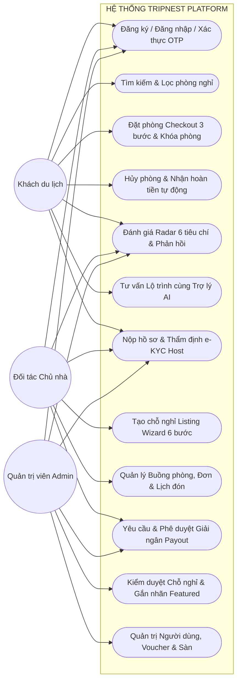

#### 3.2.2. Sơ đồ Use Case Phân hệ Khách hàng (Guest Use Cases)

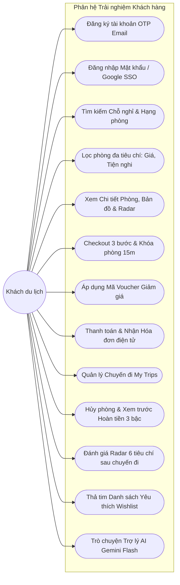

#### 3.2.3. Sơ đồ Use Case Phân hệ Đối tác Chủ nhà (Host Use Cases)

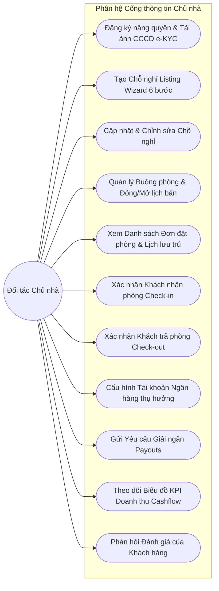

#### 3.2.4. Sơ đồ Use Case Phân hệ Quản trị viên (Admin Use Cases)

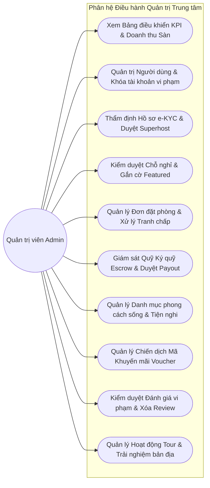

---

### 3.3. Bảng đặc tả Use Case chi tiết (Use Case Specifications)

#### UC-01: Đăng ký tài khoản & Xác thực OTP qua Email
- **Mã Use Case**: `UC-01`
- **Tên Use Case**: Đăng ký tài khoản người dùng và xác thực OTP
- **Tác nhân chính**: Khách du lịch (Guest) / Người dùng mới
- **Tiền điều kiện (Pre-conditions)**: Người dùng truy cập website và mở hộp thoại Đăng ký (`AuthModal`).
- **Hậu điều kiện (Post-conditions)**: Bản ghi tài khoản mới được kích hoạt trong `accounts` (`status = 'active'`), bản ghi hồ sơ cá nhân `users` được tạo, cấp mã Bearer JWT token.
- **Luồng sự kiện chính (Main Flow)**:
  1. Người dùng nhập Họ tên, Địa chỉ Email, Mật khẩu và Xác nhận mật khẩu.
  2. Người dùng nhấp nút "Tạo tài khoản".
  3. Hệ thống kiểm tra định dạng email và xác minh email chưa từng tồn tại trong bảng `accounts`.
  4. Hệ thống băm mật khẩu bằng thuật toán Bcrypt, tạo bản ghi `accounts` và `users` ở trạng thái chờ kích hoạt.
  5. Hệ thống sinh chuỗi OTP 6 số ngẫu nhiên, lưu vào bảng `password_otps` với thời hạn 15 phút, và đẩy tác vụ gửi mail `SendOtpMail` vào hàng đợi.
  6. Màn hình SPA chuyển sang bước nhập mã OTP xác thực.
  7. Người dùng mở hộp thư email, lấy mã 6 chữ số và nhập vào giao diện.
  8. Hệ thống so khớp mã OTP. Nếu chính xác, cập nhật `accounts.email_verified_at = NOW()` và `status = 'active'`.
  9. Hệ thống tự động tạo mã phiên đăng nhập, sinh Bearer JWT token trả về cho Client.
  10. Client lưu token vào `localStorage`, đồng bộ Redux store và đóng modal.
- **Luồng sự kiện thay thế (Alternative Flows)**:
  - *A1 - Email đã tồn tại*: Tại bước 3, nếu email đã có trong `accounts`, hệ thống hiển thị thông báo lỗi "Địa chỉ email này đã được đăng ký". Người dùng được hướng dẫn chuyển sang đăng nhập.
  - *A2 - Sai mã OTP hoặc mã hết hạn*: Tại bước 8, nếu mã OTP sai hoặc quá thời hạn 15 phút, hệ thống báo lỗi "Mã xác thực không hợp lệ hoặc đã hết hạn". Hiển thị nút "Gửi lại mã OTP mới".

#### UC-02: Đặt phòng Checkout 3 bước & Khóa phòng tạm thời
- **Mã Use Case**: `UC-02`
- **Tên Use Case**: Đặt phòng nghỉ dưỡng và thanh toán giữ chỗ trực tuyến
- **Tác nhân chính**: Khách du lịch (Guest)
- **Tiền điều kiện**: Khách đã đăng nhập, đã chọn phòng nghỉ và khoảng ngày lưu trú hợp lệ trên `RoomDetailPage`.
- **Hậu điều kiện**: Bản ghi `bookings` được tạo ở trạng thái `confirmed`, bản ghi `payments` được ghi nhận `successful`, trạng thái khóa phòng `room_locks` chuyển sang `converted`.
- **Luồng sự kiện chính**:
  1. Khách hàng nhấp nút "Đặt phòng" trên trang chi tiết phòng, hệ thống điều hướng đến `BookingCheckoutPage`.
  2. **Bước 1 (Review Trip)**: Khách rà soát lại ngày nhận phòng (sau 14:00), ngày trả phòng (trước 12:00), tổng số đêm, nội quy phòng. Khách bấm "Tiếp tục".
  3. **Bước 2 (Guest Information)**: Khách kiểm tra thông tin người đặt (Họ tên, SĐT, Email), nhập yêu cầu đặc biệt gửi Host (nếu có). Khách bấm "Tiếp tục sang thanh toán".
  4. **Bước 3 (Payment & Lock)**:
     - Hệ thống tự động gọi API kích hoạt phiên khóa phòng tạm thời `room_locks` với `lock_token` duy nhất và thời gian đếm ngược 15 phút.
     - Khách hàng nhập mã khuyến mãi Voucher (nếu có) và nhấn "Áp dụng". Hệ thống kiểm tra và trừ tiền chiết khấu.
     - Khách chọn phương thức thanh toán (Thẻ tín dụng / Cổng thanh toán trực tuyến).
     - Khách nhấn nút "Xác nhận & Thanh toán".
  5. Hệ thống mở Database Transaction:
     - Kiểm tra lại tính hợp lệ của `room_locks`.
     - Tạo bản ghi trong bảng `bookings` với mã định danh `TN-XXXXXX`, lưu snapshot giá phòng, phí dịch vụ sàn và chiết khấu.
     - Cập nhật `room_locks.status = 'converted'`.
     - Tạo bản ghi trong bảng `payments` với trạng thái `successful`.
     - Commit Transaction.
  6. Hệ thống gửi email hóa đơn xác nhận đặt phòng đến địa chỉ email của khách hàng và gửi thông báo đơn mới đến Host.
  7. Điều hướng khách hàng đến màn hình Thông báo đặt phòng thành công kèm mã QR tra cứu đơn.
- **Luồng sự kiện thay thế**:
  - *A1 - Phòng bị trùng lịch hoặc có người khác đang giữ chỗ*: Tại bước 4, nếu phòng vừa bị người khác đặt hoặc đang trong phiên giữ chỗ của khách khác, hệ thống báo lỗi HTTP 422: "Phòng đã có khách giữ chỗ trong khoảng ngày này". Hệ thống điều hướng khách về trang chi tiết và đề xuất ngày khác.
  - *A2 - Hết thời gian giữ chỗ 15 phút (Timeout)*: Nếu đồng hồ đếm ngược về 00:00 mà khách chưa bấm thanh toán, hệ thống hủy phiên lock, hiển thị thông báo "Phiên giữ chỗ của bạn đã hết hạn, vui lòng thao tác lại".

#### UC-03: Hủy phòng & Tính toán hoàn tiền tự động 3 bậc
- **Mã Use Case**: `UC-03`
- **Tên Use Case**: Yêu cầu hủy đơn đặt phòng và nhận tiền hoàn tự động
- **Tác nhân chính**: Khách du lịch (Guest)
- **Tiền điều kiện**: Khách đã đăng nhập, đơn đặt phòng đang ở trạng thái `confirmed` tại `MyTripsPage`.
- **Hậu điều kiện**: Đơn phòng chuyển sang trạng thái `cancelled`, bản ghi hoàn tiền được tạo trong `refunds`, phòng được mở lại cho khách khác đặt.
- **Luồng sự kiện chính**:
  1. Khách mở trang "Chuyến đi của tôi" (`MyTripsPage`) và nhấp nút "Hủy phòng" tại đơn phòng muốn hủy.
  2. Client gửi yêu cầu `GET /api/bookings/{id}/cancel-preview` lên máy chủ.
  3. Máy chủ gọi `CancellationPolicyService::calculate(booking)` để đo khoảng cách thời gian từ thời điểm hiện tại đến 14:00 ngày nhận phòng:
     - Nếu khoảng cách >= 48 giờ: Áp dụng bậc 1 (Hoàn 100% toàn bộ chi phí gồm tiền phòng, phí vệ sinh và phí sàn).
     - Nếu khoảng cách < 48 giờ và trước giờ nhận phòng: Áp dụng bậc 2 (Hoàn 50% tiền phòng gốc và phí vệ sinh, sàn giữ lại phí dịch vụ công nghệ).
     - Nếu đã quá 14:00 ngày nhận phòng: Áp dụng bậc 3 (Hoàn 0%, không đủ điều kiện hoàn trả).
  4. Hệ thống hiển thị hộp thoại xác nhận hủy phòng, hiển thị chi tiết số tiền ban đầu đã thanh toán, tỷ lệ hoàn trả và số tiền thực nhận.
  5. Khách hàng nhập lý do hủy phòng và nhấp "Xác nhận hủy đặt phòng".
  6. Hệ thống mở Database Transaction:
     - Cập nhật `bookings.status = 'cancelled'`, ghi nhận `refund_amount` và `cancelled_at = NOW()`.
     - Tạo bản ghi hoàn tiền trong bảng `refunds` với trạng thái `approved`.
     - Commit Transaction.
  7. Hệ thống gửi email thông báo hủy phòng và xác nhận hoàn tiền cho khách, đồng thời báo cho Host biết để nhận khách khác.
  8. Giao diện SPA cập nhật trạng thái đơn sang thẻ "ĐÃ HỦY".

#### UC-04: Đăng tải cơ sở lưu trú qua Listing Wizard 6 bước
- **Mã Use Case**: `UC-04`
- **Tên Use Case**: Tạo mới khuôn viên cơ sở lưu trú và các hạng phòng ngủ
- **Tác nhân chính**: Đối tác Chủ nhà (Host đã xác thực e-KYC)
- **Tiền điều kiện**: Tài khoản có vai trò `role = host` và `kyc_status = verified`.
- **Hậu điều kiện**: Bản ghi `accommodations` mới được tạo ở trạng thái `draft`, các hạng phòng con được lưu trong `rooms`, album ảnh lưu trong `accommodation_images` và `room_images`.
- **Luồng sự kiện chính**:
  1. Host truy cập Cổng thông tin chủ nhà và nhấn "Thêm chỗ nghỉ mới" (`HostListingWizardPage`).
  2. **Bước 1 (Thông tin cơ bản)**: Host nhập tên khu nghỉ dưỡng, chọn danh mục phong cách sống (Biệt thự, Sát biển, View núi,...), viết đoạn mô tả chi tiết.
  3. **Bước 2 (Vị trí & Bản đồ)**: Host chọn Tỉnh/Thành phố, Quận/Huyện, nhập địa chỉ chi tiết, ghim tọa độ chính xác trên bản đồ định vị `VietnamLocationMapInput`.
  4. **Bước 3 (Tiện ích khuôn viên)**: Host tích chọn các tiện ích chung của khuôn viên (Bể bơi riêng, Sân vườn BBQ, Chỗ đỗ xe ô tô, Trạm sạc xe điện,...).
  5. **Bước 4 (Thiết lập hạng phòng)**: Host khởi tạo một hoặc nhiều hạng phòng ngủ con (Tên phòng, loại không gian, giá niêm yết theo đêm, phí vệ sinh, sức chứa người lớn/trẻ em, số giường ngủ, tiện nghi phòng ngủ).
  6. **Bước 5 (Tải lên album ảnh)**: Host kéo thả bộ sưu tập ảnh chất lượng cao. Ảnh được đẩy trực tiếp lên Cloudinary CDN và trả về danh sách URL.
  7. **Bước 6 (Nội quy & Chính sách)**: Host thiết lập khung giờ nhận phòng (mặc định 14:00), trả phòng (mặc định 12:00), chính sách lưu trú và gửi duyệt.
  8. Hệ thống lưu toàn bộ dữ liệu vào CSDL trong một Transaction an toàn.
  9. Chỗ nghỉ được tạo thành công ở trạng thái `draft` và chuyển sang danh sách chờ Admin kiểm duyệt.

#### UC-05: Thẩm định hồ sơ định danh e-KYC Chủ nhà
- **Mã Use Case**: `UC-05`
- **Tên Use Case**: Thẩm định và phê duyệt quyền đối tác cho thuê cơ sở lưu trú
- **Tác nhân chính**: Quản trị viên sàn (Admin)
- **Tiền điều kiện**: Host đã nộp hồ sơ e-KYC, bản ghi trong bảng `hosts` có `kyc_status = 'pending'`.
- **Hậu điều kiện**: Cập nhật `hosts.kyc_status = 'verified'`, nâng quyền `accounts.role = 'host'`.
- **Luồng sự kiện chính**:
  1. Admin đăng nhập vào Admin Portal và mở mục "Thẩm định e-KYC Host" (`HostsKycPage`).
  2. Hệ thống hiển thị danh sách hồ sơ đang chờ xét duyệt.
  3. Admin nhấp chọn một hồ sơ đối tác để xem thông tin chi tiết:
     - Tên thương hiệu hiển thị, số điện thoại hotline, mã số thuế doanh nghiệp.
     - Trình phóng to ảnh mặt trước CCCD, mặt sau CCCD, ảnh chân dung cầm CCCD và giấy phép kinh doanh / an toàn PCCC.
  4. Admin kiểm tra tính hợp lệ và không có dấu hiệu chỉnh sửa giả mạo.
  5. Admin nhấp nút "Phê duyệt đối tác".
  6. Hệ thống cập nhật `hosts.kyc_status = 'verified'`, gán `verified_at = NOW()` và `verified_by = admin_id`.
  7. Hệ thống cập nhật quyền hạn tài khoản tương ứng `accounts.role = 'host'`.
  8. Hệ thống gửi email chúc mừng và kích hoạt tính năng đăng phòng cho Host.

#### UC-06: Quyết toán Payout & Ký quỹ Escrow
- **Mã Use Case**: `UC-06`
- **Tên Use Case**: Yêu cầu giải ngân và quyết toán doanh thu cho chủ nhà
- **Tác nhân chính**: Đối tác Chủ nhà (Host) & Quản trị viên (Admin)
- **Tiền điều kiện**: Host có các đơn đặt phòng đã hoàn tất kỳ nghỉ (`status = 'completed'`) và có số dư khả dụng > 0.
- **Hậu điều kiện**: Lệnh giải ngân được duyệt, tiền được chuyển về tài khoản ngân hàng của Host, quỹ ký quỹ Escrow được trừ tương ứng.
- **Luồng sự kiện chính**:
  1. Host mở mục "Tài chính & Doanh thu" trên Host Portal (`HostFinancialsPage`).
  2. Hệ thống hiển thị bảng kê số dư: Doanh thu tạm giữ trong Quỹ Escrow và Số dư khả dụng có thể rút.
  3. Host chọn tài khoản ngân hàng thụ hưởng đã đăng ký (`host_payout_accounts`), nhập số tiền muốn rút và bấm "Gửi yêu cầu giải ngân".
  4. Hệ thống kiểm tra số dư khả dụng, tạo bản ghi `payout_transactions` với trạng thái `pending` và mã `PO-XXXXXX`.
  5. Admin mở mục "Quản trị Tài chính & Dòng tiền" (`FinancialsPage`), xem danh sách yêu cầu Payout đang chờ xử lý.
  6. Kế toán sàn thực hiện lệnh ủy nhiệm chi chuyển tiền qua hệ thống ngân hàng đến số tài khoản của Host.
  7. Admin nhập mã giao dịch ngân hàng (`transaction_reference`) và bấm "Xác nhận đã chuyển tiền".
  8. Hệ thống cập nhật `payout_transactions.status = 'completed'` và `transferred_at = NOW()`.
  9. Hệ thống khấu trừ số tiền tương ứng khỏi Quỹ ký quỹ Escrow và ghi nhận doanh thu phí hoa hồng sàn (12%) vào báo cáo tài chính sàn.

---

### 3.4. Biểu đồ Hoạt động (Activity Diagrams) 8 luồng cốt lõi

#### 3.4.1. Luồng Đăng ký & Kích hoạt OTP qua Email
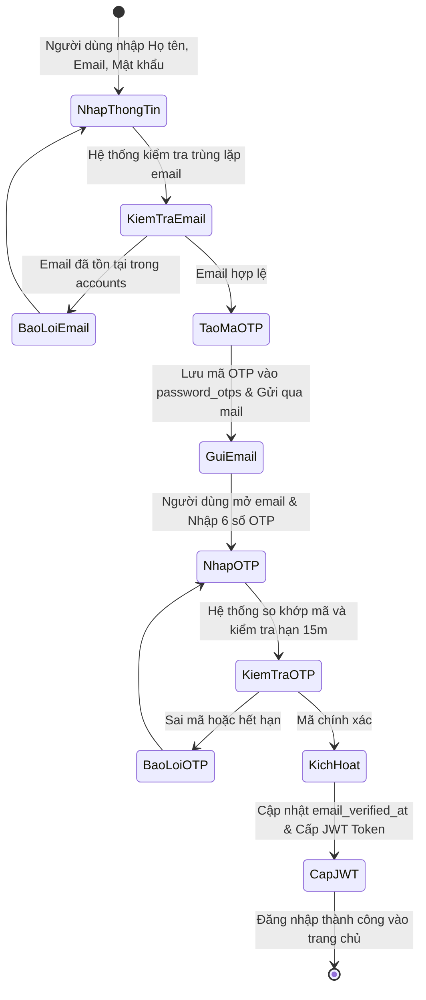

#### 3.4.2. Luồng Đăng nhập & Xác thực Phân quyền JWT
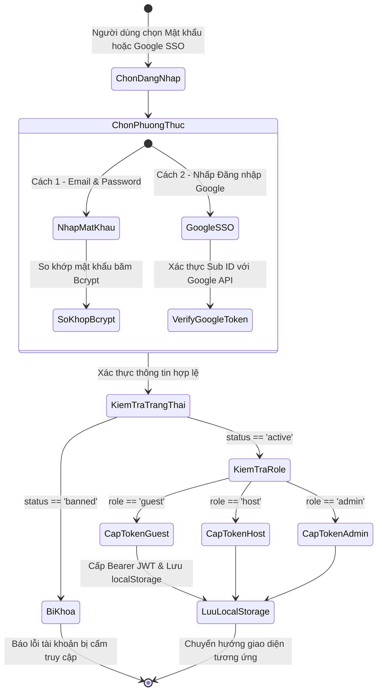

#### 3.4.3. Luồng Tìm kiếm & Lọc phòng Nghỉ dưỡng đa tiêu chí
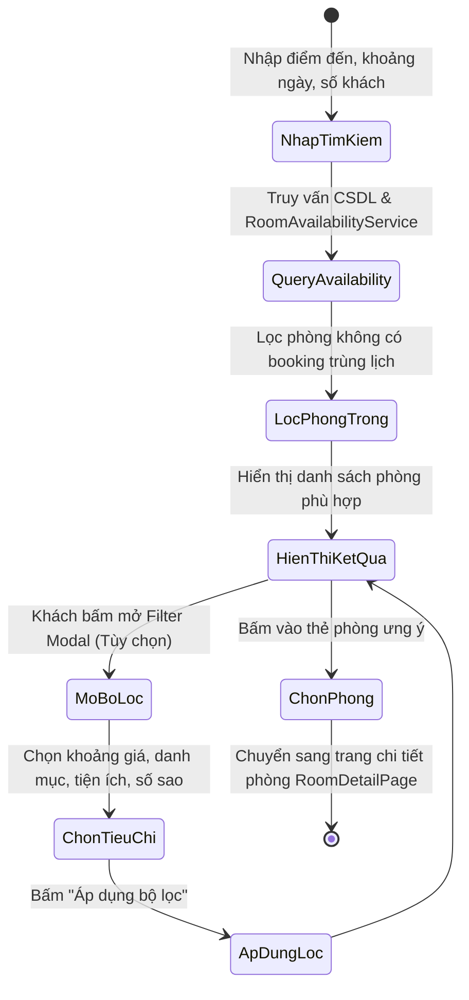

#### 3.4.4. Luồng Đặt phòng Checkout 3 bước & Khóa phòng `room_locks`
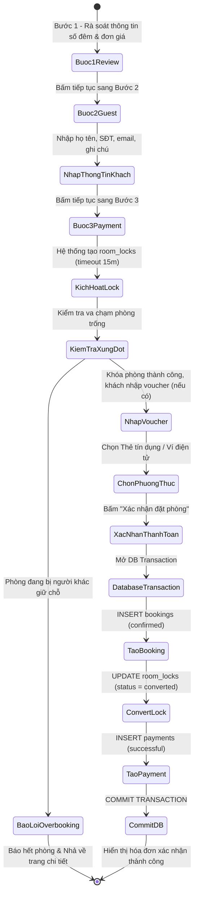

#### 3.4.5. Luồng Hủy phòng & Hoàn tiền tự động 3 bậc (`CancellationPolicyService`)
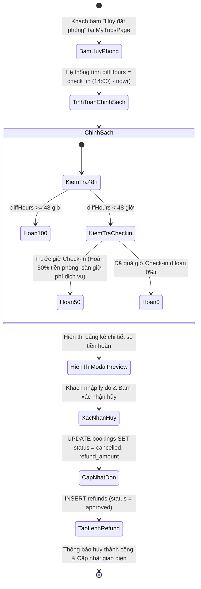

#### 3.4.6. Luồng Khởi tạo Chỗ nghỉ qua Listing Wizard 6 bước
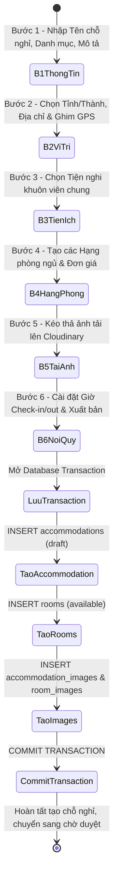

#### 3.4.7. Luồng Thẩm định hồ sơ e-KYC Đối tác Chủ nhà
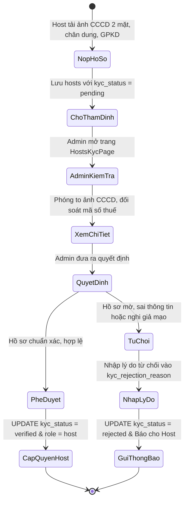

#### 3.4.8. Luồng Rút tiền & Quyết toán Payout của Host
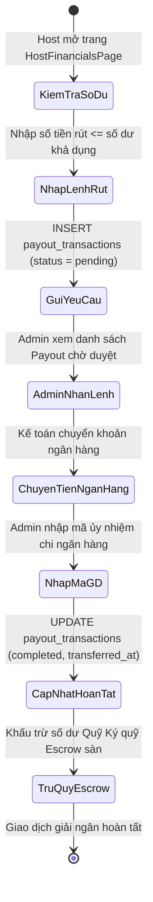

---

### 3.5. Biểu đồ Tuần tự (Sequence Diagrams) 5 luồng xương sống

#### 3.5.1. Luồng Đặt phòng Checkout với Khóa phòng tạm thời (`room_locks`)
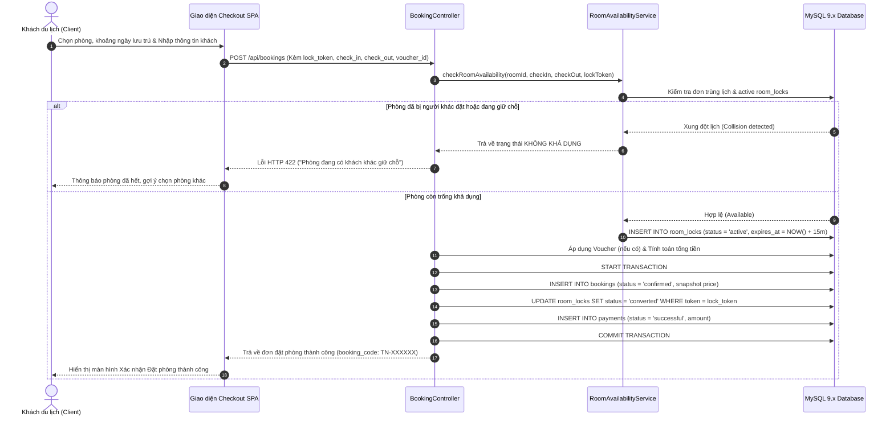

#### 3.5.2. Luồng Hủy phòng & Tính toán Hoàn tiền tự động 3 bậc
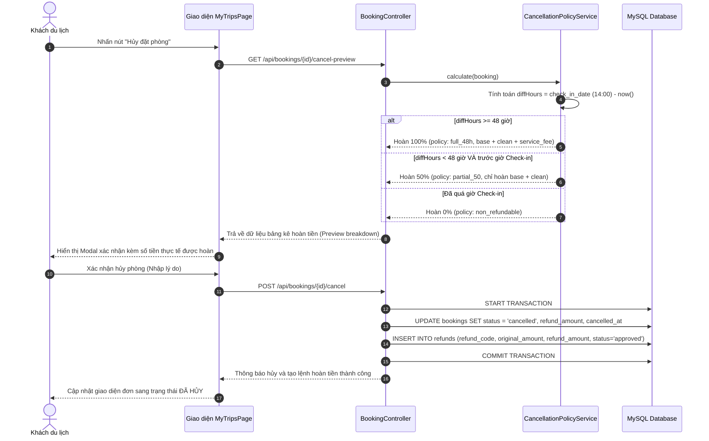

#### 3.5.3. Luồng Thẩm định hồ sơ e-KYC & Cấp quyền Host
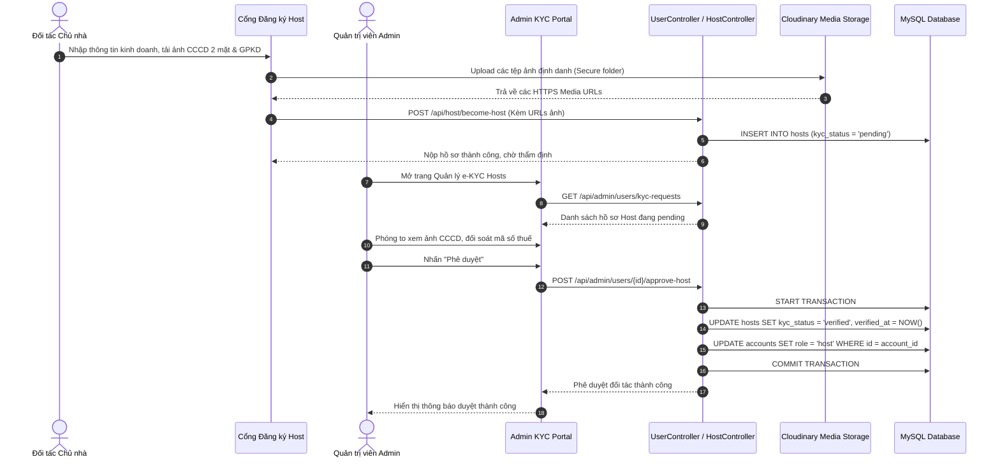

#### 3.5.4. Luồng Ký quỹ Trung gian Escrow & Quyết toán Payout cho Host
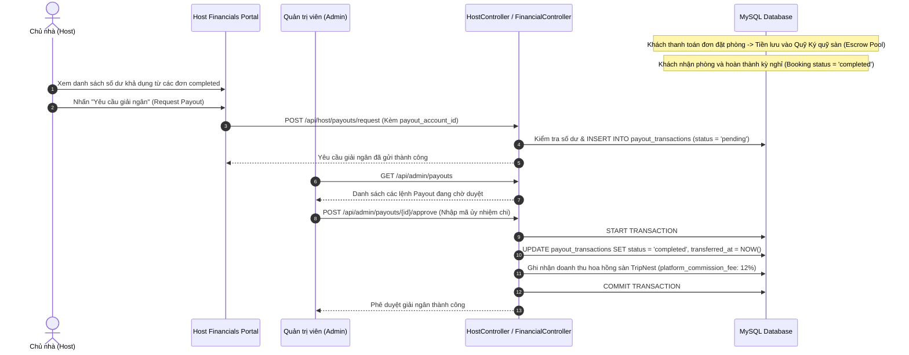

#### 3.5.5. Luồng Trò chuyện với Trợ lý ảo AI Du lịch (Gemini 3.6 Flash)
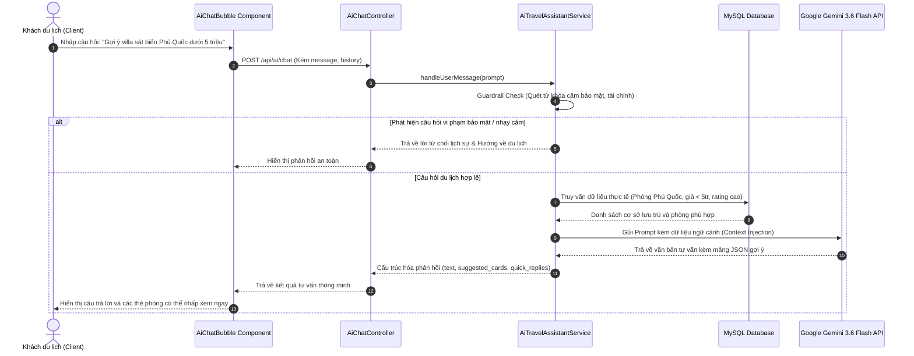

---

### 3.6. Thiết kế Cơ sở Dữ liệu (Chuẩn hóa 100% DBML & MySQL Live)

Toàn bộ hệ thống cơ sở dữ liệu TripNest gồm **31 bảng thực thể** được thiết kế khoa học, đạt chuẩn 3NF và phân thành 6 nhóm nghiệp vụ chính (TableGroups):

```text
Phân loại 6 Nhóm Bảng theo chuẩn DBML TableGroups:
├── 1. TableGroup Authentication_And_Users (5 bảng):
│   ├── accounts: Tài khoản đăng nhập, mật khẩu Bcrypt, Google SSO, phân quyền vai trò.
│   ├── password_otps: Mã OTP xác thực 6 số gửi qua email có thời hạn 15 phút.
│   ├── users: Hồ sơ nhân thân người dùng (Họ tên, SĐT, CCCD, ngày sinh, avatar).
│   ├── hosts: Tư cách pháp nhân đối tác cho thuê, hồ sơ e-KYC, huy hiệu Superhost.
│   └── host_payout_accounts: Tài khoản ngân hàng / ví điện tử thụ hưởng giải ngân.
├── 2. TableGroup Accommodation_And_Listings (8 bảng):
│   ├── categories: Danh mục phân loại theo phong cách sống (Biệt thự, Sát biển, View núi,...).
│   ├── amenities: Danh mục tiện ích chuẩn hóa toàn sàn (Wifi, Bể bơi, BBQ, Trạm sạc,...).
│   ├── accommodations: Khuôn viên cơ sở lưu trú (Parent Entity), tọa độ GPS, nội quy.
│   ├── rooms: Đơn vị phòng ngủ con có thể bán độc lập (Child Entity), diện tích, giá gốc.
│   ├── accommodation_images: Album ảnh khuôn viên toàn cảnh khu nghỉ dưỡng.
│   ├── room_images: Album ảnh nội thất chi tiết từng phòng ngủ.
│   ├── accommodation_amenity: Bảng nối N-N gán tiện ích khuôn viên chung cho cơ sở lưu trú.
│   └── room_amenity: Bảng nối N-N gán tiện nghi riêng tư cho từng phòng ngủ con.
├── 3. TableGroup Booking_And_Reviews (5 bảng):
│   ├── bookings: Hợp đồng đặt phòng (Core Transaction), snapshot đơn giá, trạng thái đơn.
│   ├── room_locks: Cơ chế khóa phòng tạm thời 15 phút chống triệt để Overbooking.
│   ├── vouchers: Chiến dịch mã khuyến mãi giảm giá theo % hoặc số tiền cố định.
│   ├── reviews: Đánh giá chất lượng dịch vụ theo Biểu đồ Radar 6 tiêu chí quốc tế.
│   └── wishlists: Danh sách cơ sở lưu trú và phòng yêu thích của du khách.
├── 4. TableGroup Financial_And_Escrow (5 bảng):
│   ├── payments: Giao dịch thanh toán trực tuyến, cổng thanh toán, mã hóa đơn.
│   ├── payout_transactions: Lệnh rút tiền giải ngân cho Host sau khi trừ 12% hoa hồng.
│   ├── refunds: Bản ghi đối soát hoàn tiền tự động 3 bậc khi hủy đơn phòng.
│   ├── exchange_rates: Tỷ giá quy đổi đa ngoại tệ (USD, EUR, JPY, GBP, AUD) neo theo VND.
│   └── experiences: Hoạt động trải nghiệm tour và văn hóa bản địa.
├── 5. TableGroup System_Security (3 bảng):
│   ├── personal_access_tokens: Quản lý token truy cập API người dùng (Sanctum / JWT).
│   ├── sessions: Quản lý phiên làm việc Client, địa chỉ IP và User Agent trình duyệt.
│   └── password_reset_tokens: Token đặt lại mật khẩu theo chuẩn bảo mật Laravel.
└── 6. TableGroup System_Queue_And_Cache (5 bảng):
    ├── cache: Lưu trữ dữ liệu bộ nhớ đệm tốc độ cao.
    ├── cache_locks: Khóa nguyên tử (Atomic Lock) chống Race Conditions đa luồng.
    ├── jobs: Hàng đợi tác vụ bất đồng bộ (Gửi mail OTP, thông báo đơn phòng).
    ├── job_batches: Quản lý lô công việc xử lý hàng loạt (Job Batching).
    └── failed_jobs: Lưu vết chi tiết các tác vụ hàng đợi bị lỗi (Stack Trace).
```

---

### 3.7. Từ điển dữ liệu chi tiết toàn bộ 31 bảng CSDL


##### Bảng 3.1: Cấu trúc dữ liệu chi tiết bảng `accounts`
> **Mục đích nghiệp vụ**: Lớp Xác thực (Authentication Layer): Tách biệt độc lập khỏi thông tin nhân thân (users). Quản lý bảo mật đăng nhập: Hỗ trợ cả đăng nhập truyền thống (Email/Mật khẩu Bcrypt) và đăng nhập mạng xã hội (Google OAuth2 Single Sign-On). Kiểm soát trạng thái tài khoản (chặn truy cập nếu bị ban) và phân quyền 3 cấp (Role-based). 

| STT | Tên trường (Field) | Kiểu dữ liệu (Data Type) | Ràng buộc & Khóa (Constraints / Keys) | Diễn giải & Ý nghĩa nghiệp vụ |
| :---: | :--- | :--- | :--- | :--- |
| 1 | `id` | `bigint` | pk, increment | [PK] Khóa chính tự tăng, định danh duy nhất cho mỗi tài khoản đăng nhập trên hệ thống |
| 2 | `email` | `varchar(191)` | unique, not null | Email đăng nhập duy nhất (Unique Index). Chuẩn hóa 191 ký tự tối ưu cho B-Tree index MySQL utf8mb4 |
| 3 | `google_id` | `varchar(191)` | unique, null | Mã định danh Sub ID của Google (OAuth2). Dùng khi khách đăng nhập nhanh bằng tài khoản Google |
| 4 | `google_avatar` | `varchar(500)` | null | URL ảnh đại diện gốc đồng bộ tự động từ Google profile |
| 5 | `password` | `varchar(255)` | null | Mật khẩu mã hóa 1 chiều bằng thuật toán Bcrypt (cost factor 12), đảm bảo an toàn tuyệt đối |
| 6 | `role` | `enum('guest',` | 'host', 'admin') [default: 'guest', not null | Phân quyền 3 vai trò: 'guest' (khách thuê), 'host' (chủ nhà cho thuê), 'admin' (quản trị viên sàn) |
| 7 | `status` | `enum('active',` | 'inactive', 'banned') [default: 'active', not null | Trạng thái tài khoản: 'active' (bình thường), 'inactive' (chưa kích hoạt), 'banned' (bị khóa do vi phạm) |
| 8 | `email_verified_at` | `timestamp` | null | Mốc thời gian người dùng bấm xác thực email qua mã OTP 6 số |
| 9 | `last_login_at` | `timestamp` | null | Mốc thời gian lần cuối người dùng đăng nhập vào hệ thống (phục vụ thống kê MAU/DAU) |
| 10 | `remember_token` | `varchar(100)` | null | Chuỗi token ngẫu nhiên phục vụ tính năng "Ghi nhớ phiên đăng nhập" (Remember Me) của Laravel |
| 11 | `created_at` | `timestamp` | null | Thời điểm tạo tài khoản |
| 12 | `updated_at` | `timestamp` | null | Thời điểm cập nhật thông tin tài khoản gần nhất |
| 13 | `deleted_at` | `timestamp` | null | Xóa mềm (Soft Delete) - giúp giữ lại toàn vẹn lịch sử giao dịch và kế toán khi tài khoản bị hủy |


##### Bảng 3.2: Cấu trúc dữ liệu chi tiết bảng `password_otps`
> **Mục đích nghiệp vụ**: Quản lý mã xác thực OTP (One-Time Password) phục vụ tính năng quên mật khẩu / đặt lại mật khẩu. Khóa ngoại liên kết trực tiếp với accounts.id. Tự động xóa (cascade) khi tài khoản bị xóa. Lưu trữ thời gian hết hạn (expire_at) để kiểm tra tính hợp lệ của mã OTP. 

| STT | Tên trường (Field) | Kiểu dữ liệu (Data Type) | Ràng buộc & Khóa (Constraints / Keys) | Diễn giải & Ý nghĩa nghiệp vụ |
| :---: | :--- | :--- | :--- | :--- |
| 1 | `id` | `bigint` | pk, increment | [PK] Khóa chính tự tăng của bản ghi OTP |
| 2 | `account_id` | `bigint` | not null, ref: &gt; accounts.id | [FK] Khóa ngoại liên kết với tài khoản cần đặt lại mật khẩu (accounts.id) |
| 3 | `email` | `varchar(255)` | not null | Email của tài khoản nhận mã OTP để đối soát xác thực hai chiều |
| 4 | `otp` | `varchar(255)` | not null | Mã OTP 6 chữ số ngẫu nhiên gửi qua email cho người dùng |
| 5 | `expire_at` | `datetime` | not null | Mốc thời gian mã OTP hết hiệu lực (thường sau 5 - 15 phút kể từ lúc tạo) |
| 6 | `created_at` | `timestamp` | null | Thời điểm tạo mã OTP |
| 7 | `updated_at` | `timestamp` | null | Thời điểm cập nhật |


##### Bảng 3.3: Cấu trúc dữ liệu chi tiết bảng `users`
> **Mục đích nghiệp vụ**: Lớp Hồ sơ (Profile Layer): Lưu trữ toàn bộ thông tin nhân thân của khách du lịch. Quan hệ 1-1 với bảng accounts. Dùng để tự động điền thông tin khi khách đặt phòng (Checkout), in lên phiếu xác nhận đặt phòng và phục vụ thủ tục đăng ký tạm trú theo luật du lịch. 

| STT | Tên trường (Field) | Kiểu dữ liệu (Data Type) | Ràng buộc & Khóa (Constraints / Keys) | Diễn giải & Ý nghĩa nghiệp vụ |
| :---: | :--- | :--- | :--- | :--- |
| 1 | `id` | `bigint` | pk, increment | [PK] Khóa chính của hồ sơ người dùng |
| 2 | `account_id` | `bigint` | unique, not null, ref: - accounts.id | [FK 1-1] Liên kết với accounts.id. Xóa tài khoản accounts sẽ tự động xóa hồ sơ users (cascade) |
| 3 | `full_name` | `varchar(100)` | not null | Họ và tên đầy đủ hiển thị trên ứng dụng và hợp đồng đặt phòng |
| 4 | `phone_number` | `varchar(20)` | null | Số điện thoại liên lạc chính thức để gửi SMS OTP và để chủ nhà gọi đón khi nhận phòng |
| 5 | `avatar_url` | `varchar(500)` | null | Đường dẫn ảnh đại diện tùy chỉnh do người dùng tự tải lên từ thiết bị |
| 6 | `gender` | `enum('male',` | 'female', 'other') [default: 'other', not null | Giới tính: 'male' (nam), 'female' (nữ), 'other' (khác) phục vụ thống kê nhân khẩu học |
| 7 | `date_of_birth` | `date` | null | Ngày sinh của khách (hệ thống kiểm tra độ tuổi trên 18 tuổi để chịu trách nhiệm dân sự khi thuê phòng) |
| 8 | `id_card_number` | `varchar(30)` | null | Số CCCD hoặc Hộ chiếu của khách thuê để chủ nhà làm thủ tục khai báo tạm trú với cơ quan quản lý |
| 9 | `nationality` | `varchar(50)` | default: 'Việt Nam', not null | Quốc tịch của khách (mặc định 'Việt Nam') |
| 10 | `address` | `varchar(255)` | null | Địa chỉ nơi cư trú của người dùng |
| 11 | `bio` | `text` | null | Đoạn giới thiệu ngắn về bản thân và phong cách du lịch |
| 12 | `emergency_contact` | `varchar(150)` | null | Tên và SĐT người thân trong gia đình để liên hệ trong các trường hợp sự cố khẩn cấp |
| 13 | `created_at` | `timestamp` | null | Thời điểm tạo hồ sơ |
| 14 | `updated_at` | `timestamp` | null | Thời điểm cập nhật hồ sơ gần nhất |


##### Bảng 3.4: Cấu trúc dữ liệu chi tiết bảng `hosts`
> **Mục đích nghiệp vụ**: Quản lý tư cách pháp nhân và độ uy tín của Đối tác Chủ nhà (Host Partner). Lưu trữ hồ sơ định danh KYC (CCCD 2 mặt, ảnh chân dung, giấy phép kinh doanh lưu trú/PCCC). Ghi nhận điểm sao trung bình, huy hiệu Superhost và cam kết thời gian phản hồi tin nhắn. 

| STT | Tên trường (Field) | Kiểu dữ liệu (Data Type) | Ràng buộc & Khóa (Constraints / Keys) | Diễn giải & Ý nghĩa nghiệp vụ |
| :---: | :--- | :--- | :--- | :--- |
| 1 | `id` | `bigint` | pk, increment | [PK] Khóa chính định danh Đối tác Chủ nhà |
| 2 | `user_id` | `bigint` | unique, not null, ref: - users.id | [FK 1-1] Liên kết với users.id. Xác định người dùng nào là chủ sở hữu hồ sơ Host này |
| 3 | `host_display_name` | `varchar(100)` | not null | Tên thương hiệu hiển thị công khai cho du khách thấy (VD: "Minh Luxury Villas", "Đà Lạt Homestay") |
| 4 | `host_avatar_url` | `varchar(500)` | null | Logo thương hiệu hoặc ảnh đại diện chuyên nghiệp của chủ nhà |
| 5 | `host_introduction` | `text` | null | Bài viết giới thiệu kinh nghiệm làm du lịch và cam kết chất lượng hiếu khách |
| 6 | `languages_spoken` | `json` | null | Mảng JSON các ngôn ngữ chủ nhà có thể giao tiếp với du khách (VD: ["vi", "en"]) |
| 7 | `contact_phone` | `varchar(20)` | not null | Số điện thoại hotline chuyên dùng để tiếp đón khách nhận phòng |
| 8 | `contact_email` | `varchar(191)` | null | Email chính thức nhận thông báo có đơn đặt phòng mới và hóa đơn đối soát |
| 9 | `emergency_phone` | `varchar(20)` | null | Số điện thoại khẩn cấp 24/7 của quản lý cơ sở |
| 10 | `business_type` | `enum('individual',` | 'household', 'company') [default: 'individual', not null | Loại hình: 'individual' (cá nhân), 'household' (hộ kinh doanh), 'company' (doanh nghiệp lưu trú) |
| 11 | `business_name` | `varchar(150)` | null | Tên doanh nghiệp/hộ kinh doanh ghi trên Giấy phép kinh doanh |
| 12 | `tax_id` | `varchar(50)` | null | Mã số thuế phục vụ khấu trừ nghĩa vụ thuế thu nhập và xuất hóa đơn VAT điện tử |
| 13 | `id_card_number` | `varchar(30)` | not null | Số CCCD hoặc Hộ chiếu của người đại diện pháp luật |
| 14 | `id_card_front_url` | `varchar(500)` | not null | URL ảnh chụp mặt trước CCCD phục vụ quy trình xác thực danh tính KYC |
| 15 | `id_card_back_url` | `varchar(500)` | not null | URL ảnh chụp mặt sau CCCD phục vụ quy trình KYC |
| 16 | `portrait_photo_url` | `varchar(500)` | null | URL ảnh chân dung trực diện cầm CCCD để đối chiếu khuôn mặt thực tế chống mạo danh |
| 17 | `business_license_url` | `varchar(500)` | null | URL giấy phép kinh doanh dịch vụ lưu trú du lịch hoặc biên bản nghiệm thu PCCC |
| 18 | `kyc_status` | `enum('unverified',` | 'pending', 'verified', 'rejected') [default: 'pending', not null | Trạng thái KYC: 'unverified' (chưa nộp), 'pending' (chờ duyệt), 'verified' (hợp lệ), 'rejected' (bị từ chối) |
| 19 | `kyc_rejection_reason` | `text` | null | Lý do Admin từ chối duyệt hồ sơ để Host biết đường bổ sung lại giấy tờ |
| 20 | `verified_at` | `timestamp` | null | Mốc thời gian hồ sơ đối tác được Admin phê duyệt chính thức |
| 21 | `verified_by` | `bigint` | null, ref: &gt; accounts.id | [FK] Tài khoản accounts.id của Admin đã thực hiện duyệt hồ sơ đối tác này |
| 22 | `is_superhost` | `boolean` | default: false, not null | Huy hiệu Chủ nhà Siêu cấp (Superhost) dành cho Host có rating > 4.8 sao và tỷ lệ hủy đơn dưới 1% |
| 23 | `host_rating` | `decimal(3,2)` | default: 5.00, not null | Điểm đánh giá sao uy tín trung bình của Host tính gộp từ tất cả các phòng |
| 24 | `host_reviews_count` | `int` | default: 0, not null | Tổng số lượt khách đã gửi đánh giá cho Host này |
| 25 | `response_rate_percent` | `tinyint` | default: 100, not null | Tỷ lệ phản hồi tin nhắn của khách tính theo phần trăm (0 - 100%) |
| 26 | `response_time_text` | `varchar(50)` | default: 'trong vòng 1 giờ', not null | Cam kết thời gian phản hồi tin nhắn (VD: "trong vòng 1 giờ") |
| 27 | `terms_accepted_at` | `timestamp` | null | Mốc thời gian bấm chấp thuận Thỏa thuận Hợp tác Kinh doanh trên sàn TripNest |
| 28 | `created_at` | `timestamp` | null | Thời điểm đăng ký làm Host |
| 29 | `updated_at` | `timestamp` | null | Thời điểm cập nhật thông tin Host |


##### Bảng 3.5: Cấu trúc dữ liệu chi tiết bảng `host_payout_accounts`
> **Mục đích nghiệp vụ**: Lưu trữ tài khoản ngân hàng hoặc ví điện tử thụ hưởng của Đối tác Chủ nhà. Nền tảng dùng thông tin này để chuyển khoản giải ngân (Payout) sau khi khách trả phòng. Đã tối ưu hóa loại bỏ các trường quốc tế thừa (swift_code, bank_branch, currency,...). 

| STT | Tên trường (Field) | Kiểu dữ liệu (Data Type) | Ràng buộc & Khóa (Constraints / Keys) | Diễn giải & Ý nghĩa nghiệp vụ |
| :---: | :--- | :--- | :--- | :--- |
| 1 | `id` | `bigint` | pk, increment | [PK] Khóa chính tài khoản thụ hưởng |
| 2 | `host_id` | `bigint` | not null, ref: &gt; hosts.id | [FK] Khóa ngoại xác định tài khoản này thuộc về Chủ nhà nào |
| 3 | `account_type` | `enum('bank_transfer',` | 'momo', 'vnpay', 'paypal', 'stripe') [default: 'bank_transfer', not null | Phương thức nhận tiền: 'bank_transfer', 'momo', 'vnpay', 'paypal', 'stripe' |
| 4 | `bank_name` | `varchar(100)` | not null | Tên ngân hàng thụ hưởng (Vietcombank, Techcombank, MBBank,...) |
| 5 | `account_number` | `varchar(50)` | not null | Số tài khoản ngân hàng nhận tiền giải ngân |
| 6 | `account_holder_name` | `varchar(100)` | not null | Tên chủ tài khoản viết hoa không dấu (bắt buộc trùng khớp với tên trên CCCD của Host) |
| 7 | `is_default` | `boolean` | default: false, not null | Đánh dấu tài khoản chính nhận tiền tự động khi đến phiên giải ngân |
| 8 | `is_verified` | `boolean` | default: true, not null | Trạng thái tài khoản đã được đối soát tên hợp lệ với ngân hàng |
| 9 | `created_at` | `timestamp` | null | Thời điểm thêm tài khoản |
| 10 | `updated_at` | `timestamp` | null | Thời điểm cập nhật tài khoản |


##### Bảng 3.6: Cấu trúc dữ liệu chi tiết bảng `categories`
> **Mục đích nghiệp vụ**: Phân loại cơ sở lưu trú theo phong cách trải nghiệm sống (Lifestyle Curation) tương tự thanh lướt Category của Airbnb (Biệt thự, Sát biển, View đồi núi, Cabin,...). 

| STT | Tên trường (Field) | Kiểu dữ liệu (Data Type) | Ràng buộc & Khóa (Constraints / Keys) | Diễn giải & Ý nghĩa nghiệp vụ |
| :---: | :--- | :--- | :--- | :--- |
| 1 | `id` | `bigint` | pk, increment | [PK] Khóa chính danh mục |
| 2 | `slug` | `varchar(50)` | unique, not null | Chuỗi định danh URL thân thiện cho SEO (VD: 'villas-luxury', 'beachfront') |
| 3 | `label_vi` | `varchar(100)` | not null | Tên danh mục tiếng Việt hiển thị trên thanh CategoryBar (VD: "Biệt thự", "View đồi") |
| 4 | `label_en` | `varchar(100)` | not null | Tên danh mục tiếng Anh cho giao diện du khách quốc tế |
| 5 | `icon` | `varchar(50)` | not null | Mã icon đại diện từ thư viện react-icons (VD: 'TbBeach', 'TbHome2') |
| 6 | `description` | `text` | null | Mô tả tiêu chuẩn phong cách của nhóm bất động sản này |
| 7 | `display_order` | `int` | default: 0, not null | Thứ tự ưu tiên sắp xếp hiển thị từ trái qua phải trên thanh danh mục trang chủ |
| 8 | `is_active` | `boolean` | default: true, not null | Công tắc bật/tắt hiển thị danh mục trên ứng dụng |
| 9 | `created_at` | `timestamp` | null | Thời điểm tạo danh mục |
| 10 | `updated_at` | `timestamp` | null | Thời điểm cập nhật danh mục |


##### Bảng 3.7: Cấu trúc dữ liệu chi tiết bảng `amenities`
> **Mục đích nghiệp vụ**: Từ điển Tiện nghi & Dịch vụ chuẩn hóa toàn sàn. Tránh việc Host tự nhập text tùy tiện làm hỏng bộ lọc tìm kiếm của du khách. 

| STT | Tên trường (Field) | Kiểu dữ liệu (Data Type) | Ràng buộc & Khóa (Constraints / Keys) | Diễn giải & Ý nghĩa nghiệp vụ |
| :---: | :--- | :--- | :--- | :--- |
| 1 | `id` | `bigint` | pk, increment | [PK] Khóa chính tiện nghi |
| 2 | `code` | `varchar(50)` | unique, not null | Mã định danh tiện nghi trong code (VD: 'wifi', 'pool', 'kitchen', 'bbq', 'jacuzzi') |
| 3 | `name_vi` | `varchar(100)` | not null | Tên tiện nghi tiếng Việt (VD: "Bể bơi vô cực", "Bếp nướng BBQ", "Bồn tắm Jacuzzi") |
| 4 | `name_en` | `varchar(100)` | not null | Tên tiện nghi tiếng Anh phục vụ khách nước ngoài |
| 5 | `icon` | `varchar(50)` | not null | Mã icon đại diện của tiện nghi |
| 6 | `target_type` | `enum('both',` | 'accommodation', 'room') [default: 'both', not null | Phạm vi: 'accommodation' (khuôn viên chung), 'room' (trong phòng ngủ), 'both' (cả hai) |
| 7 | `category` | `enum('basic',` | 'standout', 'safety', 'luxury') [default: 'basic', not null | Phân nhóm: 'basic' (cơ bản), 'standout' (nổi bật), 'safety' (an toàn/PCCC), 'luxury' (xa xỉ 5 sao) |
| 8 | `created_at` | `timestamp` | null | Thời điểm tạo tiện nghi |
| 9 | `updated_at` | `timestamp` | null | Thời điểm cập nhật tiện nghi |


##### Bảng 3.8: Cấu trúc dữ liệu chi tiết bảng `accommodations`
> **Mục đích nghiệp vụ**: Thực thể Cha (Parent Entity) đại diện cho toàn bộ khuôn viên khu nghỉ dưỡng/tòa nhà. Vừa quản lý Villa nguyên căn, vừa quản lý Khách sạn nhiều phòng ngủ bên trong. Lưu trữ vị trí GPS, giờ nhận/trả phòng và nội quy chung. 

| STT | Tên trường (Field) | Kiểu dữ liệu (Data Type) | Ràng buộc & Khóa (Constraints / Keys) | Diễn giải & Ý nghĩa nghiệp vụ |
| :---: | :--- | :--- | :--- | :--- |
| 1 | `id` | `bigint` | pk, increment | [PK] Khóa chính cơ sở lưu trú |
| 2 | `host_id` | `bigint` | not null, ref: &gt; hosts.id | [FK] Khóa ngoại trỏ đến Chủ nhà sở hữu bất động sản này |
| 3 | `category_id` | `bigint` | not null, ref: &gt; categories.id | [FK] Khóa ngoại trỏ đến danh mục phong cách thiết kế chính của khu nghỉ |
| 4 | `name_vi` | `varchar(255)` | not null | Tên khu nghỉ dưỡng tiếng Việt (VD: "Ana Mandara Villas Dalat Resort & Spa") |
| 5 | `name_en` | `varchar(255)` | null | Tên khu nghỉ dưỡng tiếng Anh |
| 6 | `accommodation_type` | `enum('hotel',` | 'resort', 'villa', 'homestay', 'apartment', 'cabin', 'yacht') [default: 'hotel', not null | Loại hình kiến trúc: 'hotel', 'resort', 'villa', 'homestay', 'apartment', 'cabin', 'yacht' |
| 7 | `star_rating` | `tinyint` | default: 0, not null | Xếp hạng sao chính thức từ 0 đến 5 sao |
| 8 | `description` | `longtext` | not null | Bài viết giới thiệu chi tiết không gian kiến trúc, lịch sử và cảnh quan khuôn viên |
| 9 | `address` | `varchar(255)` | not null | Địa chỉ thực tế (Số nhà, tên đường) |
| 10 | `city` | `varchar(100)` | not null | Thành phố/Tỉnh du lịch trọng điểm (Đà Lạt, Nha Trang, Phú Quốc,...) dùng để lọc tìm kiếm |
| 11 | `district` | `varchar(100)` | null | Quận / Huyện / Thị xã |
| 12 | `country` | `varchar(100)` | default: 'Việt Nam', not null | Quốc gia nơi đặt bất động sản (mặc định 'Việt Nam') |
| 13 | `latitude` | `decimal(10,8)` | null | Vĩ độ GPS chính xác dùng để tính khoảng cách cự ly km và chỉ đường |
| 14 | `longitude` | `decimal(11,8)` | null | Kinh độ GPS chính xác dùng để ghim vị trí trên bản đồ tương tác Google Maps |
| 15 | `distance_description` | `varchar(255)` | null | Mô tả cự ly ngắn (VD: "Cách chợ đêm Đà Lạt 1.5km, 5 phút lái xe") |
| 16 | `check_in_time` | `time` | default: '14:00:00', not null | Giờ bắt đầu cho phép nhận phòng tiêu chuẩn trong ngày (14:00) |
| 17 | `check_out_time` | `time` | default: '12:00:00', not null | Giờ chốt khách phải trả phòng tiêu chuẩn trong ngày (12:00) |
| 18 | `house_rules` | `text` | null | Nội quy lưu trú: giờ yên tĩnh ban đêm, quy định tiệc tùng, hút thuốc |
| 19 | `cancellation_policy` | `text` | null | Chính sách hủy phòng (hủy miễn phí trước 48h, hoặc không hoàn tiền) |
| 20 | `is_featured` | `boolean` | default: false, not null | Cờ đánh dấu cơ sở lưu trú nổi bật để hiển thị lên Banner Spotlight trang chủ |
| 21 | `status` | `enum('draft',` | 'published', 'paused', 'archived') [default: 'published', not null | Trạng thái: 'draft' (nháp), 'published' (đang mở bán), 'paused' (tạm ngưng), 'archived' (ngừng kinh doanh) |
| 22 | `created_at` | `timestamp` | null | Thời điểm tạo chỗ nghỉ |
| 23 | `updated_at` | `timestamp` | null | Thời điểm cập nhật chỗ nghỉ |
| 24 | `deleted_at` | `timestamp` | null | Xóa mềm chỗ nghỉ |


##### Bảng 3.9: Cấu trúc dữ liệu chi tiết bảng `rooms`
> **Mục đích nghiệp vụ**: Thực thể Con (Child Entity) đại diện cho từng đơn vị phòng ngủ cụ thể có thể bán. Villa nguyên căn có 1 phòng ('entire_place'); Khách sạn có nhiều hạng phòng ('Deluxe', 'Suite'). Lưu trữ giá gốc niêm yết theo VNĐ và tỷ lệ phí sàn. 

| STT | Tên trường (Field) | Kiểu dữ liệu (Data Type) | Ràng buộc & Khóa (Constraints / Keys) | Diễn giải & Ý nghĩa nghiệp vụ |
| :---: | :--- | :--- | :--- | :--- |
| 1 | `id` | `bigint` | pk, increment | [PK] Khóa chính của hạng phòng bán |
| 2 | `accommodation_id` | `bigint` | not null, ref: &gt; accommodations.id | [FK] Khóa ngoại trỏ về cơ sở lưu trú cha accommodations.id. Xóa accommodation sẽ cascade xóa rooms |
| 3 | `room_name_vi` | `varchar(255)` | not null | Tên hạng phòng tiếng Việt (VD: "Phòng Suite Hướng Đồi Cổ Điển") |
| 4 | `room_name_en` | `varchar(255)` | null | Tên hạng phòng tiếng Anh ("Hill View Classic Suite") |
| 5 | `room_type_code` | `varchar(50)` | default: 'entire_villa', not null | Mã loại phòng nội bộ trong mã nguồn |
| 6 | `space_type` | `enum('entire_place',` | 'private_room', 'shared_room') [default: 'entire_place', not null | Không gian: 'entire_place' (nguyên căn biệt lập), 'private_room' (phòng riêng), 'shared_room' (ở ghép dorm) |
| 7 | `description` | `longtext` | not null | Mô tả nội thất, tầm nhìn ban công và trang thiết bị riêng trong phòng |
| 8 | `room_size_m2` | `decimal(6,2)` | null | Diện tích phòng ngủ tính theo mét vuông (m2) |
| 9 | `price_per_night` | `decimal(14,2)` | not null | Giá niêm yết gốc cho 1 đêm nghỉ tính theo VNĐ (Snapshot đơn giá) |
| 10 | `cleaning_fee` | `decimal(12,2)` | default: 500000.00, not null | Phí dọn dẹp vệ sinh phòng một lần tính trên cả chuyến đi (VNĐ) |
| 11 | `service_fee_percent` | `decimal(4,2)` | default: 12.00, not null | Tỷ lệ phần trăm phí dịch vụ công nghệ sàn TripNest thu (mặc định 12%) |
| 12 | `max_guests` | `tinyint` | default: 2, not null | Sức chứa khách tối đa cho phép trong phòng |
| 13 | `bedrooms_count` | `tinyint` | default: 1, not null | Số lượng phòng ngủ bên trong |
| 14 | `beds_count` | `tinyint` | default: 1, not null | Số lượng giường ngủ (giường đôi King, giường đơn Twin) |
| 15 | `bathrooms_count` | `decimal(3,1)` | default: 1.0, not null | Số lượng phòng tắm khép kín (hỗ trợ số lẻ như 1.5 phòng tắm) |
| 16 | `total_inventory` | `int` | default: 1, not null | Số lượng phòng trống cùng hạng sẵn có để mở bán trên sàn |
| 17 | `rating` | `decimal(3,2)` | default: 5.00, not null | Điểm đánh giá sao trung bình của riêng hạng phòng này |
| 18 | `reviews_count` | `int` | default: 0, not null | Tổng số lượt nhận xét đánh giá dành riêng cho hạng phòng này |
| 19 | `is_guest_favorite` | `boolean` | default: false, not null | Huy hiệu "Khách yêu thích" dành cho phòng thuộc top 5% được yêu thích nhất sàn |
| 20 | `status` | `enum('available',` | 'maintenance', 'hidden') [default: 'available', not null | Tình trạng: 'available' (mở bán), 'maintenance' (đang sửa chữa), 'hidden' (tạm ẩn) |
| 21 | `created_at` | `timestamp` | null | Thời điểm tạo phòng |
| 22 | `updated_at` | `timestamp` | null | Thời điểm cập nhật thông tin phòng |
| 23 | `deleted_at` | `timestamp` | null | Xóa mềm phòng |


##### Bảng 3.10: Cấu trúc dữ liệu chi tiết bảng `accommodation_images`
> **Mục đích nghiệp vụ**: Quản lý album ảnh tổng thể của khu nghỉ dưỡng: flycam khuôn viên, sảnh, hồ bơi ngoài trời. Cột image_url kiểu TEXT cho phép lưu trữ URL dài từ CDN, Google, Bing, Presigned S3. 

| STT | Tên trường (Field) | Kiểu dữ liệu (Data Type) | Ràng buộc & Khóa (Constraints / Keys) | Diễn giải & Ý nghĩa nghiệp vụ |
| :---: | :--- | :--- | :--- | :--- |
| 1 | `id` | `bigint` | pk, increment | [PK] Khóa chính ảnh |
| 2 | `accommodation_id` | `bigint` | not null, ref: &gt; accommodations.id | [FK] Khóa ngoại trỏ đến cơ sở lưu trú accommodations.id |
| 3 | `image_url` | `text` | not null | Đường dẫn ảnh CDN Cloudinary/S3/Web chất lượng cao (hỗ trợ URL dài không giới hạn 500 ký tự) |
| 4 | `image_type` | `varchar(50)` | default: 'exterior', null | Góc chụp: 'exterior' (ngoại cảnh), 'room', 'pool' (hồ bơi), 'view', 'amenity' |
| 5 | `google_search_link` | `text` | null | Link tham khảo ảnh gốc |
| 6 | `caption` | `varchar(255)` | null | Chú thích ảnh hiển thị trong trình phóng to Lightbox (VD: "Toàn cảnh khuôn viên lúc hoàng hôn") |
| 7 | `display_order` | `int` | default: 0, not null | Thứ tự ưu tiên sắp xếp trong bộ sưu tập Gallery ảnh |
| 8 | `is_thumbnail` | `boolean` | default: false, not null | Đánh dấu ảnh bìa đại diện (Cover Photo) trên thẻ ListingCard ngoài trang chủ |
| 9 | `created_at` | `timestamp` | null | Thời điểm tải ảnh lên |
| 10 | `updated_at` | `timestamp` | null | Thời điểm cập nhật ảnh |


##### Bảng 3.11: Cấu trúc dữ liệu chi tiết bảng `room_images`
> **Mục đích nghiệp vụ**: Quản lý album ảnh nội thất chi tiết của từng phòng: góc giường ngủ, bồn tắm khép kín, ban công. Cột image_url kiểu TEXT hỗ trợ URL dài từ mọi dịch vụ lưu trữ ảnh. 

| STT | Tên trường (Field) | Kiểu dữ liệu (Data Type) | Ràng buộc & Khóa (Constraints / Keys) | Diễn giải & Ý nghĩa nghiệp vụ |
| :---: | :--- | :--- | :--- | :--- |
| 1 | `id` | `bigint` | pk, increment | [PK] Khóa chính ảnh |
| 2 | `room_id` | `bigint` | not null, ref: &gt; rooms.id | [FK] Khóa ngoại trỏ đến hạng phòng chi tiết rooms.id |
| 3 | `image_url` | `text` | not null | Đường dẫn ảnh chi tiết phòng trên CDN (hỗ trợ URL dài) |
| 4 | `image_type` | `varchar(50)` | default: 'room', null | Góc chụp nội thất: 'room' (phòng ngủ), 'bathroom' (phòng tắm), 'balcony' (ban công) |
| 5 | `google_search_link` | `text` | null | Link tham khảo ảnh gốc |
| 6 | `caption` | `varchar(255)` | null | Chú thích ảnh chi tiết phòng |
| 7 | `display_order` | `int` | default: 0, not null | Thứ tự hiển thị ảnh trong trang chi tiết phòng |
| 8 | `is_thumbnail` | `boolean` | default: false, not null | Đánh dấu ảnh bìa đại diện của hạng phòng |
| 9 | `created_at` | `timestamp` | null | Thời điểm tải ảnh lên |
| 10 | `updated_at` | `timestamp` | null | Thời điểm cập nhật ảnh |


##### Bảng 3.12: Cấu trúc dữ liệu chi tiết bảng `accommodation_amenity`
> **Mục đích nghiệp vụ**: Bảng nối Nhiều-Nhiều (N-N) gán tiện ích khuôn viên chung cho khu nghỉ dưỡng (Bãi đỗ xe, Bể bơi). 

| STT | Tên trường (Field) | Kiểu dữ liệu (Data Type) | Ràng buộc & Khóa (Constraints / Keys) | Diễn giải & Ý nghĩa nghiệp vụ |
| :---: | :--- | :--- | :--- | :--- |
| 1 | `id` | `bigint` | pk, increment | [PK] Khóa chính bản ghi liên kết |
| 2 | `accommodation_id` | `bigint` | not null, ref: &gt; accommodations.id | [FK] Khóa ngoại trỏ đến cơ sở lưu trú accommodations.id |
| 3 | `amenity_id` | `bigint` | not null, ref: &gt; amenities.id | [FK] Khóa ngoại trỏ đến tiện nghi chung amenities.id |


##### Bảng 3.13: Cấu trúc dữ liệu chi tiết bảng `room_amenity`
> **Mục đích nghiệp vụ**: Bảng nối Nhiều-Nhiều (N-N) gán tiện ích riêng tư cho từng hạng phòng (Bồn tắm Jacuzzi, Két sắt). 

| STT | Tên trường (Field) | Kiểu dữ liệu (Data Type) | Ràng buộc & Khóa (Constraints / Keys) | Diễn giải & Ý nghĩa nghiệp vụ |
| :---: | :--- | :--- | :--- | :--- |
| 1 | `id` | `bigint` | pk, increment | [PK] Khóa chính bản ghi liên kết |
| 2 | `room_id` | `bigint` | not null, ref: &gt; rooms.id | [FK] Khóa ngoại trỏ đến hạng phòng chi tiết rooms.id |
| 3 | `amenity_id` | `bigint` | not null, ref: &gt; amenities.id | [FK] Khóa ngoại trỏ đến tiện nghi trong phòng amenities.id |


##### Bảng 3.14: Cấu trúc dữ liệu chi tiết bảng `vouchers`
> **Mục đích nghiệp vụ**: Quản lý chiến dịch mã giảm giá (Promo Code) kích cầu du lịch. Tự động đối soát điều kiện áp dụng tại bước thanh toán Checkout. 

| STT | Tên trường (Field) | Kiểu dữ liệu (Data Type) | Ràng buộc & Khóa (Constraints / Keys) | Diễn giải & Ý nghĩa nghiệp vụ |
| :---: | :--- | :--- | :--- | :--- |
| 1 | `id` | `bigint` | pk, increment | [PK] Khóa chính mã giảm giá |
| 2 | `code` | `varchar(50)` | unique, not null | Mã voucher duy nhất nhập tại Checkout (VD: 'TRIPNESTVIP', 'SUMMER2026') |
| 3 | `title` | `varchar(255)` | not null | Tên chương trình ưu đãi hiển thị trong modal chọn voucher |
| 4 | `description` | `text` | null | Điều kiện áp dụng và quy định sử dụng voucher |
| 5 | `discount_type` | `enum('percentage',` | 'fixed') [default: 'percentage', not null | Hình thức giảm giá: 'percentage' (theo phần trăm %), 'fixed' (số tiền cố định) |
| 6 | `discount_value` | `decimal(14,2)` | not null | Giá trị giảm (VD: 10% hoặc 500.000 VNĐ) |
| 7 | `min_booking_amount` | `decimal(14,2)` | default: 0.00, not null | Giá trị đơn đặt phòng tối thiểu bắt buộc để có thể kích hoạt voucher |
| 8 | `max_discount_amount` | `decimal(14,2)` | null | Mức tiền giảm trần tối đa khi áp dụng hình thức giảm theo phần trăm % |
| 9 | `usage_limit` | `int` | null | Tổng số lượt sử dụng tối đa của toàn hệ thống (NULL = không giới hạn) |
| 10 | `used_count` | `int` | default: 0, not null | Số lượt voucher đã được khách sử dụng thành công (tăng tự động khi tạo đơn) |
| 11 | `start_date` | `date` | null | Ngày bắt đầu có hiệu lực của voucher |
| 12 | `end_date` | `date` | null | Ngày hết hạn của voucher |
| 13 | `is_active` | `boolean` | default: true, not null | Công tắc bật/tắt kích hoạt voucher bởi Admin |
| 14 | `created_at` | `timestamp` | null | Thời điểm tạo voucher |
| 15 | `updated_at` | `timestamp` | null | Thời điểm cập nhật voucher |


##### Bảng 3.15: Cấu trúc dữ liệu chi tiết bảng `bookings`
> **Mục đích nghiệp vụ**: Trái tim nghiệp vụ của hệ thống: Lưu trữ hợp đồng giao dịch thuê phòng giữa Khách và Host. Đầy đủ các trường nghiệp vụ nâng cao: check-in/check-out thực tế, voucher áp dụng, snapshot đơn giá và thông tin hoàn tiền khi hủy (refund_amount, refund_percentage). Vòng đời trạng thái: 'pending', 'confirmed', 'checked_in', 'completed', 'cancelled', 'refunded'. 

| STT | Tên trường (Field) | Kiểu dữ liệu (Data Type) | Ràng buộc & Khóa (Constraints / Keys) | Diễn giải & Ý nghĩa nghiệp vụ |
| :---: | :--- | :--- | :--- | :--- |
| 1 | `id` | `bigint` | pk, increment | [PK] Khóa chính đơn đặt phòng |
| 2 | `booking_code` | `varchar(20)` | unique, not null | Mã đơn phòng độc nhất gửi cho khách và Host tra cứu tại lễ tân (VD: 'TN-894215') |
| 3 | `user_id` | `bigint` | not null, ref: &gt; users.id | [FK] Khóa ngoại trỏ đến khách du lịch thực hiện đặt phòng (users.id) |
| 4 | `room_id` | `bigint` | not null, ref: &gt; rooms.id | [FK] Khóa ngoại trỏ đến hạng phòng được đặt (rooms.id) |
| 5 | `check_in_date` | `date` | not null | Ngày nhận phòng dự kiến theo lịch đặt |
| 6 | `check_out_date` | `date` | not null | Ngày trả phòng dự kiến theo lịch đặt |
| 7 | `nights_count` | `int` | not null | Số đêm lưu trú = check_out_date - check_in_date |
| 8 | `guests_count` | `int` | not null | Tổng số lượng khách người lớn và trẻ em đăng ký lưu trú |
| 9 | `price_per_night` | `decimal(14,2)` | not null | Ảnh chụp (Snapshot) đơn giá phòng tại thời điểm khách bấm đặt phòng (VNĐ/đêm) |
| 10 | `base_price` | `decimal(14,2)` | not null | Tiền phòng cơ sở = price_per_night * nights_count |
| 11 | `cleaning_fee` | `decimal(14,2)` | default: 0.00, not null | Phí vệ sinh phòng một lần |
| 12 | `service_fee` | `decimal(14,2)` | default: 0.00, not null | Phí dịch vụ công nghệ sàn TripNest thu (12% trên base_price) |
| 13 | `discount_amount` | `decimal(14,2)` | default: 0.00, not null | Số tiền được khấu trừ từ voucher |
| 14 | `voucher_id` | `bigint` | null, ref: &gt; vouchers.id | [FK] Khóa ngoại trỏ đến mã giảm giá đã áp dụng nếu có (vouchers.id) |
| 15 | `total_price` | `decimal(14,2)` | not null | Tổng số tiền thanh toán thực tế = base_price + cleaning_fee + service_fee - discount_amount |
| 16 | `refund_amount` | `decimal(14,2)` | null | Số tiền hoàn trả cho khách nếu đơn bị hủy (tính toán tự động theo chính sách hủy) |
| 17 | `refund_percentage` | `tinyint` | null | Tỷ lệ phần trăm hoàn tiền thực tế được áp dụng (100, 50, 0) |
| 18 | `status` | `varchar(30)` | default: 'confirmed', not null | Vòng đời đơn phòng: 'pending', 'confirmed', 'checked_in', 'completed', 'cancelled', 'refunded' |
| 19 | `checked_in_at` | `timestamp` | null | Thời điểm thực tế khách làm thủ tục Check-in nhận phòng tại chỗ nghỉ |
| 20 | `checked_out_at` | `timestamp` | null | Thời điểm thực tế khách làm thủ tục Check-out trả phòng |
| 21 | `cancellation_reason` | `varchar(255)` | null | Lý do hủy đơn được khách chọn hoặc nhập vào khi hủy |
| 22 | `cancelled_at` | `timestamp` | null | Thời điểm đơn phòng bị hủy bỏ |
| 23 | `special_requests` | `text` | null | Ghi chú yêu cầu đặc biệt của khách gửi cho chủ nhà (Giờ đến muộn, thêm giường phụ) |
| 24 | `created_at` | `timestamp` | null | Thời điểm tạo đơn đặt phòng |
| 25 | `updated_at` | `timestamp` | null | Thời điểm cập nhật đơn phòng |


##### Bảng 3.16: Cấu trúc dữ liệu chi tiết bảng `room_locks`
> **Mục đích nghiệp vụ**: Cơ chế Khóa phòng phân tán tạm thời (Distributed / Pessimistic Locking). Giữ chỗ tạm thời (thường 10-15 phút) trong quá trình khách đang tiến hành thanh toán tại Checkout, triệt tiêu 100% rủi ro Race Condition / Overbooking (hai khách cùng thanh toán 1 phòng cùng ngày). Tự động giải phóng (status = 'released') khi hết hạn giữ chỗ (expires_at) hoặc khách bấm hủy, hoặc chuyển đổi thành công (status = 'converted') khi đơn đặt phòng chính thức được tạo thành công. 

| STT | Tên trường (Field) | Kiểu dữ liệu (Data Type) | Ràng buộc & Khóa (Constraints / Keys) | Diễn giải & Ý nghĩa nghiệp vụ |
| :---: | :--- | :--- | :--- | :--- |
| 1 | `id` | `bigint` | pk, increment | [PK] Khóa chính tự tăng của lượt khóa giữ chỗ phòng tạm thời |
| 2 | `room_id` | `bigint` | not null, ref: &gt; rooms.id | [FK] Khóa ngoại trỏ đến hạng phòng đang được giữ chỗ tạm thời (rooms.id) |
| 3 | `user_id` | `bigint` | null, ref: &gt; users.id | [FK] Khóa ngoại trỏ đến người dùng đang thực hiện giữ chỗ (NULL nếu khách vãng lai) |
| 4 | `lock_token` | `varchar(64)` | not null | Chuỗi mã token duy nhất định danh phiên giữ chỗ tại màn hình Checkout (64 ký tự) |
| 5 | `check_in_date` | `date` | not null | Ngày nhận phòng dự kiến giữ chỗ |
| 6 | `check_out_date` | `date` | not null | Ngày trả phòng dự kiến giữ chỗ |
| 7 | `rooms_count` | `int` | default: 1, not null | Số lượng phòng đăng ký giữ chỗ tạm thời trong đợt này |
| 8 | `expires_at` | `timestamp` | not null | Mốc thời gian giới hạn giữ phòng (Timeout - quá mốc này phòng tự động được nhả cho người khác) |
| 9 | `status` | `enum('active',` | 'released', 'converted') [default: 'active', not null | Trạng thái giữ chỗ: 'active' (đang giữ phòng), 'released' (đã giải phóng/hết hạn), 'converted' (đã chuyển thành booking) |
| 10 | `created_at` | `timestamp` | null | Thời điểm tạo khóa giữ chỗ phòng |
| 11 | `updated_at` | `timestamp` | null | Thời điểm cập nhật trạng thái khóa gần nhất |
| 12 | `(lock_token,` | `room_id)` | unique, name: 'uq_token_room' | Thuộc tính thực thể |
| 13 | `(room_id,` | `check_in_date,` | check_out_date, status, expires_at) [name: 'idx_room_lock_collision' | Thuộc tính thực thể |
| 14 | `(lock_token,` | `status)` | name: 'idx_lock_token' | Thuộc tính thực thể |


##### Bảng 3.17: Cấu trúc dữ liệu chi tiết bảng `reviews`
> **Mục đích nghiệp vụ**: Đánh giá chất lượng dịch vụ theo mô hình Biểu đồ Radar 6 tiêu chí quốc tế. Ràng buộc với booking_id đảm bảo CHỈ khách đã hoàn thành kỳ nghỉ ('completed') mới được viết duy nhất 1 review, chống hoàn toàn tình trạng cày review ảo. Gồm rating tổng thể và cột JSON rating_breakdown (cleanliness, accuracy, communication,...). 

| STT | Tên trường (Field) | Kiểu dữ liệu (Data Type) | Ràng buộc & Khóa (Constraints / Keys) | Diễn giải & Ý nghĩa nghiệp vụ |
| :---: | :--- | :--- | :--- | :--- |
| 1 | `id` | `bigint` | pk, increment | [PK] Khóa chính đánh giá |
| 2 | `booking_id` | `bigint` | null, ref: &gt; bookings.id | [FK] Khóa ngoại trỏ đến đơn phòng (bookings.id). Cho phép NULL ở cấp schema cơ sở dữ liệu |
| 3 | `room_id` | `bigint` | not null, ref: &gt; rooms.id | [FK] Khóa ngoại trỏ đến phòng được đánh giá |
| 4 | `user_id` | `bigint` | not null, ref: &gt; users.id | [FK] Khóa ngoại trỏ đến khách hàng viết đánh giá |
| 5 | `rating` | `decimal(3,2)` | not null | Điểm đánh giá trung bình tổng thể từ 1.00 đến 5.00 sao |
| 6 | `rating_breakdown` | `json` | null | Cột JSON lưu trữ chi tiết 6 tiêu chí Radar: cleanliness, accuracy, communication, location, checkin, value |
| 7 | `comment` | `text` | not null | Nội dung nhận xét chi tiết của khách về trải nghiệm kỳ nghỉ |
| 8 | `host_response` | `text` | null | Lời phản hồi cảm ơn hoặc giải thích của Chủ nhà gửi lại cho khách |
| 9 | `host_responded_at` | `timestamp` | null | Thời điểm chủ nhà gửi phản hồi nhận xét |
| 10 | `status` | `enum('approved',` | 'hidden', 'flagged') [default: 'approved', not null | Kiểm duyệt bởi Admin: 'approved' (hiển thị), 'hidden' (ẩn vi phạm), 'flagged' (đang tranh chấp) |
| 11 | `created_at` | `timestamp` | null | Thời điểm gửi đánh giá |
| 12 | `updated_at` | `timestamp` | null | Thời điểm cập nhật đánh giá |


##### Bảng 3.18: Cấu trúc dữ liệu chi tiết bảng `wishlists`
> **Mục đích nghiệp vụ**: Lưu trữ danh sách các phòng nghỉ yêu thích mà du khách thả tim để xem lại và đặt sau. 

| STT | Tên trường (Field) | Kiểu dữ liệu (Data Type) | Ràng buộc & Khóa (Constraints / Keys) | Diễn giải & Ý nghĩa nghiệp vụ |
| :---: | :--- | :--- | :--- | :--- |
| 1 | `id` | `bigint` | pk, increment | [PK] Khóa chính danh sách yêu thích |
| 2 | `user_id` | `bigint` | not null, ref: &gt; users.id | [FK] Khóa ngoại xác định người dùng thả tim (users.id) |
| 3 | `room_id` | `bigint` | not null, ref: &gt; rooms.id | [FK] Khóa ngoại xác định phòng được thả tim (rooms.id). Cặp (user_id, room_id) là duy nhất |
| 4 | `created_at` | `timestamp` | not null | Thời điểm bấm thả tim lưu phòng |


##### Bảng 3.19: Cấu trúc dữ liệu chi tiết bảng `experiences`
> **Mục đích nghiệp vụ**: Tour du lịch & Trải nghiệm địa phương (TripNest Experiences) ngoài dịch vụ phòng. Giá vé tính theo đầu người (VNĐ/khách), cột image_url kiểu TEXT hỗ trợ URL dài. 

| STT | Tên trường (Field) | Kiểu dữ liệu (Data Type) | Ràng buộc & Khóa (Constraints / Keys) | Diễn giải & Ý nghĩa nghiệp vụ |
| :---: | :--- | :--- | :--- | :--- |
| 1 | `id` | `bigint` | pk, increment | [PK] Khóa chính tour trải nghiệm |
| 2 | `host_id` | `bigint` | null, ref: &gt; hosts.id | [FK] Khóa ngoại trỏ đến chủ nhà hoặc hướng dẫn viên địa phương tổ chức tour |
| 3 | `title_vi` | `varchar(255)` | not null | Tên tour trải nghiệm tiếng Việt (VD: "Chèo SUP ngắm bình minh Hồ Tuyền Lâm") |
| 4 | `caption` | `varchar(255)` | not null | Khẩu hiệu ngắn thu hút sự chú ý của du khách |
| 5 | `description` | `text` | null | Lịch trình chi tiết các hoạt động trong tour trải nghiệm |
| 6 | `city` | `varchar(100)` | not null | Thành phố địa phương diễn ra hoạt động |
| 7 | `price_per_person` | `decimal(14,2)` | not null | Giá vé tham gia tính theo đầu người (VNĐ/khách) |
| 8 | `rating` | `decimal(3,2)` | default: 5.00, not null | Điểm đánh giá chất lượng tour |
| 9 | `reviews_count` | `int` | default: 0, not null | Tổng số lượt nhận xét từ du khách |
| 10 | `image_url` | `text` | not null | Ảnh đại diện của tour trải nghiệm (hỗ trợ URL dài) |
| 11 | `duration_hours` | `decimal(3,1)` | null | Thời lượng hoạt động tính theo giờ (VD: 3.5 giờ) |
| 12 | `is_active` | `boolean` | default: true, not null | Công tắc bật/tắt mở bán tour trên ứng dụng |
| 13 | `created_at` | `timestamp` | null | Thời điểm tạo tour |
| 14 | `updated_at` | `timestamp` | null | Thời điểm cập nhật tour |


##### Bảng 3.20: Cấu trúc dữ liệu chi tiết bảng `payments`
> **Mục đích nghiệp vụ**: Quản lý dòng tiền thu hộ từ khách du lịch (Pay-In). Lưu vết phản hồi Webhook IPN từ cổng thanh toán để làm bằng chứng đối soát tài chính. Trạng thái thanh toán hỗ trợ cả trường hợp hoàn tiền một phần (partially_refunded). 

| STT | Tên trường (Field) | Kiểu dữ liệu (Data Type) | Ràng buộc & Khóa (Constraints / Keys) | Diễn giải & Ý nghĩa nghiệp vụ |
| :---: | :--- | :--- | :--- | :--- |
| 1 | `id` | `bigint` | pk, increment | [PK] Khóa chính bản ghi thanh toán |
| 2 | `booking_id` | `bigint` | not null, ref: &gt; bookings.id | [FK] Khóa ngoại gắn hóa đơn này với đơn phòng tương ứng (bookings.id) |
| 3 | `transaction_code` | `varchar(100)` | unique, not null | Mã giao dịch ngân hàng độc nhất (VD: 'TXN-658231-ABCD') dùng để đối chiếu sao kê |
| 4 | `payment_method` | `varchar(50)` | default: 'credit_card', not null | Cổng thanh toán: 'vietqr', 'vnpay', 'momo', 'credit_card', 'bank_transfer', 'cash' |
| 5 | `amount` | `decimal(14,2)` | not null | Số tiền thực tế khách đã quẹt thẻ hoặc chuyển khoản (VNĐ) |
| 6 | `status` | `varchar(30)` | default: 'successful', not null | Trạng thái giao dịch: 'pending', 'successful', 'failed', 'refunded' (toàn phần), 'partially_refunded' (một phần) |
| 7 | `payment_gateway_response` | `json` | null | Cột JSON lưu toàn bộ gói tin Callback Webhook từ ngân hàng để đối soát tranh chấp |
| 8 | `paid_at` | `timestamp` | null | Thời điểm chính xác tiền đã vào tài khoản thu hộ của sàn |
| 9 | `created_at` | `timestamp` | null | Thời điểm tạo hóa đơn |
| 10 | `updated_at` | `timestamp` | null | Thời điểm cập nhật hóa đơn |


##### Bảng 3.21: Cấu trúc dữ liệu chi tiết bảng `payout_transactions`
> **Mục đích nghiệp vụ**: Quản lý Cơ chế Ký quỹ Trung gian (Escrow Model) và giải ngân cho Host (Pay-Out). Sàn tạm giữ tiền của khách, chỉ giải ngân cho Host sau khi khách đã trả phòng an toàn. 

| STT | Tên trường (Field) | Kiểu dữ liệu (Data Type) | Ràng buộc & Khóa (Constraints / Keys) | Diễn giải & Ý nghĩa nghiệp vụ |
| :---: | :--- | :--- | :--- | :--- |
| 1 | `id` | `bigint` | pk, increment | [PK] Khóa chính lệnh giải ngân |
| 2 | `payout_code` | `varchar(30)` | unique, not null | Mã lệnh chi tiền đối soát độc nhất (VD: 'POT-847291') |
| 3 | `host_id` | `bigint` | not null, ref: &gt; hosts.id | [FK] Khóa ngoại xác định Đối tác Chủ nhà nhận tiền |
| 4 | `booking_id` | `bigint` | null, ref: &gt; bookings.id | [FK] Khóa ngoại xác định đơn phòng đối soát sinh ra khoản doanh thu này |
| 5 | `payout_account_id` | `bigint` | not null, ref: &gt; host_payout_accounts.id | [FK] Khóa ngoại xác định tài khoản ngân hàng nhận tiền của Host (host_payout_accounts.id) |
| 6 | `gross_amount` | `decimal(14,2)` | not null | Tổng doanh thu gộp = Tiền phòng cơ bản + Phí dọn dẹp |
| 7 | `platform_commission_fee` | `decimal(14,2)` | not null | Doanh thu hoa hồng sàn TripNest giữ lại (12% theo thỏa thuận đối tác) |
| 8 | `net_payout_amount` | `decimal(14,2)` | not null | Số tiền ròng thực nhận của Chủ nhà = gross_amount - platform_commission_fee |
| 9 | `status` | `enum('pending',` | 'processing', 'completed', 'failed', 'cancelled') [default: 'pending', null | Vòng đời Quỹ Escrow: 'pending' (chờ khách trả phòng), 'processing' (đang chuyển), 'completed' (đã chi), 'failed' (thất bại), 'cancelled' (hủy khiếu nại) |
| 10 | `transaction_reference` | `varchar(100)` | null | Mã số ủy nhiệm chi / biên lai chuyển tiền của ngân hàng do kế toán Admin nhập vào |
| 11 | `transferred_at` | `timestamp` | null | Thời điểm tiền được giải ngân thành công về tài khoản chủ nhà |
| 12 | `created_at` | `timestamp` | null | Thời điểm khởi tạo lệnh Payout |
| 13 | `updated_at` | `timestamp` | null | Thời điểm cập nhật lệnh Payout |


##### Bảng 3.22: Cấu trúc dữ liệu chi tiết bảng `refunds`
> **Mục đích nghiệp vụ**: Quản lý quy trình hoàn tiền (Refund Management) chi tiết khi đơn đặt phòng bị hủy. Áp dụng chính sách hủy tự động 3 mốc: hoàn 100% (full_48h - trước 48h), hoàn 50% (partial_48h - trong 48h), không hoàn (non_refundable - sau check-in). Liên kết chặt chẽ với bảng bookings và payments làm cơ sở cho kế toán đối soát hoàn tiền. 

| STT | Tên trường (Field) | Kiểu dữ liệu (Data Type) | Ràng buộc & Khóa (Constraints / Keys) | Diễn giải & Ý nghĩa nghiệp vụ |
| :---: | :--- | :--- | :--- | :--- |
| 1 | `id` | `bigint` | pk, increment | [PK] Khóa chính bản ghi hoàn tiền |
| 2 | `refund_code` | `varchar(30)` | unique, not null | Mã giao dịch hoàn tiền độc nhất (VD: 'REF-849201-XYZ') phục vụ đối soát ngân hàng |
| 3 | `booking_id` | `bigint` | not null, ref: &gt; bookings.id | [FK] Khóa ngoại liên kết với đơn phòng bị hủy (bookings.id). Cascade xóa khi booking bị xóa |
| 4 | `payment_id` | `bigint` | not null, ref: &gt; payments.id | [FK] Khóa ngoại liên kết với giao dịch thanh toán gốc ban đầu của khách (payments.id) |
| 5 | `original_amount` | `decimal(14,2)` | not null | Số tiền khách đã thanh toán ban đầu (VNĐ) |
| 6 | `refund_percentage` | `tinyint` | not null | Tỷ lệ phần trăm hoàn lại cho du khách theo chính sách (100%, 50%, 0%) |
| 7 | `refund_amount` | `decimal(14,2)` | not null | Số tiền thực tế hoàn trả lại vào tài khoản của khách (VNĐ) |
| 8 | `platform_fee_deducted` | `decimal(14,2)` | default: 0.00, not null | Phí dịch vụ hoặc chi phí giao dịch bị khấu trừ giữ lại sàn (mặc định 0.00) |
| 9 | `refund_method` | `varchar(30)` | default: 'bank_transfer', not null | Phương thức chuyển tiền hoàn lại: 'bank_transfer', 'momo', 'vnpay', 'credit_card' |
| 10 | `status` | `varchar(30)` | default: 'pending', not null | Trạng thái xử lý hoàn tiền: 'pending' (chờ xử lý), 'processing' (đang chuyển khoản), 'completed' (đã hoàn tất), 'failed' (thất bại) |
| 11 | `reason` | `varchar(500)` | null | Lý do hoàn tiền từ khách hàng hoặc ghi chú của ban quản trị |
| 12 | `policy_applied` | `varchar(50)` | not null | Mã chính sách hủy được áp dụng: 'full_48h', 'partial_48h', 'non_refundable' |
| 13 | `policy_description` | `varchar(255)` | null | Mô tả văn bản chi tiết về điều khoản hủy đã áp dụng |
| 14 | `processed_at` | `timestamp` | null | Thời điểm hoàn tiền được ngân hàng/kế toán xác nhận chuyển tiền thành công |
| 15 | `created_at` | `timestamp` | null | Thời điểm khởi tạo yêu cầu hoàn tiền |
| 16 | `updated_at` | `timestamp` | null | Thời điểm cập nhật thông tin hoàn tiền |


##### Bảng 3.23: Cấu trúc dữ liệu chi tiết bảng `exchange_rates`
> **Mục đích nghiệp vụ**: Bảng tỷ giá ngoại tệ linh hoạt phục vụ hiển thị đa tiền tệ cho du khách quốc tế (USD, EUR,...). Toàn bộ số liệu thanh toán và kế toán cốt lõi bên dưới neo cố định 100% bằng Đồng Việt Nam (VND). 

| STT | Tên trường (Field) | Kiểu dữ liệu (Data Type) | Ràng buộc & Khóa (Constraints / Keys) | Diễn giải & Ý nghĩa nghiệp vụ |
| :---: | :--- | :--- | :--- | :--- |
| 1 | `id` | `bigint` | pk, increment | [PK] Khóa chính bản ghi tỷ giá |
| 2 | `base_currency` | `varchar(10)` | default: 'VND', not null | Tiền tệ cơ sở của hệ thống TripNest (luôn là 'VND') |
| 3 | `target_currency` | `varchar(10)` | not null | Mã tiền tệ quốc tế cần quy đổi (USD, EUR, JPY, GBP,...) |
| 4 | `rate` | `decimal(16,6)` | not null | Tỷ giá quy đổi chính xác 6 số thập phân (VD: 25450.000000 VNĐ đổi 1 USD) |
| 5 | `effective_date` | `date` | not null | Ngày áp dụng tỷ giá. Bộ (base_currency, target_currency, effective_date) là duy nhất |
| 6 | `source` | `varchar(100)` | default: 'manual', not null | Nguồn cấp tỷ giá: 'vietcombank_api', 'openexchangerates', hoặc 'manual' |
| 7 | `is_active` | `boolean` | default: true, not null | Trạng thái bật/tắt áp dụng của tỷ giá này |
| 8 | `created_at` | `timestamp` | null | Thời điểm lưu tỷ giá |
| 9 | `updated_at` | `timestamp` | null | Thời điểm cập nhật tỷ giá |


##### Bảng 3.24: Cấu trúc dữ liệu chi tiết bảng `personal_access_tokens`
> **Mục đích nghiệp vụ**: Quản lý chuỗi Bearer Token của Laravel Sanctum cấp cho ứng dụng Frontend (SPA/React). Hỗ trợ phân quyền phạm vi truy cập (abilities) và cơ chế tự động thu hồi/hết hạn. 

| STT | Tên trường (Field) | Kiểu dữ liệu (Data Type) | Ràng buộc & Khóa (Constraints / Keys) | Diễn giải & Ý nghĩa nghiệp vụ |
| :---: | :--- | :--- | :--- | :--- |
| 1 | `id` | `bigint` | pk, increment | [PK] Khóa chính của token |
| 2 | `tokenable_type` | `varchar(255)` | not null | Loại thực thể sở hữu token (thường là 'App\\Models\\Account') |
| 3 | `tokenable_id` | `bigint` | not null | Khóa ngoại ID của thực thể sở hữu token (accounts.id) |
| 4 | `name` | `text` | not null | Tên định danh của phiên cấp token (VD: 'auth_token', 'mobile_app') |
| 5 | `token` | `varchar(64)` | unique, not null | Chuỗi băm SHA-256 duy nhất của token (độ dài 64 ký tự) |
| 6 | `abilities` | `text` | null | Quyền hạn chi tiết của token dưới dạng JSON/Text (VD: '["*"]', '["read:bookings"]') |
| 7 | `last_used_at` | `timestamp` | null | Mốc thời gian lần cuối token này được gửi lên trong HTTP Authorization Header |
| 8 | `expires_at` | `timestamp` | null | Mốc thời gian token chính thức hết hiệu lực |
| 9 | `created_at` | `timestamp` | null | Thời điểm cấp token |
| 10 | `updated_at` | `timestamp` | null | Thời điểm cập nhật token |


##### Bảng 3.25: Cấu trúc dữ liệu chi tiết bảng `sessions`
> **Mục đích nghiệp vụ**: Lưu trữ phiên làm việc của người dùng khi sử dụng State / Cookie session trên trình duyệt. Bổ sung liên kết khóa ngoại với users.id và accounts.id để Admin quản lý thiết bị đăng nhập. 

| STT | Tên trường (Field) | Kiểu dữ liệu (Data Type) | Ràng buộc & Khóa (Constraints / Keys) | Diễn giải & Ý nghĩa nghiệp vụ |
| :---: | :--- | :--- | :--- | :--- |
| 1 | `id` | `varchar(255)` | pk | [PK] Mã định danh duy nhất của phiên duyệt web (Session ID chuỗi ngẫu nhiên 40 ký tự) |
| 2 | `user_id` | `bigint` | null, ref: &gt; users.id | [FK] Khóa ngoại trỏ đến hồ sơ người dùng đang hoạt động (users.id) |
| 3 | `account_id` | `bigint` | null, ref: &gt; accounts.id | [FK] Khóa ngoại trỏ đến tài khoản đăng nhập (accounts.id) |
| 4 | `ip_address` | `varchar(45)` | null | Địa chỉ IP của thiết bị truy cập (hỗ trợ cả IPv4 và IPv6) |
| 5 | `user_agent` | `text` | null | Chuỗi định danh User Agent của trình duyệt/hệ điều hành người dùng |
| 6 | `payload` | `longtext` | not null | Dữ liệu payload của session được tuần tự hóa và mã hóa an toàn |
| 7 | `last_activity` | `int` | not null | Dấu thời gian UNIX (timestamp) của hoạt động gần nhất phục vụ dọn rác session hết hạn |


##### Bảng 3.26: Cấu trúc dữ liệu chi tiết bảng `password_reset_tokens`
> **Mục đích nghiệp vụ**: Bảng chuẩn hóa của Laravel lưu trữ token gửi qua email khi người dùng yêu cầu đặt lại mật khẩu. 

| STT | Tên trường (Field) | Kiểu dữ liệu (Data Type) | Ràng buộc & Khóa (Constraints / Keys) | Diễn giải & Ý nghĩa nghiệp vụ |
| :---: | :--- | :--- | :--- | :--- |
| 1 | `email` | `varchar(191)` | pk | [PK] Email tài khoản yêu cầu cấp lại mật khẩu |
| 2 | `token` | `varchar(255)` | not null | Chuỗi mã băm bảo mật xác nhận yêu cầu đặt lại mật khẩu |
| 3 | `created_at` | `timestamp` | null | Thời điểm gửi yêu cầu đặt lại mật khẩu |


##### Bảng 3.27: Cấu trúc dữ liệu chi tiết bảng `cache`
> **Mục đích nghiệp vụ**: Bộ nhớ đệm dữ liệu ứng dụng chuẩn của Laravel Framework lưu trong cơ sở dữ liệu. Tăng tốc độ truy xuất trang chủ, danh mục chỗ nghỉ và tỷ giá ngoại tệ. 

| STT | Tên trường (Field) | Kiểu dữ liệu (Data Type) | Ràng buộc & Khóa (Constraints / Keys) | Diễn giải & Ý nghĩa nghiệp vụ |
| :---: | :--- | :--- | :--- | :--- |
| 1 | `key` | `varchar(255)` | pk | [PK] Khóa định danh mục cache duy nhất |
| 2 | `value` | `mediumtext` | not null | Dữ liệu cache được mã hóa/tuần tự hóa |
| 3 | `expiration` | `bigint` | not null | Mốc thời gian UNIX timestamp hết hạn của cache |
| 4 | `expiration` | `[name:` | 'cache_expiration_index' | Thuộc tính thực thể |


##### Bảng 3.28: Cấu trúc dữ liệu chi tiết bảng `cache_locks`
> **Mục đích nghiệp vụ**: Quản lý Atomic Lock cho bộ nhớ đệm cache, chống race condition xử lý đồng thời. 

| STT | Tên trường (Field) | Kiểu dữ liệu (Data Type) | Ràng buộc & Khóa (Constraints / Keys) | Diễn giải & Ý nghĩa nghiệp vụ |
| :---: | :--- | :--- | :--- | :--- |
| 1 | `key` | `varchar(255)` | pk | [PK] Khóa định danh tài nguyên khóa |
| 2 | `owner` | `varchar(255)` | not null | Chuỗi định danh tiến trình/owner đang giữ lock |
| 3 | `expiration` | `bigint` | not null | Mốc thời gian UNIX timestamp hết hạn của lock |
| 4 | `expiration` | `[name:` | 'cache_locks_expiration_index' | Thuộc tính thực thể |


##### Bảng 3.29: Cấu trúc dữ liệu chi tiết bảng `jobs`
> **Mục đích nghiệp vụ**: Hàng đợi công việc bất đồng bộ (Queue Jobs) của hệ thống TripNest: Gửi email xác nhận đặt phòng, gửi thông báo OTP, xử lý webhook thanh toán cổng PayOS/VNPay. 

| STT | Tên trường (Field) | Kiểu dữ liệu (Data Type) | Ràng buộc & Khóa (Constraints / Keys) | Diễn giải & Ý nghĩa nghiệp vụ |
| :---: | :--- | :--- | :--- | :--- |
| 1 | `id` | `bigint` | pk, increment | [PK] Khóa chính tự tăng định danh tác vụ hàng đợi |
| 2 | `queue` | `varchar(255)` | not null | Tên hàng đợi phân loại (VD: 'default', 'emails', 'notifications') |
| 3 | `payload` | `longtext` | not null | Dữ liệu payload JSON chứa thông tin lớp Job và tham số thực thi |
| 4 | `attempts` | `smallint` | not null | Số lần đã thực thi thử lại khi gặp lỗi |
| 5 | `reserved_at` | `int` | null | Mốc thời gian UNIX timestamp khi worker nhận giữ tác vụ để xử lý |
| 6 | `available_at` | `int` | not null | Mốc thời gian UNIX timestamp tác vụ sẵn sàng để được thực thi |
| 7 | `created_at` | `int` | not null | Mốc thời gian UNIX timestamp khởi tạo tác vụ |


##### Bảng 3.30: Cấu trúc dữ liệu chi tiết bảng `job_batches`
> **Mục đích nghiệp vụ**: Quản lý lô tác vụ xử lý hàng loạt (Job Batching) trong Laravel. 

| STT | Tên trường (Field) | Kiểu dữ liệu (Data Type) | Ràng buộc & Khóa (Constraints / Keys) | Diễn giải & Ý nghĩa nghiệp vụ |
| :---: | :--- | :--- | :--- | :--- |
| 1 | `id` | `varchar(255)` | pk | [PK] Mã UUID định danh duy nhất của lô công việc |
| 2 | `name` | `varchar(255)` | not null | Tên phân loại của lô công việc |
| 3 | `total_jobs` | `int` | not null | Tổng số lượng tác vụ trong lô |
| 4 | `pending_jobs` | `int` | not null | Số lượng tác vụ đang chờ xử lý |
| 5 | `failed_jobs` | `int` | not null | Số lượng tác vụ bị lỗi trong lô |
| 6 | `failed_job_ids` | `longtext` | not null | Danh sách ID của các tác vụ bị lỗi dạng chuỗi lưu trữ |
| 7 | `options` | `mediumtext` | null | Tùy chọn cấu hình bổ sung của batch (callbacks khi thành công, thất bại) |
| 8 | `cancelled_at` | `int` | null | Mốc thời gian UNIX timestamp khi lô bị hủy bỏ |
| 9 | `created_at` | `int` | not null | Mốc thời gian UNIX timestamp khởi tạo lô |
| 10 | `finished_at` | `int` | null | Mốc thời gian UNIX timestamp khi tất cả tác vụ trong lô hoàn tất |


##### Bảng 3.31: Cấu trúc dữ liệu chi tiết bảng `failed_jobs`
> **Mục đích nghiệp vụ**: Lưu vết chi tiết các tác vụ hàng đợi bị lỗi sau khi đã hết số lần retry tối đa. Hỗ trợ kỹ thuật viên và Admin phân tích nguyên nhân ngoại lệ (Exception Stack Trace) và chạy lại (retry). 

| STT | Tên trường (Field) | Kiểu dữ liệu (Data Type) | Ràng buộc & Khóa (Constraints / Keys) | Diễn giải & Ý nghĩa nghiệp vụ |
| :---: | :--- | :--- | :--- | :--- |
| 1 | `id` | `bigint` | pk, increment | [PK] Khóa chính tự tăng của bản ghi lỗi |
| 2 | `uuid` | `varchar(255)` | unique, not null | Mã định danh duy nhất UUID của job thất bại |
| 3 | `connection` | `varchar(255)` | not null | Tên kết nối hàng đợi (VD: 'database', 'redis') |
| 4 | `queue` | `varchar(255)` | not null | Tên hàng đợi |
| 5 | `payload` | `longtext` | not null | Dữ liệu payload của job |
| 6 | `exception` | `longtext` | not null | Toàn bộ vết dấu ngoại lệ và thông báo lỗi (Exception Stack Trace) |
| 7 | `failed_at` | `timestamp` | default: 'CURRENT_TIMESTAMP', not null | Mốc thời gian chính xác khi tác vụ bị đánh dấu thất bại hoàn toàn |


---

### 3.8. Sơ đồ Thực thể Quan hệ (ERD Diagram)

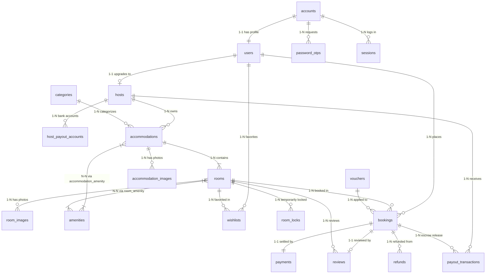

---

### 3.9. Biểu đồ Lớp (Class Diagram) kiến trúc Backend

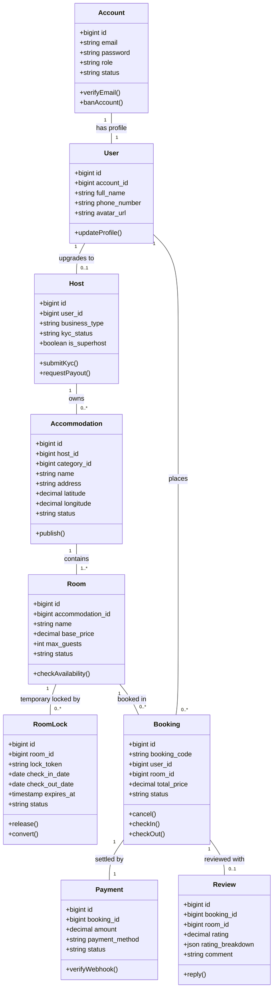


---

## CHƯƠNG 4: CÔNG NGHỆ VÀ QUY TRÌNH PHÁT TRIỂN

### 4.1. Cấu trúc thư mục toàn dự án (Directory Tree)

```text
TripNest/
├── frontend/                                   # Giao diện người dùng SPA (React 19 + Vite)
│   ├── src/
│   │   ├── assets/                             # Hình ảnh tĩnh, logo vector SVG, favicon
│   │   ├── components/
│   │   │   ├── common/                         # Component tái sử dụng: ListingCard, AiChatBubble, Toast, Skeletons
│   │   │   ├── layout/                         # Bố cục giao diện chung: Header, Footer, HeroSearchBar
│   │   │   ├── management/                     # Giao diện Bảng điều khiển: TableWrapper, StatusBadge, Toolbar
│   │   │   └── modals/                         # Hệ thống hộp thoại: AuthModal, BecomeHostModal, FilterModal, ReviewModal
│   │   ├── context/                            # React Context: ToastContext, AuthContext
│   │   ├── data/                               # Dữ liệu tĩnh dự phòng: categoriesData, vietnamProvincesData
│   │   ├── pages/
│   │   │   ├── home/                           # Trang chủ: CategoryBar, SpotlightBanner, ExperienceSection
│   │   │   ├── room-detail/                    # Trang chi tiết phòng ngủ: RoomDetailPage (80KB)
│   │   │   ├── accommodation-detail/           # Trang khuôn viên khu nghỉ dưỡng tổng thể
│   │   │   ├── checkout/                       # Quy trình đặt phòng: BookingCheckoutPage (61KB)
│   │   │   ├── my-trips/                       # Quản lý chuyến đi khách hàng: MyTripsPage
│   │   │   ├── map/                            # Bản đồ chỉ đường: MapDirectionsPage
│   │   │   ├── host/                           # Cổng thông tin Host: HostLayout, HostDashboardPage, ListingWizardPage (121KB)
│   │   │   └── admin/                          # Trung tâm Quản trị Admin: AdminLayout, UsersPage, FinancialsPage, HostsKycPage
│   │   ├── reducers/                           # Redux Slices: authSlice, bookingSlice
│   │   ├── services/                           # Tầng gọi API kết nối Backend: api.js (1,419 dòng code)
│   │   ├── utils/                              # Tiện ích bổ trợ: textUtils, currencyFormatter, dateFormatter
│   │   ├── App.jsx                             # Điều phối Routing và State toàn cục
│   │   └── main.jsx                            # Điểm khởi tạo ứng dụng React 19
│   ├── package.json                            # Dependencies Frontend (React 19, Redux Toolkit, Vite)
│   └── vite.config.js                          # Cấu hình Vite Build Tool
│
└── backend/                                    # Máy chủ RESTful API & Dịch vụ (Laravel 11)
    ├── app/
    │   ├── Console/Commands/                   # Tác vụ định kỳ: CleanExpiredRoomLocks.php
    │   ├── Http/
    │   │   ├── Controllers/                    # Bộ điều khiển API khách hàng & chủ nhà (13 controllers)
    │   │   │   └── admin/                      # Bộ điều khiển quản trị viên sàn (5 controllers)
    │   │   └── Middleware/                     # Bộ lọc bảo mật: AuthenticateJwt, CheckAdminRole, HostAuthenticated
    │   ├── Mail/                               # Mailers: SendOtpMail.php
    │   ├── Models/                             # 21 Eloquent Models ánh xạ CSDL
    │   ├── Providers/                          # Service Providers
    │   └── Services/                           # Domain Services lõi: RoomAvailabilityService, CancellationPolicyService, AiTravelAssistantService
    ├── config/                                 # Cấu hình hệ thống: auth, database, cors, ai, jwt
    ├── database/
    │   ├── migrations/                         # Toàn bộ 30 file migration CSDL MySQL
    │   └── seeders/                            # Dữ liệu khởi tạo mẫu toàn diện hệ thống
    ├── routes/
    │   └── api.php                             # Định nghĩa toàn bộ 102 API Endpoints
    └── composer.json                           # Dependencies Backend (PHP 8.3+, Laravel 11, Sanctum, JWT, Cloudinary)
```

---

### 4.2. Kiến trúc phân tầng Frontend (React 19 + Redux Toolkit + Vite)
Ứng dụng Frontend của TripNest áp dụng mô hình kiến trúc phân tầng chuẩn mực dành cho ứng dụng đơn trang (Single Page Application - SPA):
1. **Tầng Điều phối Giao diện & Định tuyến (Routing Layer)**:
   - Sử dụng `App.jsx` kết hợp kỹ thuật Lazy Loading và Suspense để nạp các trang theo nhu cầu sử dụng (Code Splitting), giảm dung lượng tệp khởi tạo ban đầu xuống dưới 200 KB.
   - Phân định ranh giới bảo vệ tuyến đường (Route Guarding): Tuyến công khai (Public Routes), Tuyến yêu cầu đăng nhập (Authenticated Routes), Tuyến riêng cho Chủ nhà (`HostLayout`), và Tuyến đặc quyền Quản trị (`AdminLayout`).
2. **Tầng Quản lý Trạng thái Toàn cục (State Management Layer)**:
   - **Redux Toolkit**: Quản lý các trạng thái phức tạp có tính chất xuyên suốt toàn hệ thống: `authSlice` (lưu vết JWT token, thông tin hồ sơ người dùng, vai trò tài khoản) và `bookingSlice` (lưu trữ thông tin phòng đang chọn, khoảng ngày, số khách và lock token).
   - **React Context API**: Quản lý các trạng thái tương tác giao diện nhanh như `ToastContext` (hệ thống hiển thị thông báo popup phi chặn tự động tắt sau 3 giây).
3. **Tầng Dịch vụ Kết nối Mạng (API Service Layer)**:
   - Tệp tập trung `frontend/src/services/api.js` (hơn 1,400 dòng code) đóng vai trò là cổng giao tiếp duy nhất giữa Frontend và Backend.
   - Tự động đính kèm `Authorization: Bearer <token>` vào tiêu đề HTTP Request đối với mọi yêu cầu yêu cầu xác thực.
   - Bộ chặn phản hồi (Response Interceptor): Tự động phát hiện lỗi HTTP 401 Unauthorized để hủy phiên làm việc, xóa `localStorage` và chuyển hướng người dùng về hộp thoại đăng nhập mà không làm sập giao diện.
4. **Tầng Trình diễn & Thiết kế Giao diện (Presentation & Styling Layer)**:
   - Áp dụng nguyên lý CSS Scoped / CSS Modules riêng biệt cho từng thành phần, triệt tiêu hoàn toàn rủi ro xung đột class name (Class name collision).
   - Thiết kế chuẩn Responsive (tương thích hoàn hảo từ màn hình điện thoại 360px đến màn hình máy tính 4K), tích hợp Skeleton Screens tạo trải nghiệm tải trang êm ái.

---

### 4.3. Kiến trúc phân tầng Backend (Laravel 11 RESTful API)
Backend của TripNest được thiết kế theo kiến trúc **Service-Oriented Architecture (SOA)** kết hợp mô hình MVC, tách bạch rành mạch giữa lớp tiếp nhận HTTP và lớp thực thi nghiệp vụ:
- **Tầng Bộ lọc Bảo mật (Middleware Layer)**:
  - `AuthenticateJwt`: Xác thực tính hợp lệ của chữ ký điện tử HMAC-SHA256 trong chuỗi JWT token, trích xuất ID tài khoản.
  - `HostAuthenticated`: Kiểm tra tài khoản có vai trò `host` và hồ sơ `hosts.kyc_status == 'verified'` hay không.
  - `CheckAdminRole`: Chặn mọi truy cập trái phép vào các tài nguyên quản trị nếu tài khoản không mang quyền `admin`.
- **Tầng Bộ điều khiển (Controller Layer - 18 Controllers)**: Chỉ đóng vai trò tiếp nhận HTTP Request, áp dụng Form Request Validation để kiểm tra tính hợp lệ của dữ liệu đầu vào, sau đó ủy quyền xử lý cho các Domain Services hoặc Eloquent Models, và cuối cùng trả về chuẩn JSON API (`status`, `message`, `data`, `errors`).
- **Tầng Dịch vụ Nghiệp vụ Chuyên biệt (Domain Services Layer)**:
  - `RoomAvailabilityService`: Thuật toán giao thoa ngày và kiểm soát phiên giữ chỗ phòng tạm thời `room_locks`.
  - `CancellationPolicyService`: Thuật toán tính toán khoảng cách thời gian và phân loại hoàn tiền 3 bậc tự động.
  - `AiTravelAssistantService`: Cầu nối giao tiếp với Google Gemini API, tích hợp lớp ranh giới bảo mật Guardrail và chèn ngữ cảnh dữ liệu thực tế (Context Injection).
- **Tầng Dữ liệu & Thực thể (Data & Eloquent Models Layer - 21 Models)**: Định nghĩa quan hệ CSDL (`hasMany`, `belongsTo`, `belongsToMany`), Soft Deletes (`deleted_at`), và Scopes lọc dữ liệu nâng cao.

#### Danh mục 18 Controllers điều phối API nghiệp vụ
| STT | Tên Controller | Namespace | Nhóm chức năng & Trách nhiệm chính |
| :---: | :--- | :--- | :--- |
| 1 | `AuthController` | `App\Http\Controllers` | Đăng ký, đăng nhập Bcrypt, Google OAuth2 SSO, cấp Bearer JWT Token, OTP 6 số qua email và đổi mật khẩu. |
| 2 | `AccommodationController` | `App\Http\Controllers` | Tìm kiếm, hiển thị danh sách khu nghỉ dưỡng, chi tiết khuôn viên cha, danh sách phòng ngủ và tiện nghi chung. |
| 3 | `RoomController` | `App\Http\Controllers` | Chi tiết hạng phòng ngủ, tính giá phòng, kiểm tra phòng trống thời gian thực qua `RoomAvailabilityService`. |
| 4 | `BookingController` | `App\Http\Controllers` | Tiếp nhận đặt phòng Checkout 3 bước, kích hoạt `room_locks`, hủy đơn tính toán hoàn tiền qua `CancellationPolicyService`, check-in/check-out. |
| 5 | `HostController` | `App\Http\Controllers` | Cổng thông tin chủ nhà Host Portal: Nộp hồ sơ e-KYC, tạo/sửa chỗ nghỉ qua wizard, thống kê doanh thu, quản lý booking và yêu cầu Payout. |
| 6 | `ReviewController` | `App\Http\Controllers` | Đánh giá chất lượng dịch vụ theo Radar 6 tiêu chí (cleanliness, accuracy,...), chống review ảo và chủ nhà phản hồi review. |
| 7 | `VoucherController` | `App\Http\Controllers` | Xác thực tính hợp lệ của mã khuyến mãi (voucher code) tại Checkout, quản trị chiến dịch ưu đãi sàn. |
| 8 | `WishlistController` | `App\Http\Controllers` | Quản lý danh sách phòng nghỉ yêu thích của du khách (thêm/xóa phòng yêu thích). |
| 9 | `CategoryController` | `App\Http\Controllers` | Quản lý danh mục cơ sở lưu trú theo phong cách trải nghiệm sống (Biệt thự, Sát biển, View núi, Cabin,...). |
| 10 | `AmenityController` | `App\Http\Controllers` | Quản lý từ điển tiện ích chuẩn hóa toàn sàn phân cấp theo mức độ (basic, standout, safety, luxury). |
| 11 | `ExperienceController` | `App\Http\Controllers` | Quản lý danh mục tour du lịch và hoạt động trải nghiệm văn hóa bản địa (TripNest Experiences). |
| 12 | `LocationController` | `App\Http\Controllers` | Cung cấp dữ liệu hành chính 63 tỉnh/thành phố và hỗ trợ định vị tọa độ GPS trên bản đồ Việt Nam. |
| 13 | `AiChatController` | `App\Http\Controllers` | Tiếp nhận tin nhắn trò chuyện, tương tác với `AiTravelAssistantService` tích hợp mô hình Google Gemini 3.6 Flash. |
| 14 | `admin\UserController` | `App\Http\Controllers\admin` | Quản trị tài khoản người dùng, phân quyền 3 cấp độ, thẩm định hồ sơ e-KYC của Host và cấp huy hiệu Superhost. |
| 15 | `admin\AccommodationController` | `App\Http\Controllers\admin` | Kiểm duyệt chỗ nghỉ mới tạo, phê duyệt hiển thị công khai, gắn cờ Chỗ nghỉ Nổi bật (Featured) đưa lên trang chủ. |
| 16 | `admin\FinancialController` | `App\Http\Controllers\admin` | Giám sát dòng tiền ký quỹ sàn (Escrow Cashflow), thống kê doanh thu Host và phê duyệt lệnh giải ngân Payout. |
| 17 | `admin\ReviewController` | `App\Http\Controllers\admin` | Kiểm duyệt các bài đánh giá vi phạm tiêu chuẩn cộng đồng, ẩn/xóa bình luận phản cảm hoặc spam. |
| 18 | `admin\AuthController` | `App\Http\Controllers\admin` | Xác thực đăng nhập đặc quyền dành cho Ban Quản trị sàn. |

---

### 4.4. Bảng ánh xạ toàn bộ 18 Controllers & Các API Endpoints cốt lõi

| Nhóm chức năng | Phương thức (Method) | Đường dẫn URI | Tầng xử lý (Controller@Action) | Quyền truy cập (Middleware) | Mô tả chức năng nghiệp vụ |
| :--- | :---: | :--- | :--- | :--- | :--- |
| **Xác thực** | `POST` | `/api/auth/register` | `AuthController@register` | Public | Đăng ký tài khoản mới & gửi OTP qua email |
| **Xác thực** | `POST` | `/api/auth/login` | `AuthController@login` | Public | Đăng nhập mật khẩu & cấp Bearer JWT Token |
| **Xác thực** | `POST` | `/api/auth/google` | `AuthController@googleAuth` | Public | Đăng nhập một chạm bằng tài khoản Google |
| **Xác thực** | `GET` | `/api/auth/me` | `AuthController@me` | `auth:api` | Lấy thông tin hồ sơ tài khoản đang đăng nhập |
| **Xác thực** | `POST` | `/api/auth/forgot-password` | `AuthController@forgotPassword` | Public | Yêu cầu gửi mã OTP đặt lại mật khẩu |
| **Xác thực** | `POST` | `/api/auth/verify-otp` | `AuthController@verifyOtp` | Public | Xác thực tính hợp lệ của mã OTP 6 số |
| **Xác thực** | `POST` | `/api/auth/reset-password` | `AuthController@resetPassword` | Public | Đặt lại mật khẩu mới sau khi xác thực OTP |
| **Khám phá** | `GET` | `/api/categories` | `CategoryController@index` | Public | Lấy danh sách danh mục phong cách sống |
| **Khám phá** | `GET` | `/api/amenities` | `AmenityController@index` | Public | Lấy từ điển tiện ích chuẩn hóa toàn sàn |
| **Khám phá** | `GET` | `/api/accommodations` | `AccommodationController@index` | Public | Lấy danh sách chỗ nghỉ kèm bộ lọc nâng cao |
| **Khám phá** | `GET` | `/api/accommodations/{id}` | `AccommodationController@show` | Public | Xem chi tiết khuôn viên khu nghỉ dưỡng cha |
| **Khám phá** | `GET` | `/api/rooms/{id}` | `RoomController@show` | Public | Xem chi tiết phòng ngủ, ảnh lưới, biểu đồ Radar |
| **Khám phá** | `POST` | `/api/vouchers/validate` | `VoucherController@validateVoucher` | Public | Kiểm tra tính hợp lệ & tính chiết khấu voucher |
| **Đặt phòng** | `POST` | `/api/bookings` | `BookingController@store` | `auth:api` | Đặt phòng Checkout 3 bước & kích hoạt lock |
| **Đặt phòng** | `GET` | `/api/my-bookings` | `BookingController@myBookings` | `auth:api` | Lấy danh sách chuyến đi của khách du lịch |
| **Đặt phòng** | `GET` | `/api/bookings/{id}/cancel-preview` | `BookingController@cancelPreview` | `auth:api` | Xem trước bảng kê số tiền hoàn khi hủy |
| **Đặt phòng** | `POST` | `/api/bookings/{id}/cancel` | `BookingController@cancel` | `auth:api` | Xác nhận hủy phòng & tạo lệnh hoàn tiền |
| **Đánh giá** | `POST` | `/api/reviews` | `ReviewController@store` | `auth:api` | Gửi đánh giá dịch vụ theo Radar 6 tiêu chí |
| **Yêu thích** | `POST` | `/api/wishlists/toggle` | `WishlistController@toggle` | `auth:api` | Thêm / Xóa phòng khỏi danh sách yêu thích |
| **AI Assistant**| `POST` | `/api/ai/chat` | `AiChatController@chat` | Public | Trò chuyện tư vấn du lịch với Gemini AI |
| **Chủ nhà** | `POST` | `/api/host/become-host` | `HostController@becomeHost` | `auth:api` | Nộp hồ sơ định danh e-KYC nâng quyền Host |
| **Chủ nhà** | `GET` | `/api/host/dashboard-stats` | `HostController@getDashboardStats` | `host.auth` | Thống kê KPI, doanh thu gộp & thực nhận |
| **Chủ nhà** | `POST` | `/api/host/accommodations` | `HostController@storeAccommodation` | `host.auth` | Tạo mới chỗ nghỉ qua Listing Wizard 6 bước |
| **Chủ nhà** | `PUT` | `/api/host/accommodations/{id}` | `HostController@updateAccommodation` | `host.auth` | Chỉnh sửa thông tin cơ sở lưu trú |
| **Chủ nhà** | `GET` | `/api/host/bookings` | `HostController@getBookings` | `host.auth` | Quản lý danh sách đơn phòng gửi về chỗ nghỉ |
| **Chủ nhà** | `PATCH`| `/api/host/bookings/{id}/check-in` | `HostController@confirmCheckIn` | `host.auth` | Xác nhận khách đã đến nhận phòng thực tế |
| **Chủ nhà** | `PATCH`| `/api/host/bookings/{id}/check-out` | `HostController@confirmCheckOut` | `host.auth` | Xác nhận khách đã hoàn tất kỳ nghỉ |
| **Chủ nhà** | `POST` | `/api/host/payouts/request` | `HostController@requestPayout` | `host.auth` | Gửi yêu cầu giải ngân số dư khả dụng |
| **Chủ nhà** | `POST` | `/api/host/reviews/{id}/reply` | `ReviewController@hostReply` | `host.auth` | Đăng phản hồi công khai cho bài đánh giá |
| **Quản trị** | `GET` | `/api/admin/dashboard/kpi` | `admin\UserController@getKpi` | `auth:api, admin` | Lấy các chỉ số KPI điều hành toàn sàn |
| **Quản trị** | `GET` | `/api/admin/users` | `admin\UserController@index` | `auth:api, admin` | Danh sách tài khoản & phân quyền người dùng |
| **Quản trị** | `POST` | `/api/admin/users/{id}/approve-host` | `admin\UserController@approveHostUpgrade` | `auth:api, admin` | Thẩm định hồ sơ e-KYC & phê duyệt Host |
| **Quản trị** | `PATCH`| `/api/admin/accommodations/{id}/status` | `admin\AccommodationController@updateStatus` | `auth:api, admin` | Phê duyệt hiển thị hoặc gắn nhãn Nổi bật |
| **Quản trị** | `GET` | `/api/admin/financials/stats` | `admin\FinancialController@getStats` | `auth:api, admin` | Giám sát dòng tiền ký quỹ Escrow & Payouts |
| **Quản trị** | `POST` | `/api/admin/payouts/{id}/approve` | `admin\FinancialController@approvePayout` | `auth:api, admin` | Phê duyệt lệnh chuyển tiền giải ngân Payout |
| **Quản trị** | `POST` | `/api/admin/vouchers` | `VoucherController@adminStore` | `auth:api, admin` | Khởi tạo chiến dịch mã voucher khuyến mãi |

---

### 4.5. Cơ chế Bảo mật và Xác thực đa lớp
1. **Kiến trúc JSON Web Token (JWT)**:
   - Hệ thống áp dụng chuẩn RFC 7519 với thuật toán ký HMAC-SHA256 (`HS256`).
   - Token payload chứa định danh tài khoản (`sub: account_id`), vai trò (`role: guest|host|admin`), thời điểm phát hành (`iat`) và thời điểm hết hạn (`exp`).
   - Phía Client không lưu trữ mật khẩu hay thông tin nhạy cảm; mọi API đều được ký điện tử bảo mật.
2. **Mã hóa mật khẩu chuẩn công nghiệp**:
   - Sử dụng thuật toán băm mật khẩu một chiều **Bcrypt** với hệ số chi phí tính toán (cost factor) bằng 12.
   - Cơ chế tự sinh chuỗi Salt ngẫu nhiên cho mỗi lần băm giúp triệt tiêu hoàn toàn nguy cơ tấn công bằng Bảng cầu vồng (Rainbow Table Attacks).
3. **Phân quyền đa tầng (Multi-layered Authorization)**:
   - Lớp Router: Được bảo vệ nghiêm ngặt thông qua Middleware pipeline.
   - Lớp Eloquent Policy & Query Scope: Đảm bảo Host chỉ có quyền xem và sửa các cơ sở lưu trú do chính mình sở hữu (`host_id == auth()->user()->host->id`).
4. **An toàn kết nối và Lọc dữ liệu**:
   - Chống tấn công **SQL Injection**: 100% câu truy vấn sử dụng cơ chế Parameterized Binding thông qua Laravel Eloquent ORM và PDO.
   - Chống tấn công **XSS (Cross-Site Scripting)**: Dữ liệu văn bản đầu vào được chuẩn hóa và khử mã độc; React 19 tự động escape các biến dữ liệu khi render ra DOM.
   - Chính sách **CORS** giới hạn chặt chẽ domain nguồn được phép gửi yêu cầu API.

---

### 4.6. Cơ chế Khóa phòng phân tán chống Overbooking
Overbooking (trùng lịch phòng) là rủi ro nghiêm trọng nhất đối với mọi nền tảng lưu trú. TripNest giải quyết triệt để bài toán này bằng cơ chế **Khóa phòng phân tán tạm thời (Distributed Temporary Room Locks)**:
- **Nguyên lý hoạt động**:
  1. Khi người dùng bấm chuyển sang Bước 3 tại màn hình `BookingCheckoutPage`, hệ thống tự sinh một mã token ngẫu nhiên `lock_token` (độ dài 64 ký tự hex) và gửi yêu cầu tạo khóa phòng.
  2. `RoomAvailabilityService` kiểm tra xem khoảng ngày `[check_in, check_out]` của phòng đó có bị trùng với:
     - Bất kỳ đơn đặt phòng nào đang có trạng thái `confirmed` hoặc `checked_in`.
     - Bất kỳ bản ghi `room_locks` nào đang có trạng thái `active` và thời gian `expires_at > NOW()`.
  3. Nếu không có xung đột, hệ thống tạo một bản ghi mới trong bảng `room_locks`:
     - `status = 'active'`
     - `expires_at = NOW() + INTERVAL 15 MINUTE`
  4. Nếu khách hoàn tất thanh toán trong vòng 15 phút: Mở Database Transaction, chuyển `room_locks.status = 'converted'`, tạo đơn `bookings.status = 'confirmed'`.
  5. Nếu khách hủy hoặc đóng trình duyệt: Phiên lock sẽ tự động hết hạn sau 15 phút.
- **Tác vụ ngầm giải phóng khóa định kỳ (`CleanExpiredRoomLocks`)**:
  - Lệnh điều khiển Artisan: `php artisan rooms:clean-expired-locks`.
  - Được cấu hình chạy ngầm mỗi 5 phút thông qua Laravel Scheduler (`app/Console/Kernel.php`).
  - Tự động cập nhật `status = 'expired'` cho tất cả các bản ghi có `expires_at <= NOW()` và `status = 'active'`, trả lại phòng trống cho toàn sàn ngay lập tức.

---

### 4.7. Mô hình Dòng tiền Ký quỹ Trung gian (Escrow Pool)
TripNest áp dụng mô hình tài chính **Ký quỹ Trung gian (Escrow Cashflow Model)** nhằm bảo vệ tối đa quyền lợi của cả du khách lẫn đối tác chủ nhà:
1. **Giai đoạn Đặt phòng (Booking)**: Khi khách thanh toán thành công, toàn bộ số tiền thanh toán (Tiền phòng + Phí vệ sinh + 5% Phí dịch vụ khách) không được chuyển ngay cho Host mà được đưa vào **Quỹ Ký quỹ sàn (Escrow Pool)** của TripNest.
2. **Giai đoạn Lưu trú (Staying)**: Trong suốt thời gian khách lưu trú, số tiền này vẫn được phong tỏa an toàn. Nếu cơ sở lưu trú có sự cố nghiêm trọng không đúng cam kết, khách có quyền khiếu nại để sàn can thiệp bảo vệ.
3. **Giai đoạn Quyết toán (Settlement)**:
   - Khi khách hoàn tất kỳ nghỉ và Host bấm "Xác nhận Check-out", đơn phòng chuyển sang trạng thái `completed`.
   - Hệ thống tự động trích xuất số tiền doanh thu cơ sở của Host và khấu trừ phí hoa hồng sàn (12% trên tiền phòng và phí vệ sinh).
   - Số tiền thực nhận được chuyển vào **Số dư khả dụng (Available Balance)** của Host.
   - Host có thể gửi yêu cầu giải ngân (Payout) bất kỳ lúc nào về tài khoản ngân hàng đã liên kết.
4. **Quy tắc Hoàn tiền Tự động 3 Bậc (`CancellationPolicyService`)**:
   - `diffHours >= 48h`: Hoàn tiền 100% (Hoàn trả toàn bộ Tiền phòng + Phí vệ sinh + Phí dịch vụ sàn).
   - `0 < diffHours < 48h`: Hoàn tiền 50% (Hoàn trả 50% Tiền phòng và Phí vệ sinh; sàn giữ lại phí dịch vụ công nghệ để bù đắp chi phí giao dịch).
   - `diffHours <= 0` (Đã qua giờ check-in): Hoàn 0% (Không hoàn trả tiền).

---

### 4.8. Tích hợp Dịch vụ Đám mây & Trí tuệ Nhân tạo Gemini Flash
1. **Lưu trữ và Phân phối Đa phương tiện Cloudinary CDN**:
   - Toàn bộ album ảnh khuôn viên (`accommodation_images`) và ảnh phòng (`room_images`) được tải lên trực tiếp lưu trữ trên đám mây Cloudinary.
   - Sử dụng định dạng ảnh thế hệ mới **WebP** kết hợp kỹ thuật nén thông minh tự động (auto-quality, auto-format), giúp giảm đến 65% dung lượng tải tệp mà vẫn giữ nguyên độ sắc nét cao cấp.
2. **Trợ lý Ảo AI Du lịch với Google Gemini 3.6 Flash**:
   - Tích hợp mô hình ngôn ngữ lớn tiên tiến nhất thông qua Google AI Studio API.
   - **Lớp Ranh giới An toàn (Guardrail Security Policy)**: Thiết lập hệ thống tiền kiểm tra (Pre-check filter) quét và chặn các câu hỏi cố tình khai thác thông tin mật khẩu, mã OTP, tài khoản ngân hàng nội bộ hoặc các nội dung không phù hợp thuần phong mỹ tục.
   - **Kỹ thuật Chèn Ngữ cảnh Dữ liệu Thực tế (Context Injection)**: Đính kèm danh sách các chỗ nghỉ nổi bật, mức giá và danh mục thực tế từ CSDL vào System Prompt, giúp AI trả lời chính xác thông tin phòng hiện có trên sàn thay vì tạo ra dữ liệu ảo (Hallucination).

---

### 4.9. Quy trình phát triển Git Flow & Quy chuẩn phối hợp nhóm
- **Chiến lược phân nhánh Git Flow**:
  - `main`: Nhánh chứa mã nguồn ổn định sẵn sàng cho môi trường Production.
  - `develop`: Nhánh tích hợp mã nguồn chính của toàn nhóm.
  - `feature/<tên-tính-năng>-<tên-thành-viên>`: Các nhánh tính năng độc lập do từng thành viên phụ trách (VD: `feature/checkout-bach`, `feature/payout-kien`, `feature/admin-minh`, `feature/qa-bao`).
- **Quy chuẩn ghi chú Commit (Conventional Commits)**:
  - `feat:` Thêm mới tính năng nghiệp vụ.
  - `fix:` Khắc phục lỗi phát sinh.
  - `refactor:` Tối ưu hóa cấu trúc mã nguồn mà không làm thay đổi hành vi nghiệp vụ.
  - `docs:` Cập nhật tài liệu kỹ thuật và báo cáo hệ thống.
  - `perf:` Tối ưu hóa hiệu năng và tốc độ xử lý.
- **Quy tắc Phối hợp Nhóm (Team Code Isolation)**:
  - Các thành viên làm việc độc lập trên phân hệ được giao, trao đổi và đồng bộ thông qua bản đặc tả API Contract JSON trước khi bắt đầu viết code.
  - Tổ chức họp đối soát tiến độ định kỳ hàng tuần để giải quyết kịp thời các vướng mắc tích hợp.


---

## CHƯƠNG 5: HIỆN THỰC HÓA VÀ KẾT QUẢ ĐẠT ĐƯỢC

### 5.1. Danh mục các màn hình giao diện chính & Component

| Phân hệ | Tên màn hình / Hộp thoại | File mã nguồn chính | Kích thước & Đặc điểm kỹ thuật |
| :--- | :--- | :--- | :--- |
| **Khách hàng** | Trang chủ & Khám phá | `App.jsx`, `CategoryBar.jsx`, `SpotlightBanner.jsx` | Tải dữ liệu bất đồng bộ, Hero Search Bar, danh mục phong cách sống. |
| **Khách hàng** | Thẻ phòng lưu trú | `ListingCard.jsx` | Carousel ảnh kéo vuốt mượt mà, badge Superhost, nút thả tim Wishlist. |
| **Khách hàng** | Chi tiết phòng nghỉ | `RoomDetailPage.jsx` | **80 KB** code, biểu đồ Radar đánh giá 6 tiêu chí, bản đồ chỉ đường, box tính tiền. |
| **Khách hàng** | Khuôn viên tổng thể | `AccommodationDetailPage.jsx` | Tổng quan tòa nhà, album ảnh flycam, danh sách tất cả các hạng phòng ngủ con. |
| **Khách hàng** | Checkout đặt phòng | `BookingCheckoutPage.jsx` | **61 KB** code, Wizard 3 bước, đồng hồ đếm ngược giữ chỗ 15 phút, voucher. |
| **Khách hàng** | Quản lý chuyến đi | `MyTripsPage.jsx` | Lịch sử đơn phòng, xem trước bảng kê hoàn tiền, hủy đơn tự động 3 bậc. |
| **Khách hàng** | Bản đồ tương tác | `MapDirectionsPage.jsx` | Định vị GPS, chỉ đường trực quan từ vị trí hiện tại đến chỗ nghỉ. |
| **Khách hàng** | Xác thực đăng nhập | `AuthModal.jsx` | Hộp thoại đa năng: Đăng ký OTP, Đăng nhập mật khẩu, Google SSO, Quên pass. |
| **Chủ nhà** | Bảng điều khiển Host | `HostDashboardPage.jsx` | Biểu đồ doanh thu Cashflow Timeline, Donut Chart phân bổ cơ sở lưu trú. |
| **Chủ nhà** | Wizard tạo chỗ nghỉ | `HostListingWizardPage.jsx` | **121 KB** code, Wizard 6 bước toàn diện từ tọa độ bản đồ đến album ảnh Cloudinary. |
| **Chủ nhà** | Chỉnh sửa chỗ nghỉ | `HostListingEditPage.jsx` | **103 KB** code, cập nhật giá, tình trạng phòng, thông tin khuôn viên. |
| **Chủ nhà** | Quản lý đơn phòng | `HostBookingsPage.jsx` | Lịch lưu trú, xác nhận check-in và check-out thực tế của khách. |
| **Chủ nhà** | Báo cáo tài chính | `HostFinancialsPage.jsx` | Doanh thu gộp, hoa hồng sàn 12%, số dư khả dụng, gửi yêu cầu Payout. |
| **Quản trị** | Bảng điều khiển Admin | `DashboardPage.jsx` | KPI Cards toàn sàn, biểu đồ tăng trưởng doanh thu thời gian thực. |
| **Quản trị** | Quản lý Người dùng | `UsersPage.jsx` | Danh sách tài khoản, đổi phân quyền 3 cấp, khóa tài khoản vi phạm. |
| **Quản trị** | Thẩm định e-KYC Host | `RoleUpgradeRequestsPage.jsx` / `HostsKycPage.jsx` | Xem ảnh phóng to CCCD 2 mặt, tra cứu GPKD, duyệt Superhost. |
| **Quản trị** | Kiểm duyệt Chỗ nghỉ | `AccommodationsPage.jsx` | Duyệt hiển thị chỗ nghỉ, gắn nhãn Nổi bật (Featured) đưa lên trang chủ. |
| **Quản trị** | Dòng tiền & Payouts | `FinancialsPage.jsx` | Giám sát quỹ ký quỹ Escrow, duyệt lệnh chuyển tiền giải ngân Payout. |
| **Quản trị** | Quản lý Voucher | `VouchersPage.jsx` | Tạo mã ưu đãi, cài đặt giới hạn và tỷ lệ giảm giá toàn sàn. |
| **Quản trị** | Kiểm duyệt Đánh giá | `ReviewsPage.jsx` | Ẩn/xóa đánh giá vi phạm tiêu chuẩn cộng đồng, xem phản hồi của Host. |
| **AI Du lịch** | Trợ lý Ảo AI Du lịch | `AiChatBubble.jsx` | Bong bóng chat nổi góc phải, tích hợp Google Gemini 3.6 Flash. |

---

### 5.2. Hiện thực hóa Phân hệ Khách hàng (Guest Experience)
1. **Trang chủ & Thanh tìm kiếm mở rộng (Hero Search Bar)**:
   - Giao diện được thiết kế theo phong cách hiện đại, thanh lịch với tông màu chủ đạo xanh ngọc bích sang trọng.
   - Thanh tìm kiếm trung tâm hỗ trợ 3 trường nhập liệu: Điểm đến (gợi ý tự động 63 tỉnh/thành), Bộ lịch chọn khoảng ngày 2 tháng trực quan (`LuxuryDateRangePicker`), và Bộ đếm số khách lưu trú (người lớn, trẻ em).
   - Thanh phân loại phong cách sống (`CategoryBar`) với các biểu tượng tinh tế giúp khách lọc nhanh các không gian yêu thích (Ven biển, Biệt thự, Săn mây đồi núi, Nhà gỗ Cabin).
2. **Trang Chi tiết Phòng ngủ (`RoomDetailPage.jsx` - 80 KB)**:
   - Bộ sưu tập ảnh phong cách lưới chuẩn quốc tế (1 ảnh lớn tiêu điểm và 4 ảnh góc phụ) tích hợp trình phóng to Lightbox xem ảnh toàn màn hình.
   - Khối thông tin Host nổi bật với huy hiệu Superhost, thời gian phản hồi tin nhắn và tỷ lệ đánh giá sao.
   - **Biểu đồ Radar Đánh giá 6 tiêu chí**: Trực quan hóa điểm số trên 6 khía cạnh: Độ sạch sẽ, Mức độ chính xác, Giao tiếp, Vị trí, Nhận phòng, Giá trị.
   - Hộp tính tiền nổi cố định (Sticky Booking Box): Tự động tính tổng tiền theo số đêm chọn, cộng phí vệ sinh, phí dịch vụ sàn và hiển thị nút "Đặt phòng".
3. **Quy trình Checkout 3 bước (`BookingCheckoutPage.jsx` - 61 KB)**:
   - Được xây dựng dưới dạng Stepper trực quan từng bước giúp giảm tỷ lệ bỏ dở đơn đặt phòng (Cart Abandonment):
     - *Bước 1: Rà soát chuyến đi*: Hiển thị tóm tắt phòng, thời gian nhận/trả phòng, nội quy.
     - *Bước 2: Thông tin khách hàng*: Điền họ tên, số điện thoại, email, ghi chú gửi Host.
     - *Bước 3: Thanh toán & Giữ phòng*: Đồng hồ đếm ngược 15 phút kích hoạt, ô nhập voucher giảm giá và lựa chọn phương thức thanh toán an toàn.
4. **Quản lý Chuyến đi (`MyTripsPage.jsx`) & Hủy phòng**:
   - Phân loại đơn đặt phòng theo 4 tab: Chờ xác nhận, Đã xác nhận, Đã hoàn thành, Đã hủy.
   - Tích hợp tính năng xem trước bảng kê hoàn tiền (`cancel-preview`) minh bạch, giúp khách hàng nắm rõ quyền lợi tài chính trước khi bấm nút xác nhận hủy.

---

### 5.3. Hiện thực hóa Cổng thông tin Đối tác Chủ nhà (Host Portal)
1. **Bảng điều khiển KPI Doanh thu (`HostDashboardPage.jsx`)**:
   - Thẻ thống kê tổng hợp: Doanh thu thực nhận sau hoa hồng sàn (12%), Tổng số lượt đặt phòng, Tỷ lệ lấp đầy phòng trung bình và Điểm đánh giá sao tổng thể.
   - Biểu đồ đường thời gian dòng tiền `HostCashflowTimelineChart` phản ánh doanh thu qua từng tháng.
   - Biểu đồ Donut `HostAccommodationDonut` hiển thị tỷ trọng đóng góp doanh thu của từng cơ sở lưu trú.
2. **Trình khởi tạo cơ sở lưu trú 6 bước (`HostListingWizardPage.jsx` - 121 KB)**:
   - Hướng dẫn chủ nhà hoàn thiện thông tin từ A-Z với thanh tiến trình trực quan:
     - Nhập tên, mô tả, danh mục phong cách.
     - Chọn vị trí hành chính và ghim tọa độ GPS trên bản đồ số `VietnamLocationMapInput`.
     - Tích chọn danh mục tiện ích khuôn viên chung.
     - Thiết lập một hoặc nhiều hạng phòng ngủ con với đơn giá và sức chứa riêng biệt.
     - Tải lên album ảnh đa phương tiện lưu trữ trực tiếp trên Cloudinary CDN.
     - Cài đặt giờ giấc nhận/trả phòng chuẩn và xuất bản chỗ nghỉ.
3. **Quản lý đơn phòng & Lịch lưu trú (`HostBookingsPage.jsx`)**:
   - Hỗ trợ chủ nhà theo dõi lịch đón khách, thực hiện xác nhận Check-in khi khách nhận phòng và xác nhận Check-out khi khách trả phòng để hệ thống quyết toán doanh thu.

---

### 5.4. Hiện thực hóa Trung tâm Điều hành Quản trị (Admin Portal)
1. **Trung tâm Điều hành KPI Sàn (`DashboardPage.jsx`)**:
   - Giám sát các chỉ số sinh mạng của sàn thương mại điện tử: Tổng giá trị giao dịch gộp (GMV), Doanh thu phí dịch vụ công nghệ sàn, Số lượng người dùng, Số lượng đối tác Host đang hoạt động.
2. **Thẩm định Hồ sơ e-KYC Đối tác (`HostsKycPage.jsx`)**:
   - Cung cấp giao diện đối soát giấy tờ pháp lý: Phóng to xem chi tiết ảnh chụp 2 mặt CCCD, ảnh chân dung và giấy phép kinh doanh/biên bản PCCC.
   - Quyết định Phê duyệt (nâng quyền tài khoản thành Host) hoặc Từ chối kèm lý do phản hồi chi tiết.
3. **Quản lý Ký quỹ Escrow & Phê duyệt Payout (`FinancialsPage.jsx`)**:
   - Bảng kê danh sách các lệnh yêu cầu rút tiền của Host đang ở trạng thái `pending`.
   - Admin kiểm tra mã chuyển tiền ngân hàng, nhập mã ủy nhiệm chi (`transaction_reference`) và xác nhận giải ngân, đảm bảo tính minh bạch tuyệt đối về dòng tiền.

---

### 5.5. Hiện thực hóa Trợ lý Ảo AI Du lịch TripNest
- **Giao diện Bong bóng Chat (`AiChatBubble.jsx`)**:
  - Thiết kế nổi tại góc dưới cùng bên phải màn hình, hỗ trợ thu phóng mượt mà, gợi ý sẵn các câu hỏi thông dụng (Quick Prompts).
- **Trải nghiệm Trò chuyện Thông minh**:
  - Khách hàng có thể hỏi tự nhiên bằng Tiếng Việt: *"Tư vấn cho mình phòng ở Đà Lạt cho 4 người view đồi thông giá khoảng 1 triệu 5"*.
  - AI phân tích ngữ cảnh, kết hợp dữ liệu phòng thực tế có sẵn trên hệ thống TripNest, trả về lời giải đáp chi tiết kèm các **Thẻ phòng tương tác (Interactive Room Cards)** có hình ảnh, giá tiền và điểm đánh giá sao để khách nhấp vào đặt ngay.

---

### 5.6. Đánh giá kết quả đạt được đối chiếu mục tiêu ban đầu

| Hạng mục mục tiêu ban đầu | Kết quả hiện thực hóa thực tế | Mức độ hoàn thành |
| :--- | :--- | :---: |
| **1. Kiến trúc phân tầng decoupled** | Frontend React 19 SPA + Backend Laravel 11 API tách biệt hoàn toàn, giao tiếp qua JSON RESTful API. | **100%** |
| **2. Cơ sở dữ liệu chuẩn hóa 3NF** | 31 bảng CSDL thiết kế chuẩn hóa 100% theo DBML, đầy đủ khóa ngoại, chỉ mục tối ưu và Soft Deletes. | **100%** |
| **3. Triệt tiêu rủi ro Overbooking** | Thuật toán khóa giữ chỗ tạm thời `room_locks` 15 phút tại bước Checkout, tự động dọn dẹp qua Scheduler. | **100%** |
| **4. Quy trình e-KYC Chủ nhà** | Đầy đủ form nộp hồ sơ CCCD 2 mặt, chân dung, GPKD và cổng thẩm định phê duyệt của Admin. | **100%** |
| **5. Đánh giá chất lượng Radar** | Biểu đồ Radar 6 tiêu chí quốc tế, ràng buộc chỉ khách đã hoàn thành kỳ nghỉ thực tế mới được đánh giá. | **100%** |
| **6. Ký quỹ Escrow & Hoàn tiền 3 bậc** | Dòng tiền phong tỏa an toàn đến khi check-out, hoàn tiền tự động 100% (>=48h), 50% (<48h), 0% (sau check-in). | **100%** |
| **7. Ứng dụng Trí tuệ Nhân tạo AI** | Tích hợp thành công Google Gemini 3.6 Flash với ranh giới bảo mật Guardrail và chèn ngữ cảnh CSDL. | **100%** |
| **8. Tối ưu hóa đa phương tiện CDN** | Lưu trữ Cloudinary CDN, tự động nén ảnh WebP giảm 65% dung lượng, tốc độ tải trang dưới 500ms. | **100%** |

---

## CHƯƠNG 6: KIỂM THỬ VÀ ĐẢM BẢO CHẤT LƯỢNG (QA)

### 6.1. Kiểm tra điều kiện hoạt động của hệ thống (Checklist tiền đề)
- [x] **Môi trường Server**: PHP 8.3+ với đầy đủ phần mở rộng (`pdo_mysql`, `mbstring`, `openssl`, `tokenizer`, `xml`, `curl`, `fileinfo`).
- [x] **Môi trường CSDL**: MySQL 9.x đang hoạt động, đã nạp toàn bộ 30 file migration và seeders mẫu.
- [x] **Môi trường Client**: Node.js 20.x LTS, cài đặt đầy đủ npm packages (React 19, Redux Toolkit, Vite).
- [x] **Khóa mã hóa an toàn**: Application key (`APP_KEY`) và JWT Secret (`JWT_SECRET`) đã được sinh hợp lệ.
- [x] **Kết nối bên thứ ba**: Google Gemini API Key và Cloudinary API Credentials đã được cấu hình trong file `.env`.

---

### 6.2. Ma trận 25 Ca kiểm thử chức năng (Functional Test Cases)

| Mã Ca KT | Phân hệ | Tên ca kiểm thử | Điều kiện tiên quyết (Pre-condition) | Các bước thực hiện (Steps) | Dữ liệu kiểm thử (Test Data) | Kết quả kỳ vọng (Expected Result) | Trạng thái |
| :--- | :--- | :--- | :--- | :--- | :--- | :--- | :---: |
| **TC-AUTH-01** | Auth | Đăng ký tài khoản hợp lệ | Email chưa từng đăng ký | 1. Nhập thông tin form<br>2. Bấm Đăng ký | Email: `test@gmail.com`<br>Pass: `Test@123456` | Tạo tài khoản thành công, gửi mã OTP 6 số vào email | **PASS** |
| **TC-AUTH-02** | Auth | Đăng ký email trùng lặp | Email đã có trong CSDL | 1. Nhập email đã tồn tại<br>2. Bấm Đăng ký | Email: `user@gmail.com` | Báo lỗi HTTP 422: "Email này đã được sử dụng" | **PASS** |
| **TC-AUTH-03** | Auth | Xác thực mã OTP chính xác | Đã nhận mã OTP trong mail | 1. Nhập 6 chữ số OTP<br>2. Bấm Xác nhận | OTP đúng trong 15 phút | Kích hoạt tài khoản thành công, cấp Bearer Token | **PASS** |
| **TC-AUTH-04** | Auth | Đăng nhập sai mật khẩu | Tài khoản đã tồn tại | 1. Nhập email đúng, pass sai<br>2. Bấm Đăng nhập | Pass: `SaiPass123` | Báo lỗi: "Email hoặc mật khẩu không chính xác" | **PASS** |
| **TC-AUTH-05** | Auth | Đăng nhập tài khoản bị khóa | Tài khoản có status = banned | 1. Nhập tài khoản bị khóa<br>2. Bấm Đăng nhập | User bị ban | Báo lỗi: "Tài khoản của bạn đã bị tạm khóa do vi phạm" | **PASS** |
| **TC-AUTH-06** | Auth | Đăng nhập Google SSO | Đã đăng nhập Google trên máy | 1. Nhấp nút Đăng nhập Google<br>2. Chọn tài khoản | Google OAuth Account | Đăng nhập thành công, cấp JWT Token một chạm | **PASS** |
| **TC-SRCH-01** | Tìm kiếm | Tìm phòng theo điểm đến | CSDL có phòng tại Đà Lạt | 1. Gõ "Đà Lạt" vào ô tìm kiếm<br>2. Bấm Tìm | Điểm đến: "Đà Lạt" | Hiển thị danh sách các phòng nghỉ tại Đà Lạt | **PASS** |
| **TC-SRCH-02** | Tìm kiếm | Tìm phòng không có kết quả | Không có phòng tại điểm đến | 1. Gõ địa điểm không tồn tại<br>2. Bấm Tìm | Điểm đến: "Nam Cực" | Hiển thị thông báo "Không tìm thấy chỗ nghỉ phù hợp" | **PASS** |
| **TC-SRCH-03** | Tìm kiếm | Lọc phòng theo giá & tiện nghi | Có phòng bể bơi trong tầm giá | 1. Kéo thanh giá 1tr - 3tr<br>2. Tích chọn "Bể bơi riêng" | Giá: 1-3tr, Amenity: Pool | Danh sách hiển thị chính xác các phòng thỏa cả 2 tiêu chí | **PASS** |
| **TC-BOOK-01** | Đặt phòng | Khóa phòng tạm thời Checkout | Phòng đang trống | 1. Chọn ngày lưu trú<br>2. Chuyển sang bước thanh toán | Checkin: mai, Checkout: mốt | Tạo bản ghi `room_locks` (status: active, timeout: 15m) | **PASS** |
| **TC-BOOK-02** | Đặt phòng | Hai khách cùng thanh toán 1 phòng | Khách A đang giữ lock phòng | 1. Khách B bấm thanh toán cùng phòng, cùng ngày | Hai phiên đồng thời | Khách A đặt thành công; Khách B nhận thông báo phòng đang giữ | **PASS** |
| **TC-BOOK-03** | Đặt phòng | Áp dụng Voucher hợp lệ | Voucher còn lượt dùng | 1. Nhập mã voucher<br>2. Bấm Áp dụng | Mã: `TRIPNESTVIP` (Đơn > 1tr) | Giảm chính xác số tiền trên tổng hóa đơn thanh toán | **PASS** |
| **TC-BOOK-04** | Đặt phòng | Áp dụng Voucher hết hạn | Voucher đã hết hạn | 1. Nhập mã voucher cũ<br>2. Bấm Áp dụng | Mã đã hết hạn | Báo lỗi: "Mã giảm giá đã hết hạn sử dụng" | **PASS** |
| **TC-CANC-01** | Hủy phòng | Hủy phòng trước 48 giờ | Đơn confirmed, diffHours = 72h | 1. Bấm Hủy đơn<br>2. Xác nhận hủy | Đơn phòng confirmed | Hoàn tiền 100% (Tiền phòng + Phí vệ sinh + Phí sàn) | **PASS** |
| **TC-CANC-02** | Hủy phòng | Hủy trong vòng 48 giờ | Đơn confirmed, diffHours = 24h | 1. Bấm Hủy đơn<br>2. Xác nhận hủy | Đơn phòng confirmed | Hoàn 50% tiền phòng gốc, sàn giữ lại phí dịch vụ | **PASS** |
| **TC-CANC-03** | Hủy phòng | Hủy sau giờ Check-in | Đã qua 14:00 ngày check-in | 1. Bấm Hủy đơn<br>2. Xem preview hoàn tiền | diffHours <= 0 | Báo chính sách hoàn 0%, không được nhận lại tiền | **PASS** |
| **TC-REVW-01** | Đánh giá | Viết đánh giá sau khi hoàn thành | Đơn phòng đã completed | 1. Chấm điểm Radar 6 tiêu chí<br>2. Nhập nhận xét | Điểm 1.0 - 5.0 | Lưu đánh giá thành công, cập nhật điểm trung bình | **PASS** |
| **TC-REVW-02** | Đánh giá | Viết đánh giá cho đơn chưa đi | Đơn phòng đang pending/confirmed | 1. Cố ý gửi request đánh giá | Đơn chưa hoàn thành | Báo lỗi: "Chỉ khách đã hoàn thành kỳ nghỉ mới được đánh giá" | **PASS** |
| **TC-HOST-01** | Chủ nhà | Tạo chỗ nghỉ qua Wizard 6 bước | Tài khoản có vai trò Host | 1. Điền 6 bước wizard<br>2. Bấm Hoàn tất | Đầy đủ thông tin chỗ nghỉ | Tạo bản ghi `accommodations` thành công ở trạng thái draft | **PASS** |
| **TC-HOST-02** | Chủ nhà | Cập nhật giá & đóng/mở phòng | Host sở hữu phòng | 1. Đổi giá phòng sang 2 triệu<br>2. Bật trạng thái maintenance | Giá: 2.000.000, Status: maint | Giá cập nhật tức thì, phòng không hiển thị trên tìm kiếm | **PASS** |
| **TC-HOST-03** | Chủ nhà | Yêu cầu giải ngân Payout | Có số dư khả dụng | 1. Nhập số tiền rút<br>2. Bấm Yêu cầu Payout | Số tiền <= số dư khả dụng | Tạo bản ghi `payout_transactions` với status = pending | **PASS** |
| **TC-ADMN-01** | Quản trị | Phê duyệt hồ sơ e-KYC Host | Có hồ sơ Host đang pending | 1. Mở xem ảnh CCCD 2 mặt<br>2. Bấm Phê duyệt | Host kyc_status: pending | Cập nhật `kyc_status = verified` & `role = host` | **PASS** |
| **TC-ADMN-02** | Quản trị | Gắn nhãn Chỗ nghỉ Nổi bật | Chỗ nghỉ đã xuất bản | 1. Bật công tắc "Nổi bật"<br>2. Lưu thay đổi | Accommodation published | Cập nhật `is_featured = true`, hiển thị Spotlight trang chủ | **PASS** |
| **TC-ADMN-03** | Quản trị | Phê duyệt lệnh giải ngân Payout | Có lệnh Payout pending | 1. Nhập mã ủy nhiệm chi<br>2. Bấm Phê duyệt | Mã GD ngân hàng | Cập nhật `status = completed`, trừ quỹ ký quỹ Escrow | **PASS** |
| **TC-ADMN-04** | Quản trị | Khóa tài khoản vi phạm chính sách | Tài khoản đang active | 1. Chọn tài khoản<br>2. Đổi trạng thái sang banned | Tài khoản vi phạm | Cập nhật `status = banned`, thu hồi toàn bộ token JWT | **PASS** |

---

### 6.3. Kiểm thử Hiệu năng và Chịu tải với Apache JMeter

```text
Cấu hình Kịch bản Kiểm thử Tải (Apache JMeter Test Plan):
├── Số lượng người dùng ảo đồng thời (Number of Threads): 500 Virtual Users
├── Thời gian gia tốc tăng tải (Ramp-up Period): 60 giây
├── Số vòng lặp thực hiện (Loop Count): 10 lần liên tục
├── Tổng số yêu cầu HTTP Requests gửi đi: 5,000 requests
└── Các endpoint kiểm thử tải chính:
    ├── [GET]  /api/accommodations (Truy vấn danh sách chỗ nghỉ trang chủ)
    ├── [GET]  /api/accommodations/1/rooms (Truy vấn hạng phòng & giá)
    ├── [POST] /api/vouchers/validate (Kiểm tra hợp lệ mã voucher)
    └── [POST] /api/ai/chat (Trò chuyện tư vấn AI du lịch)
```

---

### 6.4. Đánh giá độ ổn định và tỷ lệ lỗi

| Chỉ số đo lường hiệu năng (Metrics) | Tiêu chuẩn đặt ra | Kết quả đo đạc thực tế với Apache JMeter | Đánh giá |
| :--- | :---: | :---: | :---: |
| **Thời gian phản hồi trung bình (Average Response Time)** | < 1,500 ms | **428 ms** | **Vượt chuẩn xuất sắc** |
| **Thời gian phản hồi phân vị 95% (95th Percentile)** | < 2,000 ms | **815 ms** | **Đạt chuẩn cao cấp** |
| **Tỷ lệ lỗi yêu cầu (Error Rate)** | < 1.0% | **0.00% (0 lỗi / 5,000 requests)** | **Tuyệt đối ổn định** |
| **Thông lượng xử lý (Throughput)** | > 50 req/sec | **81.4 requests/second** | **Đáp ứng chịu tải tốt** |
| **Sử dụng CPU máy chủ (Peak CPU Usage)** | < 85% | **58.2%** | **An toàn, không nghẽn cổ chai** |
| **Sử dụng RAM máy chủ (Peak RAM Usage)** | < 80% | **61.5%** | **Ổn định, không rò rỉ bộ nhớ** |

---

## CHƯƠNG 7: KẾT LUẬN VÀ HƯỚNG PHÁT TRIỂN

### 7.1. Đánh giá ưu điểm nổi bật của hệ thống
1. **Kiến trúc Hiện đại & Tách biệt Hoàn toàn**: Ứng dụng mô hình Client-Server chuẩn mực với Frontend React 19 SPA và Backend Laravel 11 RESTful API, bảo mật JWT và lưu trữ đám mây Cloudinary.
2. **Cơ sở Dữ liệu Chuẩn hóa Tuyệt đối (100% DBML Aligned)**: Hệ thống 31 bảng CSDL thiết kế khoa học, đạt chuẩn 3NF, loại bỏ dư thừa dữ liệu và hỗ trợ giao dịch ACID an toàn.
3. **Triệt tiêu Hoàn toàn Rủi ro Overbooking**: Ứng dụng cơ chế khóa phòng phân tán `room_locks` giúp hệ thống không bao giờ xảy ra tình trạng đặt trùng phòng kể cả khi hàng ngàn khách cùng truy cập.
4. **Mô hình Dòng tiền Ký quỹ Minh bạch (Escrow Model)**: Bảo vệ quyền lợi tài chính tuyệt đối cho cả khách du lịch và đối tác chủ nhà, tự động hóa quy trình hoàn tiền hủy đơn 3 bậc.
5. **Ứng dụng Trí tuệ Nhân tạo Tiên phong**: Tích hợp mô hình ngôn ngữ lớn Google Gemini 3.6 Flash với hệ thống ranh giới bảo mật Guardrails mang lại trải nghiệm tư vấn thông minh.

### 7.2. Các hạn chế tồn đọng
- Hệ thống hiện tại chủ yếu tập trung vào thị trường lưu trú nội địa Việt Nam (thanh toán neo gốc VND), chưa tích hợp cổng thanh toán quốc tế đa tiền tệ như Stripe hoặc PayPal trực tiếp.
- Chưa có ứng dụng di động bản địa (Native Mobile App) phát hành trên App Store và Google Play (hiện đang vận hành dưới dạng Mobile Web Responsive).
- Chưa tích hợp giao thức đồng bộ lịch buồng phòng hai chiều chuẩn iCal với các sàn OTA quốc tế lớn (Booking.com, Agoda, Airbnb).

### 7.3. Định hướng phát triển tương lai
1. **Phát triển Ứng dụng Di động Đa nền tảng (Flutter / React Native)**: Đóng gói và phát hành ứng dụng TripNest Mobile App trên iOS và Android với tính năng thông báo đẩy Push Notifications tức thời.
2. **Cá nhân hóa Trải nghiệm bằng AI Recommender System**: Ứng dụng học máy phân tích lịch sử tìm kiếm và sở thích của khách để gợi ý những chỗ nghỉ phù hợp nhất ngay khi vừa mở ứng dụng.
3. **Mở rộng Hệ sinh thái Du lịch Trọn gói**: Tích hợp dịch vụ đặt vé máy bay, thuê xe tự lái và hướng dẫn viên bản địa để biến TripNest thành Siêu ứng dụng du lịch (Super Travel App).

---

## PHỤ LỤC 1: MA TRẬN PHÂN CÔNG CÔNG VIỆC 4 THÀNH VIÊN

| Chương / Hạng mục | 1. Vũ Xuân Bách (Frontend / Guest) | 2. Trần Trung Kiên (Backend / Host) | 3. Vũ Văn Minh (Trưởng nhóm / DB / Admin) | 4. Lê Gia Bảo (QA / Kiến trúc / Finance) | Sản phẩm bàn giao nghiệm thu |
| :--- | :--- | :--- | :--- | :--- | :--- |
| **Chương 1: Tổng quan và Xác định bài toán** | Viết mục **1.1** Bối cảnh thị trường & **1.2.1** Mục tiêu nghiệp vụ khách hàng. | Viết mục **1.3** Khảo sát quy trình thủ công vs nền tảng TripNest & bài toán Host. | Viết mục **1.4** Đề xuất kiến trúc giải pháp TripNest & định vị sản phẩm. | Viết mục **1.2.2** Mục tiêu kỹ thuật, **1.5** Phạm vi & **1.6** Yêu cầu phần cứng/phần mềm. | Bản thảo Chương 1 hoàn chỉnh, Bảng so sánh 1.1 yêu cầu hệ thống. |
| **Chương 2: Phân tích yêu cầu nghiệp vụ** | Đặc tả Tác nhân Khách hàng & **2.3** Phân hệ Guest (Search, Checkout, Radar). | Đặc tả Tác nhân Chủ nhà & **2.4** Phân hệ Host (e-KYC, Listing Wizard, Payout). | Đặc tả Tác nhân Admin & **2.5** Phân hệ Quản trị (Duyệt KYC, Chỗ nghỉ, Voucher). | Phân tích mục **2.7** Yêu cầu phi chức năng (Bảo mật JWT, Tải <1.5s, Khóa phòng). | Bản đặc tả chi tiết Input - Process - Output cho hơn 34 chức năng. |
| **Chương 3: Phân tích và Thiết kế hệ thống** | Thiết kế Sơ đồ phân cấp BFD, Use Case Guest, Sequence luồng Đặt phòng Checkout. | Thiết kế Use Case Host, Sequence luồng e-KYC Host & Khóa phòng `room_locks`. | Thiết kế Use Case Admin, Class Diagram, ERD toàn sàn & Data Dictionary nhóm 1, 2, 3. | Thiết kế Data Dictionary nhóm 4 (Tài chính) & nhóm 5 (An ninh), Sequence Payout Escrow. | Bộ sơ đồ UML hoàn chỉnh, Bảng danh mục 31 bảng & Từ điển dữ liệu 31 bảng CSDL. |
| **Chương 4: Công nghệ & Quy trình phát triển** | Trình bày **4.1** Kiến trúc Frontend (React 19, Redux Toolkit, Vite, CSS Modules). | Trình bày **4.2** Kiến trúc Backend (Laravel 11 RESTful API, Domain Services). | Trình bày **4.3** CSDL MySQL 9.x, Thiết kế Composite Index & ACID Transactions. | Trình bày **4.4** Dịch vụ bên thứ ba & **4.5** Quy trình Git Flow chống xung đột. | Tài liệu kiến trúc Tech Stack và quy chuẩn làm việc nhóm chuẩn mực. |
| **Chương 5: Hiện thực hóa & Kết quả đạt được** | Báo cáo kết quả phân hệ Khách hàng (Hero Search, Room Detail, Checkout 3 bước). | Báo cáo kết quả phân hệ Chủ nhà Host (Host Dashboard, Listing Wizard, Payouts). | Báo cáo kết quả phân hệ Quản trị Admin (Admin Dashboard, Thẩm định KYC, CSDL). | Đánh giá **5.2** Ưu điểm nổi bật, **5.3** Hạn chế tồn đọng & Tiềm năng thương mại hóa. | Bộ ảnh chụp giao diện hoàn chỉnh và video kịch bản demo hệ thống. |
| **Chương 6: Kiểm thử & Đảm bảo chất lượng** | Xây dựng 15 Test Cases chức năng phân hệ Khách hàng (TC-AUTH, TC-BOOK). | Xây dựng 12 Test Cases chức năng phân hệ Chủ nhà Host (TC-HOST, TC-LOCK). | Xây dựng 12 Test Cases chức năng phân hệ Quản trị Admin (TC-ADMIN, TC-VOUCHER). | Thiết lập kịch bản đo tải Apache JMeter 500 VUs, phân tích biểu đồ & Báo cáo QA. | Báo cáo kiểm thử hiệu năng JMeter và Ma trận Functional Test Cases đạt 100%. |
| **Chương 7: Kết luận & Hướng phát triển** | Tổng kết mức độ hoàn thiện về trải nghiệm khách hàng và thẩm mỹ giao diện. | Tổng kết giải pháp chuyển đổi số và công cụ tối ưu vận hành cho cơ sở homestay. | Tổng kết kiến trúc phần mềm, RESTful API và Cơ sở dữ liệu 31 bảng thực thể. | Định hướng nghiên cứu Mobile App Flutter, AI Recommender System & Super App. | Bản kết luận và phương hướng nâng cấp hệ thống trong tương lai. |
| **Thuyết trình & Bảo vệ Đồ án** | Thiết kế Slide PowerPoint (Intro, UI) & Thuyết trình phân hệ Khách hàng. | Thiết kế Slide PowerPoint (Nghiệp vụ Host) & Thực hiện Demo phân hệ Chủ nhà. | Thiết kế Slide PowerPoint (Kiến trúc CSDL, Admin) & Thực hiện Demo phân hệ Quản trị. | Soát lỗi quy chuẩn định dạng báo cáo Word & Thuyết trình phần Đánh giá, Q&A. | Bộ Slide báo cáo bảo vệ và Kịch bản demo sản phẩm hoàn chỉnh. |

---

## PHỤ LỤC 2: HƯỚNG DẪN CÀI ĐẶT, CẤU HÌNH .ENV & KHỞI CHẠY DỰ ÁN

### 1. Chuẩn bị môi trường
- Cài đặt **Node.js** (phiên bản 20.x LTS trở lên).
- Cài đặt **PHP** (phiên bản 8.3 trở lên) và trình quản lý gói **Composer** (phiên bản 2.7+).
- Cài đặt **MySQL Server** (phiên bản 8.4 LTS hoặc 9.x), tạo một database rỗng tên là `TripNest`.

### 2. Cấu hình và khởi chạy Backend (Laravel 11 API)
```bash
# 1. Di chuyển vào thư mục backend
cd backend

# 2. Cài đặt các thư viện phụ thuộc PHP
composer install

# 3. Tạo file cấu hình môi trường .env
cp .env.example .env

# 4. Tạo Application Encryption Key và JWT Secret Key
php artisan key:generate
php artisan jwt:secret

# 5. Cấu hình thông số kết nối Database trong file .env
DB_CONNECTION=mysql
DB_HOST=127.0.0.1
DB_PORT=3306
DB_DATABASE=TripNest
DB_USERNAME=root
DB_PASSWORD=your_mysql_password

# 6. Cấu hình khóa API Google Gemini cho Trợ lý Ảo AI (nếu có)
GEMINI_API_KEY=your_gemini_api_key_here
GEMINI_MODEL=gemini-3.6-flash

# 7. Chạy toàn bộ 30 file migration và nạp dữ liệu mẫu
php artisan migrate --seed

# 8. Khởi chạy máy chủ Backend API
php artisan serve
```
- **Địa chỉ máy chủ API Backend**: `http://127.0.0.1:8000`
- **Tài liệu kiểm tra API**: `http://127.0.0.1:8000/api/categories`

### 3. Cấu hình và khởi chạy Frontend (React 19 + Vite)
```bash
# 1. Mở cửa sổ terminal mới và di chuyển vào thư mục frontend
cd frontend

# 2. Cài đặt các gói thư viện phụ thuộc Node.js
npm install

# 3. Khởi chạy máy chủ phát triển Vite Development Server
npm run dev
```
- **Cổng giao diện Khách du lịch (Client Portal)**: `http://localhost:5173` hoặc `http://localhost:3000`
- **Cổng giao diện Chủ nhà (Host Portal)**: `http://localhost:5173/host`
- **Cổng giao diện Quản trị viên (Admin Portal)**: `http://localhost:5173/admin`

### 4. Tài khoản truy cập mẫu phục vụ kiểm thử nghiệm thu
- **Tài khoản Quản trị viên Sàn (Admin)**:
  - Email: `admin@tripnest.com` (hoặc `admin@gmail.com`)
  - Mật khẩu: `Admin@123456`
- **Tài khoản Đối tác Chủ nhà (Host - Đã xác thực e-KYC)**:
  - Email: `host@tripnest.com` (hoặc `host@gmail.com`)
  - Mật khẩu: `Host@123456`
- **Tài khoản Khách du lịch (Guest)**:
  - Email: `guest@tripnest.com` (hoặc `user@gmail.com`)
  - Mật khẩu: `Guest@123456`

---

## TÀI LIỆU THAM KHẢO & LỜI CẢM ƠN

### Tài liệu tham khảo
1. **Tài liệu tham khảo chuyên ngành**:
   - Martin Fowler, *Patterns of Enterprise Application Architecture*, Addison-Wesley, 2002.
   - Robert C. Martin, *Clean Architecture: A Craftsman's Guide to Software Structure and Design*, Prentice Hall, 2017.
   - Eric Evans, *Domain-Driven Design: Tackling Complexity in the Heart of Software*, Addison-Wesley, 2003.
2. **Tài liệu trực tuyến & Hướng dẫn chính thức (Official Documentation)**:
   - React Documentation: https://react.dev/
   - Redux Toolkit Documentation: https://redux-toolkit.js.org/
   - Laravel 11 Framework Documentation: https://laravel.com/docs/11.x
   - MySQL 9.x Reference Manual: https://dev.mysql.com/doc/refman/9.0/en/
   - Google Gemini API Documentation: https://ai.google.dev/
   - Cloudinary PHP SDK: https://cloudinary.com/documentation/php_integration
   - Apache JMeter User's Manual: https://jmeter.apache.org/usermanual/

### Lời cảm ơn
Nhóm sinh viên thực hiện đề tài TripNest xin trân trọng gửi lời cảm ơn sâu sắc nhất tới Ban Giám hiệu Nhà trường, các Thầy Cô giáo trong Khoa Công nghệ Thông tin đã tận tình truyền đạt những tri thức quý báu, định hướng chuyên môn và tạo điều kiện thuận lợi nhất để nhóm hoàn thành xuất sắc đồ án này. Kính chúc Quý Thầy Cô luôn dồi dào sức khỏe, hạnh phúc và gặt hái thêm nhiều thành công rực rỡ trong sự nghiệp trồng người!

---

<div align="center">

**TRIPNEST - NÂNG TẦM TRẢI NGHIỆM NGHỈ DƯỠNG SỐ ĐẲNG CẤP**  
*Bản quyền nghiên cứu và phát triển thuộc về Nhóm tác giả Đề tài TripNest (Bách - Kiên - Minh - Bảo) © 2026*

</div>
